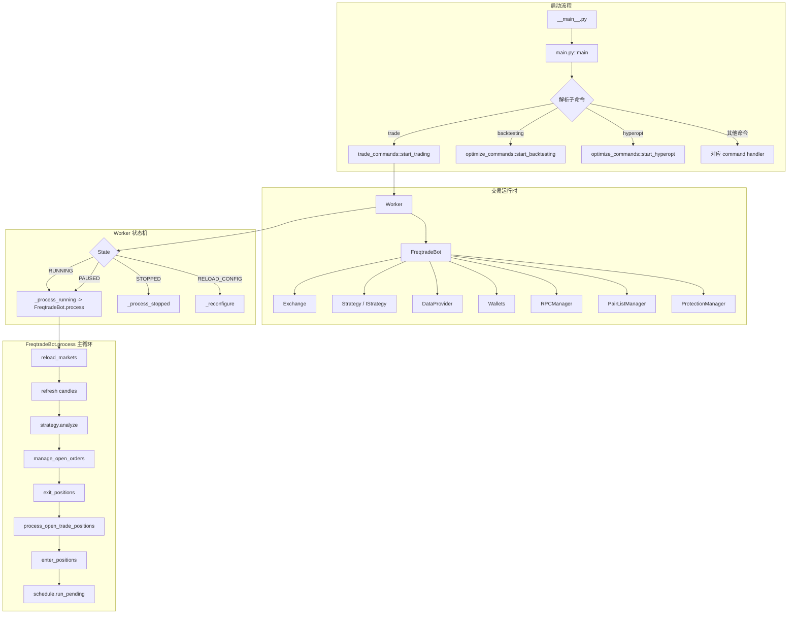
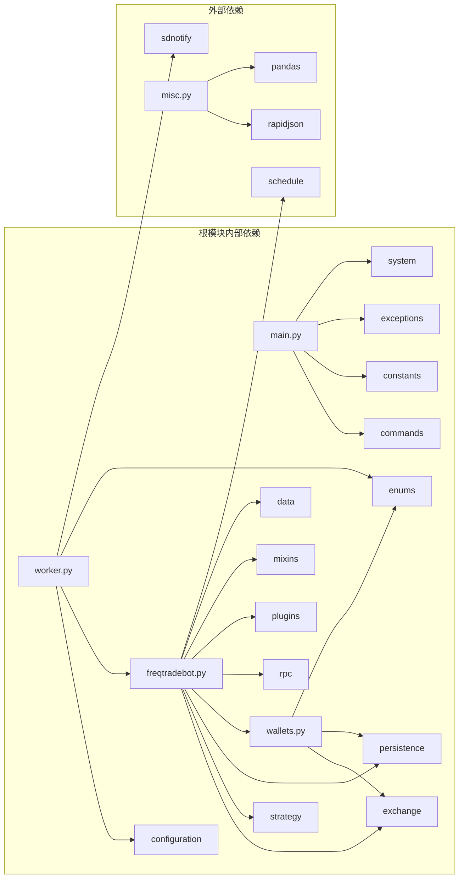
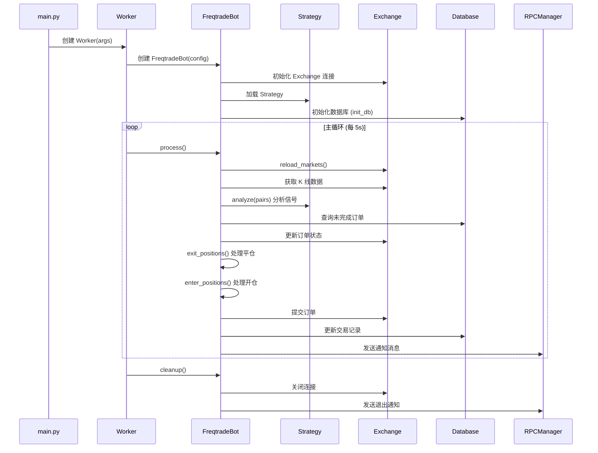

# Freqtrade 根模块源码文档

## 1. 模块概述

Freqtrade 根模块 (`freqtrade/`) 是整个加密货币自动交易机器人的核心入口与骨架。该模块包含了应用程序的生命周期管理、核心交易逻辑引擎、钱包管理系统、全局常量定义、异常体系以及通用工具函数。

根模块的职责可以概括为:
- **应用启动与入口**: `__main__.py` 和 `main.py` 负责解析命令行参数、初始化日志系统、设置系统配置并分发子命令。
- **工作循环管理**: `worker.py` 中的 `Worker` 类实现了主事件循环,管理 Bot 的状态机(RUNNING / PAUSED / STOPPED / RELOAD_CONFIG)以及 throttling 节流机制。
- **核心交易引擎**: `freqtradebot.py` 中的 `FreqtradeBot` 类是交易逻辑的核心,负责开仓、平仓、订单管理、资金费率更新、清算价格维护等全部交易操作。
- **钱包与资金管理**: `wallets.py` 提供了 Dry-run 和 Live 两种模式下的钱包余额同步、仓位管理及 stake amount 计算。
- **全局常量**: `constants.py` 定义了所有配置默认值、类型别名和业务常量。
- **异常体系**: `exceptions.py` 建立了层次化的异常类型树,用于区分配置错误、依赖错误、交易所错误和策略错误。
- **工具函数**: `misc.py` 包含 JSON 序列化/反序列化、深度字典合并、安全取值、DataFrame 操作等通用辅助函数。

## 2. 目录结构

| 文件 | 功能说明 |
|------|---------|
| `__init__.py` | 包初始化文件,定义 `__version__` 版本号,在开发模式下自动追加 Git commit hash |
| `__main__.py` | 模块入口点,允许通过 `python -m freqtrade` 方式启动 |
| `main.py` | 主启动脚本,负责 Python 版本检查、参数解析、子命令分发和全局异常处理 |
| `worker.py` | Worker 工作进程类,实现主循环、状态机管理、throttling 节流和 systemd 通知 |
| `freqtradebot.py` | 核心交易引擎类 `FreqtradeBot`,包含完整的交易生命周期管理(约 1200+ 行) |
| `wallets.py` | 钱包管理模块,包含 `Wallet`、`PositionWallet` 数据结构和 `Wallets` 管理类 |
| `constants.py` | 全局常量定义,包括默认配置值、类型别名、支持的法币列表等 |
| `exceptions.py` | 异常类层次结构定义,涵盖操作异常、配置错误、交易所错误、策略错误等 |
| `misc.py` | 通用工具函数集合,包含 JSON 处理、字典操作、DataFrame 工具等 |

## 3. 架构图



## 4. 核心类/函数说明

### 4.1 `main()` 函数 (`main.py`)

```python
def main(sysargv: list[str] | None = None) -> None:
```

应用程序的全局入口函数,负责:
1. 调用 `setup_logging_pre()` 初始化预日志
2. 调用 `asyncio_setup()` 配置 asyncio 事件循环(Win32 适配)
3. 实例化 `Arguments` 解析命令行参数
4. 根据解析结果分发到对应的子命令处理函数(`args["func"]`)
5. 全局捕获 `KeyboardInterrupt`、`ConfigurationError`、`FreqtradeException` 等异常
6. 最终通过 `sys.exit(return_code)` 退出

### 4.2 `Worker` 类 (`worker.py`)

```python
class Worker:
    def __init__(self, args: dict[str, Any], config: Config | None = None) -> None:
    def run(self) -> None:
    def _worker(self, old_state: State | None) -> State:
    def _throttle(self, func, throttle_secs, timeframe=None, ...) -> Any:
    def _reconfigure(self) -> None:
    def exit(self) -> None:
```

Worker 是 Freqtrade 的主工作进程,关键设计:

- **状态机**: 管理 `State.RUNNING`、`State.PAUSED`、`State.STOPPED`、`State.RELOAD_CONFIG` 四种状态的转换。
- **Throttling 节流**: `_throttle()` 方法确保每次迭代至少耗时 `process_throttle_secs`(默认 5 秒),并可选择对齐到下一根 K 线的起始时间。
- **Systemd 集成**: 通过 `sdnotify` 库支持 systemd watchdog 和状态通知(`READY=1`、`WATCHDOG=1`、`RELOADING=1`、`STOPPING=1`)。
- **心跳日志**: 每隔 `heartbeat_interval`(默认 60 秒)输出一次心跳日志,包含 PID、版本号和当前状态。
- **热重载**: `_reconfigure()` 方法在收到 `RELOAD_CONFIG` 状态时执行配置热重载,清理旧实例并创建新的 `FreqtradeBot`。

### 4.3 `FreqtradeBot` 类 (`freqtradebot.py`)

```python
class FreqtradeBot(LoggingMixin):
    def __init__(self, config: Config) -> None:
    def process(self) -> None:
    def enter_positions(self) -> int:
    def create_trade(self, pair: str) -> bool:
    def execute_entry(self, pair, stake_amount, ...) -> bool:
    def exit_positions(self, trades: list[Trade]) -> int:
    def manage_open_orders(self) -> None:
    def update_trade_state(self, trade, order_id, ...) -> bool:
    def cleanup(self) -> None:
```

这是整个项目中最核心的类(约 1200+ 行),主要职责包括:

- **初始化**: 加载 Exchange、Strategy、Wallets、RPCManager、DataProvider、PairListManager、ProtectionManager 等所有核心组件。
- **主循环 (`process`)**: 刷新市场数据 -> 分析策略信号 -> 管理未完成订单 -> 处理平仓 -> 仓位调整 -> 尝试开仓。
- **开仓逻辑 (`enter_positions` / `create_trade`)**: 遍历白名单,检查信号、锁定状态、可用资金,执行入场订单。
- **DCA 仓位调整 (`process_open_trade_positions`)**: 当策略启用 `position_adjustment_enable` 时,检查并执行仓位加减。
- **平仓逻辑 (`exit_positions`)**: 检查 ROI、Stoploss、Trailing Stoploss、自定义退出信号等退出条件。
- **订单管理 (`manage_open_orders`)**: 处理超时订单、交易所取消、部分成交等情况。
- **Futures 特性**: 支持 Funding Fee 更新、Liquidation Price 计算、Cross/Isolated Margin 模式。
- **定时任务**: 使用 `schedule` 库管理定时任务(如每小时更新 Funding Fee)。

### 4.4 `Wallets` 类 (`wallets.py`)

```python
class Wallets:
    def __init__(self, config, exchange, is_backtest=False) -> None:
    def update(self, require_update=True) -> None:
    def get_trade_stake_amount(self, pair, max_open_trades, update=True) -> float:
    def get_available_stake_amount(self) -> float:
    def validate_stake_amount(self, pair, stake_amount, ...) -> float:
```

钱包管理的核心设计:

- **双模式运行**: `_update_dry()` 从数据库计算模拟余额;`_update_live()` 从交易所 API 获取实际余额。
- **数据结构**: `Wallet` (NamedTuple: currency, free, used, total) 和 `PositionWallet` (NamedTuple: symbol, position, leverage, collateral, side)。
- **Stake Amount 计算**: 支持固定金额和 `unlimited` 模式,后者根据 `max_open_trades` 自动分配。
- **Cross Margin 支持**: 在 cross margin 模式下,会将所有非 stake currency 的余额通过汇率转换后计入可用资金。
- **缓存机制**: 通过 `_last_wallet_refresh` 实现 1 小时的缓存,避免频繁调用交易所 API。

### 4.5 异常层次结构 (`exceptions.py`)

```
FreqtradeException (基类)
├── OperationalException (需要人工干预,Bot 会停止)
│   └── ConfigurationError (配置错误)
├── DependencyException (依赖条件不满足)
│   ├── PricingError (价格无法确定)
│   └── ExchangeError (交易所错误)
│       ├── InvalidOrderException (无效订单)
│       │   ├── RetryableOrderError (可重试的订单错误)
│       │   └── InsufficientFundsError (资金不足)
│       └── TemporaryError (临时性错误)
│           └── DDosProtection (DDoS 保护触发)
└── StrategyError (用户策略代码错误)
```

### 4.6 全局常量 (`constants.py`)

关键常量分类:

| 类别 | 代表常量 | 说明 |
|------|---------|------|
| 运行参数 | `PROCESS_THROTTLE_SECS=5`, `RETRY_TIMEOUT=30` | 主循环间隔和重试超时 |
| 数据库 | `DEFAULT_DB_PROD_URL`, `DEFAULT_DB_DRYRUN_URL` | 生产和模拟环境的 SQLite URL |
| 数据格式 | `DEFAULT_DATAFRAME_COLUMNS`, `DEFAULT_TRADES_COLUMNS` | DataFrame 和交易数据的标准列定义 |
| 类型别名 | `Config = dict[str, Any]`, `BuySell`, `LongShort` | 全局类型别名定义 |
| Pairlist | `AVAILABLE_PAIRLISTS` | 内置 Pairlist 处理器列表(16 种) |
| Hyperopt | `HYPEROPT_LOSS_BUILTIN`, `HYPEROPT_BUILTIN_SPACES` | 内置超参优化损失函数和参数空间 |
| 环境变量 | `ENV_VAR_PREFIX = "FREQTRADE__"` | 环境变量配置前缀 |
| 法币 | `SUPPORTED_FIAT` | 支持的法币列表(35 种) |

### 4.7 工具函数 (`misc.py`)

| 函数 | 功能 |
|------|------|
| `file_dump_json` / `file_load_json` | JSON 文件读写(支持 gzip 压缩) |
| `deep_merge_dicts` | 深度合并字典,后者优先 |
| `safe_value_fallback` / `safe_value_fallback2` | 安全取值,支持多 key 回退 |
| `safe_value_nested` | 嵌套字典安全取值(支持点号分隔路径) |
| `pair_to_filename` | 交易对名称转文件名安全字符串 |
| `dataframe_to_json` / `json_to_dataframe` | DataFrame 与 JSON 互相转换 |
| `remove_entry_exit_signals` | 清除 DataFrame 中的交易信号列 |
| `append_candles_to_dataframe` | 追加新 K 线数据到 DataFrame(保留最近 1500 根) |
| `parse_db_uri_for_logging` | 解析数据库 URI 并脱敏密码 |
| `chunks` | 将列表分割为指定大小的块 |

## 5. 依赖关系



## 6. 数据流



## 7. 版本管理

`__init__.py` 中的版本号管理策略:
1. 基础版本号格式: `YYYY.M-dev`(如 `2026.4-dev`)
2. 开发模式下自动追加 Git short commit hash: `2026.4-dev-abc1234`
3. Docker 环境回退: 读取 `freqtrade_commit` 文件,格式为 `docker-2026.4-dev-abc12345`

这种设计确保了在开发、CI/CD 和生产环境中都能准确追踪代码版本。
