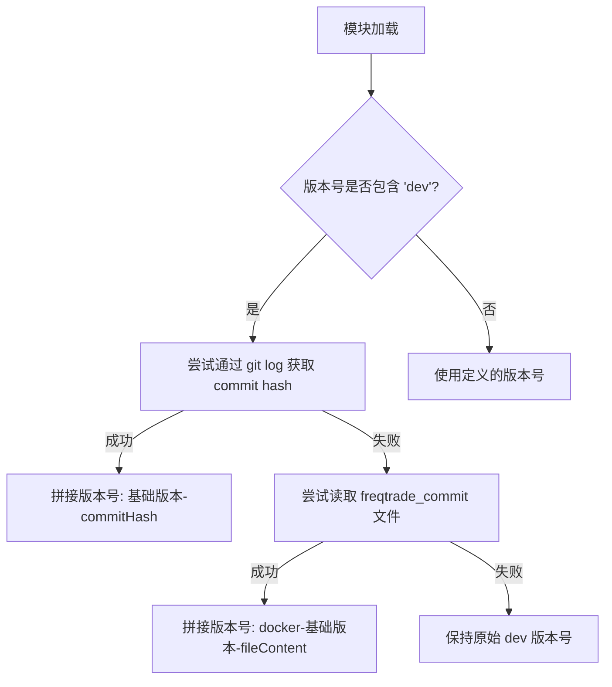

# __init__.py

## 概述
`freqtrade/__init__.py` 是 freqtrade 包的初始化文件，主要负责定义和动态生成项目的版本号 (`__version__`)。

## 架构图

## 核心变量

### `__version__`
- **类型**: `str`
- **默认值**: `"2026.4-dev"`
- **说明**: freqtrade 的版本号。如果是开发版本（包含 `"dev"` 字符串），会尝试以下方式增强版本信息：
  1. **优先**: 通过 `git log` 命令获取最近一次 commit 的短 hash，拼接到版本号后面，如 `"2026.4-dev-abc1234"`
  2. **降级**: 如果 git 不可用（例如在 Docker 容器中），尝试读取项目根目录下的 `freqtrade_commit` 文件（CI 构建 Docker 镜像时创建），生成如 `"docker-2026.4-dev-abc1234e"` 的版本号
  3. **兜底**: 如果以上都失败，保持原始的 `"2026.4-dev"` 不变

## 依赖关系

### 内部依赖（本项目模块）
- 无

### 外部依赖（第三方库）
- `subprocess` — 执行 git 命令获取 commit hash
- `pathlib.Path` — 文件路径操作

### 被依赖（谁引用了本文件）
- `freqtrade.main` — 导入 `__version__` 用于启动时打印版本信息
- `freqtrade.worker` — 导入 `__version__` 用于心跳日志
- `freqtrade.system.version_info` — 导入 `__version__` 用于版本信息打印
- 项目中大量模块通过 `from freqtrade import __version__` 引用版本号
