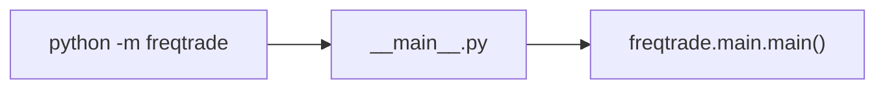

# __main__.py

## 概述
`freqtrade/__main__.py` 是 Python 模块入口文件，允许用户通过 `python -m freqtrade` 的方式运行 freqtrade。该文件内容非常简洁，仅导入并调用 `freqtrade.main` 模块中的 `main()` 函数。

## 架构图

## 核心逻辑
当 Python 解释器以模块方式执行 freqtrade 时（`python -m freqtrade`），会自动执行 `__main__.py`。文件通过 `if __name__ == "__main__"` 守卫调用 `main.main()`，将控制权转移给主入口函数。

## 依赖关系

### 内部依赖（本项目模块）
- `freqtrade.main` — 导入 `main()` 函数作为程序入口

### 外部依赖（第三方库）
- 无

### 被依赖（谁引用了本文件）
- Python 解释器 — 通过 `python -m freqtrade` 命令自动调用
