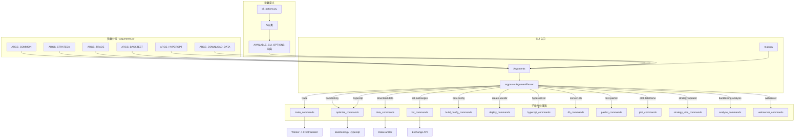
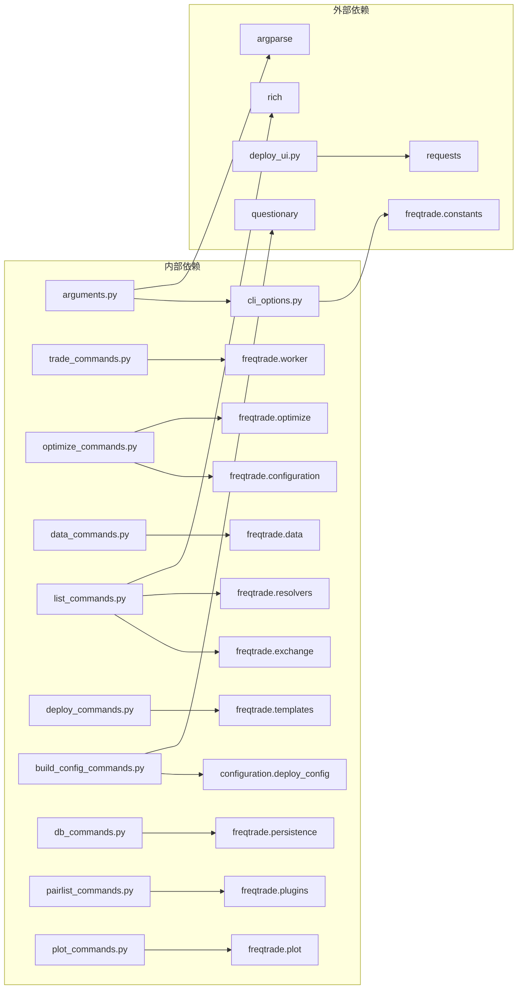
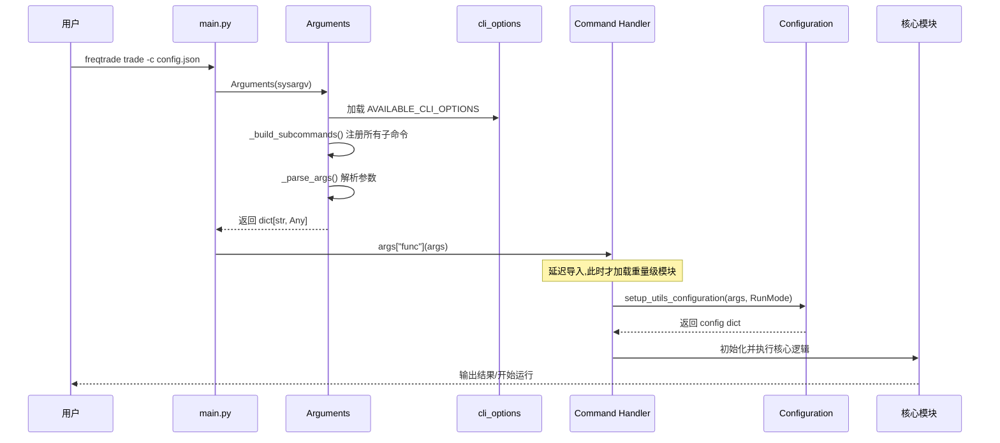

# Freqtrade CLI 命令系统源码文档

## 1. 模块概述

`freqtrade/commands/` 模块实现了 Freqtrade 的完整命令行界面 (CLI) 系统。该模块基于 Python 标准库 `argparse` 构建,采用子命令模式(subcommands pattern),将不同功能划分为独立的命令处理器。

核心设计理念:
- **延迟导入**: 所有命令处理器采用延迟导入模式,仅在实际执行时才加载对应的重量级模块(如 Backtesting、Hyperopt),显著减少启动时间。
- **参数声明式配置**: 通过 `Arg` 类和 `AVAILABLE_CLI_OPTIONS` 字典,以声明式方式定义所有 CLI 参数,便于统一管理和复用。
- **子命令分组**: 将约 30 个子命令按功能分为交易、优化、数据管理、列表查询、部署、绘图等类别。
- **配置自动发现**: 支持从多个位置自动发现配置文件(`user_data/config.json`、`config.json`)。

## 2. 目录结构

| 文件 | 功能说明 |
|------|---------|
| `__init__.py` | 模块入口,导出所有子命令入口函数和 `Arguments` 类 |
| `arguments.py` | CLI 参数管理核心,定义 `Arguments` 类和所有参数分组常量(如 `ARGS_BACKTEST`、`ARGS_HYPEROPT` 等) |
| `cli_options.py` | CLI 参数定义,包含 `Arg` 类和 `AVAILABLE_CLI_OPTIONS` 字典(约 100+ 个参数定义) |
| `trade_commands.py` | 实盘/模拟交易命令 `start_trading`,创建 Worker 并启动交易循环 |
| `optimize_commands.py` | 优化命令集合:Backtesting、Hyperopt、Edge(已废弃)、Lookahead Analysis、Recursive Analysis |
| `data_commands.py` | 数据管理命令:下载数据、转换格式、列出可用数据 |
| `list_commands.py` | 列表查询命令:列出交易所、交易对、策略、时间周期、FreqAI 模型等 |
| `deploy_commands.py` | 部署命令:创建用户目录、部署新策略模板、安装 FreqUI |
| `deploy_ui.py` | FreqUI 安装辅助函数:下载、解压、版本管理 |
| `build_config_commands.py` | 配置生成命令:交互式创建新配置文件、显示当前配置 |
| `hyperopt_commands.py` | Hyperopt 结果查看命令:列出历史优化结果、显示特定 epoch 详情 |
| `db_commands.py` | 数据库迁移命令:在不同数据库系统间迁移 Trade/Order/PairLock 数据 |
| `pairlist_commands.py` | Pairlist 测试命令:测试 Pairlist 配置,输出生成的交易对列表 |
| `plot_commands.py` | 绘图命令:绘制 K 线图(含指标)和收益曲线图 |
| `strategy_utils_commands.py` | 策略更新命令:自动将旧版策略文件迁移到新版 API |
| `analyze_commands.py` | 回测分析命令:分析入场/出场原因 |
| `webserver_commands.py` | Web 服务器命令:启动独立 API 服务(含 FreqUI) |

## 3. 架构图



## 4. 核心类/函数说明

### 4.1 `Arg` 类 (`cli_options.py`)

```python
class Arg:
    def __init__(self, *args, fthelp: dict[str, str] | None = None, **kwargs):
        self.cli = args      # CLI 标志,如 ('-s', '--strategy')
        self.fthelp = fthelp  # 每个子命令可能有不同的帮助文本
        self.kwargs = kwargs  # 传递给 argparse 的参数
```

`Arg` 类是 CLI 参数的封装,支持:
- 标准的 argparse 参数(action、type、default、choices 等)
- **上下文感知帮助文本**: 通过 `fthelp` 字典,同一参数在不同子命令下可显示不同的帮助信息(例如 `--export-filename` 在 backtesting 和 hyperopt-show 中含义不同)

### 4.2 `Arguments` 类 (`arguments.py`)

```python
class Arguments:
    def __init__(self, args: list[str] | None) -> None:
    def get_parsed_arg(self) -> dict[str, Any]:
    def _parse_args(self) -> Namespace:
    def _build_args(self, optionlist, parser) -> None:
    def _build_subcommands(self) -> None:
```

核心参数管理器,职责:
1. **构建解析器**: `_build_subcommands()` 注册约 30 个子命令,每个子命令绑定对应的处理函数(通过 `set_defaults(func=...)`)。
2. **参数解析**: `_parse_args()` 解析命令行参数,并自动发现配置文件。
3. **配置文件自动发现逻辑**:
   - 优先使用 `--config` 显式指定的文件
   - 否则检查 `user_data/config.json`
   - 最后回退到当前目录的 `config.json`
   - 部分命令(如 `list-exchanges`、`create-userdir`)不需要配置文件

### 4.3 参数分组常量

`arguments.py` 中定义了丰富的参数分组,用于在构建子命令时复用参数集:

| 分组常量 | 包含参数 | 使用场景 |
|----------|---------|---------|
| `ARGS_COMMON` | verbosity, logfile, config, datadir 等 | 所有子命令共享 |
| `ARGS_STRATEGY` | strategy, strategy_path, freqaimodel 等 | 需要加载策略的命令 |
| `ARGS_TRADE` | db_url, sd_notify, dry_run, fee | trade 子命令 |
| `ARGS_COMMON_OPTIMIZE` | timeframe, timerange, pairs, stake_amount | 所有优化命令共享 |
| `ARGS_BACKTEST` | 继承 ARGS_COMMON_OPTIMIZE + export, breakdown 等 | backtesting 命令 |
| `ARGS_HYPEROPT` | 继承 ARGS_COMMON_OPTIMIZE + epochs, spaces, loss 等 | hyperopt 命令 |
| `ARGS_DOWNLOAD_DATA` | pairs, days, timeframes, erase 等 | download-data 命令 |
| `NO_CONF_REQURIED` | 不需要配置文件的命令列表 | 配置文件自动发现逻辑 |
| `NO_CONF_ALLOWED` | 完全不允许配置文件的命令列表 | 如 create-userdir、list-exchanges |

### 4.4 命令处理器详解

#### `start_trading` (`trade_commands.py`)

```python
def start_trading(args: dict[str, Any]) -> int:
```

交易模式入口,流程:
1. 注册 `SIGTERM` 信号处理器(转换为 `KeyboardInterrupt`)
2. 创建 `Worker` 实例
3. 调用 `worker.run()` 进入主循环
4. 在 `finally` 中确保调用 `worker.exit()` 清理资源

#### `start_backtesting` / `start_hyperopt` (`optimize_commands.py`)

```python
def setup_optimize_configuration(args, method: RunMode) -> dict[str, Any]:
def start_backtesting(args: dict[str, Any]) -> None:
def start_hyperopt(args: dict[str, Any]) -> None:
```

优化命令共享 `setup_optimize_configuration` 配置预处理函数,该函数:
- 验证钱包余额是否大于 stake_amount
- 格式化并显示钱包余额信息

Hyperopt 特别使用了 `FileLock` 防止并发执行(因为资源密集型操作)。

#### `start_download_data` (`data_commands.py`)

```python
def start_download_data(args: dict[str, Any]) -> None:
def start_convert_data(args: dict[str, Any], ohlcv: bool = True) -> None:
def start_list_data(args: dict[str, Any]) -> None:
```

数据管理命令集:
- 支持 OHLCV 和 Trades 两种数据类型
- 支持 json、jsongz、feather、parquet 四种存储格式
- `--days` 和 `--timerange` 互斥校验
- 数据列表展示支持 Rich Table 格式化输出

#### `start_list_exchanges` / `start_list_markets` (`list_commands.py`)

列表查询命令支持多种输出格式:
- Rich Table (默认,带颜色)
- 单列输出 (`--one-column`)
- JSON 输出 (`--print-json`)
- CSV 输出 (`--print-csv`)

交易所列表特别支持:
- 区分 Supported/Unsupported 交易所
- 显示别名关系(如 binanceus -> binance)
- 按 trading_mode 过滤
- DEX 交易所过滤

#### `start_new_config` (`build_config_commands.py`)

交互式配置生成器,使用 `questionary` 库引导用户完成:
1. Dry-run 模式选择
2. Stake currency 和 amount 设置
3. 交易所选择和 API 密钥输入
4. Telegram 通知配置
5. API Server (FreqUI) 配置

生成的配置通过 Jinja2 模板渲染(每个交易所有独立模板)。

#### `start_convert_db` (`db_commands.py`)

数据库迁移工具,支持迁移:
- Trade 和 Order 记录
- PairLock 记录
- KeyValueStore 记录
- CustomData 记录

使用 SQLAlchemy 的 `make_transient` 实现跨 Session 迁移,并在迁移后更新序列 ID。

#### `start_install_ui` (`deploy_commands.py` + `deploy_ui.py`)

FreqUI 安装流程:
1. 从 GitHub API 获取最新 Release 信息
2. 对比当前已安装版本
3. 清理旧文件
4. 下载 ZIP 包并解压到 `rpc/api_server/ui/installed/`
5. 写入 `.uiversion` 版本标记文件

### 4.5 辅助验证函数 (`cli_options.py`)

```python
def check_int_positive(value: str) -> int:   # 正整数校验
def check_int_nonzero(value: str) -> int:    # 非零整数校验
```

这些函数作为 argparse 的 `type` 参数使用,在参数解析阶段即完成值验证。

## 5. 依赖关系



## 6. 数据流



## 7. 完整子命令列表

| 子命令 | 处理函数 | 功能 |
|--------|---------|------|
| `trade` | `start_trading` | 启动实盘/模拟交易 |
| `backtesting` | `start_backtesting` | 执行回测 |
| `backtesting-show` | `start_backtesting_show` | 显示回测结果 |
| `backtesting-analysis` | `start_analysis_entries_exits` | 分析回测入场/出场 |
| `hyperopt` | `start_hyperopt` | 执行超参数优化 |
| `hyperopt-list` | `start_hyperopt_list` | 列出 Hyperopt 结果 |
| `hyperopt-show` | `start_hyperopt_show` | 显示 Hyperopt 结果详情 |
| `edge` | `start_edge` | Edge 模块(已废弃并移除) |
| `download-data` | `start_download_data` | 下载历史数据 |
| `convert-data` | `start_convert_data` | 转换 OHLCV 数据格式 |
| `convert-trade-data` | `start_convert_data` | 转换 Trade 数据格式 |
| `trades-to-ohlcv` | `start_convert_trades` | Trade 数据转 OHLCV |
| `list-data` | `start_list_data` | 列出已下载的数据 |
| `list-exchanges` | `start_list_exchanges` | 列出可用交易所 |
| `list-markets` | `start_list_markets` | 列出交易所市场 |
| `list-pairs` | `start_list_markets` | 列出交易对 |
| `list-strategies` | `start_list_strategies` | 列出可用策略 |
| `list-hyperoptloss` | `start_list_hyperopt_loss_functions` | 列出损失函数 |
| `list-freqaimodels` | `start_list_freqAI_models` | 列出 FreqAI 模型 |
| `list-timeframes` | `start_list_timeframes` | 列出可用时间周期 |
| `show-trades` | `start_show_trades` | 显示交易记录 |
| `create-userdir` | `start_create_userdir` | 创建用户目录 |
| `new-config` | `start_new_config` | 交互式创建配置文件 |
| `show-config` | `start_show_config` | 显示当前配置(脱敏) |
| `new-strategy` | `start_new_strategy` | 从模板创建新策略 |
| `install-ui` | `start_install_ui` | 安装 FreqUI |
| `convert-db` | `start_convert_db` | 数据库迁移 |
| `test-pairlist` | `start_test_pairlist` | 测试 Pairlist 配置 |
| `plot-dataframe` | `start_plot_dataframe` | 绘制 K 线图 |
| `plot-profit` | `start_plot_profit` | 绘制收益图 |
| `webserver` | `start_webserver` | 启动 Web 服务器 |
| `strategy-updater` | `start_strategy_update` | 更新旧策略代码 |
| `lookahead-analysis` | `start_lookahead_analysis` | 前瞻偏差分析 |
| `recursive-analysis` | `start_recursive_analysis` | 递归公式分析 |
