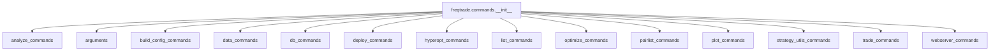

# __init__.py

## 概述

`freqtrade/commands/__init__.py` 是 commands 模块的包初始化文件。它负责从各子模块中导入所有的 CLI 命令入口函数（`start_*` 系列函数）和核心类（`Arguments`），统一对外暴露 commands 模块的公共 API。这使得外部调用者可以直接通过 `from freqtrade.commands import xxx` 的方式访问所有命令。

## 架构图

## 导出列表

该文件导出以下符号：

| 导出名称 | 来源模块 | 说明 |
|---------|---------|------|
| `start_analysis_entries_exits` | `analyze_commands` | 启动回测入场/出场分析 |
| `Arguments` | `arguments` | CLI 参数管理类 |
| `start_new_config` | `build_config_commands` | 创建新配置文件 |
| `start_show_config` | `build_config_commands` | 显示合并后的配置 |
| `start_convert_data` | `data_commands` | 转换 OHLCV/交易数据格式 |
| `start_convert_trades` | `data_commands` | 转换交易数据为 OHLCV |
| `start_download_data` | `data_commands` | 下载回测数据 |
| `start_list_data` | `data_commands` | 列出已下载数据 |
| `start_list_trades_data` | `data_commands` | 列出已下载的交易数据 |
| `start_convert_db` | `db_commands` | 数据库迁移 |
| `start_create_userdir` | `deploy_commands` | 创建用户数据目录 |
| `start_install_ui` | `deploy_commands` | 安装 FreqUI |
| `start_new_strategy` | `deploy_commands` | 创建新策略 |
| `start_hyperopt_list` | `hyperopt_commands` | 列出 Hyperopt 结果 |
| `start_hyperopt_show` | `hyperopt_commands` | 显示 Hyperopt 详情 |
| `start_list_exchanges` | `list_commands` | 列出交易所 |
| `start_list_freqAI_models` | `list_commands` | 列出 FreqAI 模型 |
| `start_list_hyperopt_loss_functions` | `list_commands` | 列出 Hyperopt 损失函数 |
| `start_list_markets` | `list_commands` | 列出市场/交易对 |
| `start_list_strategies` | `list_commands` | 列出策略 |
| `start_list_timeframes` | `list_commands` | 列出可用时间周期 |
| `start_show_trades` | `list_commands` | 显示交易记录 |
| `start_backtesting` | `optimize_commands` | 启动回测 |
| `start_backtesting_show` | `optimize_commands` | 显示回测结果 |
| `start_edge` | `optimize_commands` | Edge 模块（已废弃） |
| `start_hyperopt` | `optimize_commands` | 启动超参数优化 |
| `start_lookahead_analysis` | `optimize_commands` | 启动前瞻偏差分析 |
| `start_recursive_analysis` | `optimize_commands` | 启动递归分析 |
| `start_test_pairlist` | `pairlist_commands` | 测试交易对列表配置 |
| `start_plot_dataframe` | `plot_commands` | 绘制 K 线图 |
| `start_plot_profit` | `plot_commands` | 绘制利润图 |
| `start_strategy_update` | `strategy_utils_commands` | 更新策略文件 |
| `start_trading` | `trade_commands` | 启动交易 |
| `start_webserver` | `webserver_commands` | 启动 Web 服务器 |

## 依赖关系

### 内部依赖（本项目模块）
- `freqtrade.commands.analyze_commands` — 回测分析命令
- `freqtrade.commands.arguments` — 参数管理类
- `freqtrade.commands.build_config_commands` — 配置构建命令
- `freqtrade.commands.data_commands` — 数据管理命令
- `freqtrade.commands.db_commands` — 数据库命令
- `freqtrade.commands.deploy_commands` — 部署命令
- `freqtrade.commands.hyperopt_commands` — Hyperopt 命令
- `freqtrade.commands.list_commands` — 列表查看命令
- `freqtrade.commands.optimize_commands` — 优化命令
- `freqtrade.commands.pairlist_commands` — 交易对列表命令
- `freqtrade.commands.plot_commands` — 绘图命令
- `freqtrade.commands.strategy_utils_commands` — 策略工具命令
- `freqtrade.commands.trade_commands` — 交易命令
- `freqtrade.commands.webserver_commands` — Web 服务命令

### 外部依赖（第三方库）
无

### 被依赖（谁引用了本文件）
- `freqtrade.main` — 主入口，导入 `Arguments`
- `freqtrade.commands.arguments` — 在 `_build_subcommands` 中导入所有 `start_*` 函数
- `tests/test_arguments.py` — 测试中导入 `Arguments`
- `tests/test_configuration.py` — 测试中导入 `Arguments`
- `tests/conftest.py` — 测试中导入 `Arguments`
- `tests/test_plotting.py` — 测试中导入绘图命令
- `tests/commands/test_commands.py` — 命令测试
