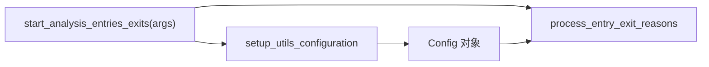

# analyze_commands.py

## 概述

`freqtrade/commands/analyze_commands.py` 提供回测结果的入场/出场原因分析功能。该文件仅包含一个入口函数 `start_analysis_entries_exits`，用于启动对回测结果中各笔交易的入场和出场原因进行统计和分析。用户可以通过 `freqtrade backtesting-analysis` 子命令来调用此功能。

## 架构图

## 核心类/函数

### start_analysis_entries_exits(args: dict[str, Any]) -> None

回测分析脚本的入口函数。

- **参数**：`args` — 从 `Arguments()` 解析得到的 CLI 参数字典
- **返回值**：`None`
- **职责**：
  1. 调用 `setup_utils_configuration` 以 `RunMode.UTIL_NO_EXCHANGE` 模式初始化配置（不需要交易所连接）
  2. 记录日志 "Starting freqtrade in analysis mode"
  3. 调用 `process_entry_exit_reasons(config)` 执行实际的入场/出场原因分析
- **关键逻辑**：所有重型模块（`configuration`、`entryexitanalysis`）都采用延迟导入（函数内部导入），以避免在启动时加载不必要的可选依赖

## 依赖关系

### 内部依赖（本项目模块）
- `freqtrade.enums.RunMode` — 运行模式枚举
- `freqtrade.configuration.setup_utils_configuration` — 配置初始化工具（延迟导入）
- `freqtrade.data.entryexitanalysis.process_entry_exit_reasons` — 入场/出场原因分析的核心处理函数（延迟导入）

### 外部依赖（第三方库）
- `logging` — 标准库，日志记录

### 被依赖（谁引用了本文件）
- `freqtrade.commands.__init__` — 导出 `start_analysis_entries_exits`
- `freqtrade.commands.arguments` — 在子命令构建中通过 `__init__` 间接引用，绑定到 `backtesting-analysis` 子命令
- `tests/data/test_entryexitanalysis.py` — 直接导入并测试此函数
