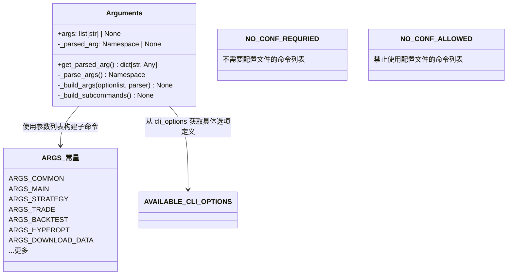
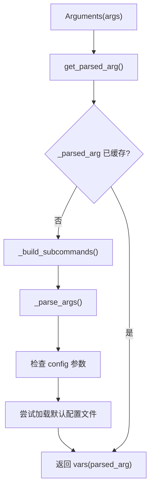

# arguments.py

## 概述

`freqtrade/commands/arguments.py` 是 Freqtrade CLI 的参数管理核心模块。它定义了 `Arguments` 类，负责构建整个 `argparse` 解析器体系，包括主命令和所有子命令（trade、backtesting、hyperopt、download-data 等 30+ 个子命令）。文件中还定义了大量的参数列表常量（`ARGS_*`），用于声明每个子命令需要哪些 CLI 选项。

## 架构图

## 核心类/函数

### Arguments

CLI 参数管理类，负责接收命令行参数列表并解析成字典格式。

#### `__init__(self, args: list[str] | None) -> None`
- **参数**：`args` — 命令行参数列表，`None` 时使用 `sys.argv`
- **职责**：保存原始参数列表，初始化缓存为 `None`

#### `get_parsed_arg(self) -> dict[str, Any]`
- **返回值**：解析后的参数字典
- **职责**：惰性构建并解析参数。如果尚未解析，先调用 `_build_subcommands()` 构建所有子命令，再调用 `_parse_args()` 解析，最后缓存结果
- **关键逻辑**：使用 `vars()` 将 `Namespace` 转换为字典

#### `_parse_args(self) -> Namespace`
- **返回值**：`argparse.Namespace` 实例
- **职责**：调用 `parser.parse_args()`，并处理 config 文件的默认值查找逻辑
- **关键逻辑**：
  1. 优先在 `user_data_dir/config.json` 查找配置文件
  2. 其次在当前目录查找 `config.json`
  3. 对于 `NO_CONF_REQURIED` 列表中的命令，如果找不到配置文件则不注入默认配置路径

#### `_build_args(self, optionlist, parser) -> None`
- **参数**：`optionlist` — 选项名称列表；`parser` — ArgumentParser 或 _ArgumentGroup
- **职责**：根据选项名称列表从 `AVAILABLE_CLI_OPTIONS` 字典中获取 `Arg` 对象，并调用 `parser.add_argument()` 注册参数
- **关键逻辑**：支持 `fthelp`（per-command 帮助文本），会根据 parser 的 `prog` 属性选择对应的帮助信息

#### `_build_subcommands(self) -> None`
- **职责**：构建完整的子命令体系，包括：
  - 公共参数组（Common arguments）
  - 策略参数组（Strategy arguments）
  - 30+ 个子命令（trade, create-userdir, new-config, backtesting, hyperopt 等）
  - 每个子命令都通过 `set_defaults(func=start_xxx)` 绑定对应的入口函数

## 参数列表常量

| 常量名 | 说明 |
|--------|------|
| `ARGS_COMMON` | 通用参数：verbosity, config, datadir 等 |
| `ARGS_MAIN` | 主命令参数：version |
| `ARGS_STRATEGY` | 策略参数：strategy, strategy_path, freqaimodel 等 |
| `ARGS_TRADE` | 交易参数：db_url, sd_notify, dry_run 等 |
| `ARGS_BACKTEST` | 回测参数：继承 ARGS_COMMON_OPTIMIZE + 回测特有选项 |
| `ARGS_HYPEROPT` | 超参数优化参数：epochs, spaces, hyperopt_loss 等 |
| `ARGS_DOWNLOAD_DATA` | 数据下载参数：pairs, days, timeframes 等 |
| `ARGS_LIST_EXCHANGES` | 列出交易所参数 |
| `ARGS_PLOT_DATAFRAME` | K 线绘图参数 |
| `ARGS_LOOKAHEAD_ANALYSIS` | 前瞻偏差分析参数（从 ARGS_BACKTEST 过滤+扩展） |
| `NO_CONF_REQURIED` | 不强制要求配置文件的命令列表（如 download-data, list-strategies） |
| `NO_CONF_ALLOWED` | 禁止使用配置文件的命令列表（如 create-userdir, list-exchanges） |

## 依赖关系

### 内部依赖（本项目模块）
- `freqtrade.commands.cli_options.AVAILABLE_CLI_OPTIONS` — CLI 选项定义字典
- `freqtrade.constants.DEFAULT_CONFIG` — 默认配置文件名
- `freqtrade.commands` — 延迟导入所有 `start_*` 函数用于绑定子命令

### 外部依赖（第三方库）
- `argparse` — 标准库，命令行参数解析
- `copy.deepcopy` — 标准库，深拷贝选项配置
- `functools.partial` — 标准库，用于创建带预设参数的函数（如 `start_convert_data` 的 `ohlcv` 参数）
- `pathlib.Path` — 标准库，路径处理

### 被依赖（谁引用了本文件）
- `freqtrade.commands.__init__` — 导出 `Arguments` 类
- `freqtrade.main` — 通过 `__init__` 导入 `Arguments` 解析命令行
- `freqtrade.configuration.configuration` — 导入 `NO_CONF_ALLOWED` 进行配置验证
- `tests/test_arguments.py` — 参数解析测试
- `tests/conftest.py` — 测试配置
- `build_helpers/create_command_partials.py` — 构建帮助文档
