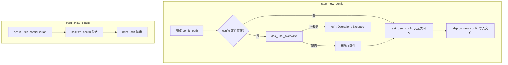

# build_config_commands.py

## 概述

`freqtrade/commands/build_config_commands.py` 提供配置文件管理相关的 CLI 命令。包含两个入口函数：`start_new_config` 用于交互式创建新的配置文件，`start_show_config` 用于显示当前合并后的完整配置（脱敏处理）。对应 `freqtrade new-config` 和 `freqtrade show-config` 两个子命令。

## 架构图

## 核心类/函数

### start_new_config(args: dict[str, Any]) -> None

交互式创建新配置文件的入口函数。

- **参数**：`args` — CLI 参数字典，必须包含 `config` 键（配置文件路径列表）
- **返回值**：`None`
- **职责**：
  1. 从 `args["config"][0]` 获取目标配置文件路径
  2. 调用 `chown_user_directory` 确保父目录的权限正确
  3. 如果目标文件已存在，通过 `ask_user_overwrite` 询问用户是否覆盖
  4. 调用 `ask_user_config` 交互式收集用户配置选项
  5. 调用 `deploy_new_config` 生成并写入配置文件
- **异常**：用户选择不覆盖已存在文件时抛出 `OperationalException`

### start_show_config(args: dict[str, Any]) -> None

显示合并后配置的入口函数。

- **参数**：`args` — CLI 参数字典
- **返回值**：`None`
- **职责**：
  1. 以 `RunMode.UTIL_EXCHANGE` 模式初始化配置（`set_dry=False` 表示不强制设置为模拟模式）
  2. 调用 `sanitize_config` 对原始配置进行脱敏处理（隐藏 API 密钥等敏感信息）
  3. 如果 `args["show_sensitive"]` 为 True，则显示原始敏感信息
  4. 使用 Rich 库的 `print_json` 格式化输出 JSON

## 依赖关系

### 内部依赖（本项目模块）
- `freqtrade.enums.RunMode` — 运行模式枚举
- `freqtrade.exceptions.OperationalException` — 操作异常
- `freqtrade.configuration.deploy_config` — 延迟导入：`ask_user_config`, `ask_user_overwrite`, `deploy_new_config`
- `freqtrade.configuration.directory_operations.chown_user_directory` — 延迟导入：目录权限管理
- `freqtrade.configuration.sanitize_config` — 延迟导入：配置脱敏
- `freqtrade.configuration.config_setup.setup_utils_configuration` — 延迟导入：配置初始化

### 外部依赖（第三方库）
- `logging` — 标准库，日志记录
- `pathlib.Path` — 标准库，路径处理
- `rich.print_json` — Rich 库，格式化 JSON 输出（延迟导入）

### 被依赖（谁引用了本文件）
- `freqtrade.commands.__init__` — 导出 `start_new_config`, `start_show_config`
- `tests/commands/test_build_config.py` — 直接导入 `start_new_config` 进行测试
