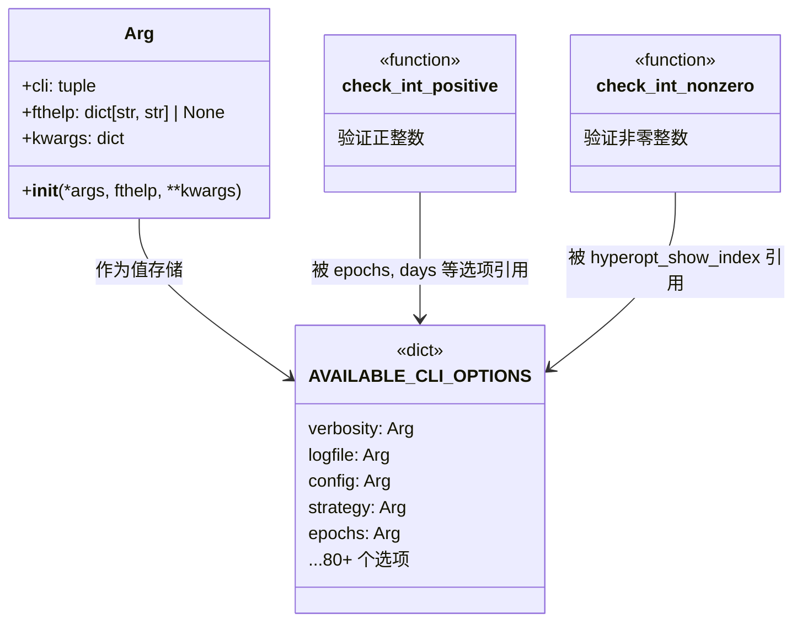

# cli_options.py

## 概述

`freqtrade/commands/cli_options.py` 定义了 Freqtrade 所有 CLI 命令行选项的具体配置。文件核心是一个全局字典 `AVAILABLE_CLI_OPTIONS`，其中每个键对应一个选项名称，值为 `Arg` 类实例，封装了 `argparse.add_argument()` 所需的所有参数。此外还提供了两个参数验证函数。该文件是整个 CLI 系统的选项定义中心，由 `arguments.py` 引用来构建解析器。

## 架构图

## 核心类/函数

### Arg

CLI 参数封装类，用于统一管理每个命令行选项的定义。

- **`__init__(self, *args, fthelp=None, **kwargs)`**
  - `*args` — 选项标志（如 `"-v"`, `"--verbose"`），对应 `argparse.add_argument` 的位置参数
  - `fthelp` — 可选的 per-command 帮助文本字典，格式为 `{"freqtrade <command>": help_text}`。如果当前命令的 prog 匹配某个 key，则使用对应的 help 文本替代 `kwargs["help"]`
  - `**kwargs` — 传递给 `argparse.add_argument` 的所有关键字参数（help、action、type、choices、default、metavar、nargs 等）
- **属性**：
  - `cli` — 选项标志元组
  - `fthelp` — per-command 帮助文本字典
  - `kwargs` — argparse 关键字参数

### check_int_positive(value: str) -> int

参数类型验证函数，确保输入值为正整数（> 0）。

- **参数**：`value` — 命令行传入的字符串
- **返回值**：转换后的正整数
- **异常**：`ArgumentTypeError` — 当值不是正整数时抛出

### check_int_nonzero(value: str) -> int

参数类型验证函数，确保输入值为非零整数（!= 0，允许负数）。

- **参数**：`value` — 命令行传入的字符串
- **返回值**：转换后的非零整数
- **异常**：`ArgumentTypeError` — 当值为零或非整数时抛出

### AVAILABLE_CLI_OPTIONS

全局字典，包含 80+ 个 CLI 选项定义。主要分类如下：

| 分类 | 代表选项 | 说明 |
|------|---------|------|
| 通用选项 | `verbosity`, `logfile`, `config`, `datadir` | 日志、配置文件、数据路径 |
| 策略选项 | `strategy`, `strategy_path`, `freqaimodel` | 策略类名、搜索路径 |
| 交易选项 | `db_url`, `dry_run`, `dry_run_wallet` | 数据库、模拟交易 |
| 回测选项 | `timeframe`, `timerange`, `position_stacking`, `export` | 时间周期、仓位叠加、导出 |
| Hyperopt 选项 | `epochs`, `spaces`, `hyperopt_loss`, `early_stop` | 优化轮次、搜索空间、损失函数 |
| 交易所列表选项 | `print_one_column`, `list_exchanges_all`, `trading_mode` | 输出格式、交易模式 |
| 交易对选项 | `base_currencies`, `quote_currencies`, `list_pairs_all` | 基础/报价币种筛选 |
| 数据下载选项 | `pairs`, `days`, `timeframes`, `download_trades` | 交易对、天数、下载交易数据 |
| 数据转换选项 | `format_from`, `format_to`, `erase` | 数据格式转换 |
| 绘图选项 | `indicators1`, `indicators2`, `plot_limit` | 指标选择、绘图限制 |
| 分析选项 | `analysis_groups`, `indicator_list`, `entry_only` | 入场/出场分析相关 |
| UI 选项 | `erase_ui_only`, `ui_version`, `ui_prerelease` | FreqUI 安装管理 |
| Lookahead 分析 | `minimum_trade_amount`, `targeted_trade_amount` | 前瞻偏差检测 |

## 依赖关系

### 内部依赖（本项目模块）
- `freqtrade.constants` — 导入 `HYPEROPT_BUILTIN_SPACE_OPTIONS`, `HYPEROPT_LOSS_BUILTIN`, `DEFAULT_DB_PROD_URL`, `DEFAULT_DB_DRYRUN_URL`, `AVAILABLE_DATAHANDLERS`, `EXPORT_OPTIONS`, `BACKTEST_BREAKDOWNS`, `BACKTEST_CACHE_DEFAULT`, `BACKTEST_CACHE_AGE`, `TRADING_MODES` 等常量
- `freqtrade.enums.CandleType` — K 线类型枚举，用于 `candle_types` 选项的 `choices`

### 外部依赖（第三方库）
- `argparse` — 标准库，使用 `SUPPRESS` 和 `ArgumentTypeError`

### 被依赖（谁引用了本文件）
- `freqtrade.commands.arguments` — 导入 `AVAILABLE_CLI_OPTIONS` 用于构建子命令解析器
- `tests/test_arguments.py` — 直接导入并测试 `check_int_positive`, `check_int_nonzero`, `Arg` 类
