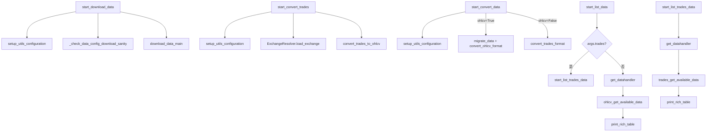

# data_commands.py

## 概述

`freqtrade/commands/data_commands.py` 提供数据管理相关的 CLI 命令，涵盖数据下载、格式转换和数据列表查看功能。对应的子命令包括 `download-data`、`convert-data`、`convert-trade-data`、`trades-to-ohlcv`、`list-data` 等。该文件是 Freqtrade 数据管理子系统的命令入口层。

## 架构图

## 核心类/函数

### _check_data_config_download_sanity(config: Config) -> None

内部辅助函数，验证数据下载配置的合法性。

- **校验规则**：
  1. `--days` 和 `--timerange` 互斥，不能同时使用
  2. 必须提供 `pairs`（交易对列表）
- **异常**：`ConfigurationError`

### start_download_data(args: dict[str, Any]) -> None

下载回测数据的入口函数（对应 `freqtrade download-data`）。

- **职责**：
  1. 以 `RunMode.UTIL_EXCHANGE` 模式初始化配置
  2. 调用 `_check_data_config_download_sanity` 验证配置
  3. 调用 `download_data_main(config)` 执行下载
  4. 捕获 `KeyboardInterrupt` 实现优雅中断

### start_convert_trades(args: dict[str, Any]) -> None

将下载的逐笔交易数据转换为 OHLCV K 线数据（对应 `freqtrade trades-to-ohlcv`）。

- **职责**：
  1. 初始化配置并加载交易所实例
  2. 校验每个目标 timeframe 的有效性
  3. 获取可用市场，扩展交易对列表（支持通配符）
  4. 调用 `convert_trades_to_ohlcv` 执行转换
- **关键逻辑**：将 `stake_currency` 设为空字符串以跳过不相关的检查

### start_convert_data(args: dict[str, Any], ohlcv: bool = True) -> None

转换数据存储格式（对应 `freqtrade convert-data` 和 `freqtrade convert-trade-data`）。

- **参数**：
  - `args` — CLI 参数
  - `ohlcv` — `True` 转换 OHLCV 数据，`False` 转换交易数据
- **职责**：
  - OHLCV 模式：先执行数据迁移（`migrate_data`），再调用 `convert_ohlcv_format`
  - 交易数据模式：调用 `convert_trades_format`

### start_list_data(args: dict[str, Any]) -> None

列出已下载的 OHLCV 数据（对应 `freqtrade list-data`）。

- **职责**：
  1. 如果 `args["trades"]` 为 True，委托给 `start_list_trades_data`
  2. 否则获取 DataHandler，查询可用的交易对/时间周期组合
  3. 支持交易对过滤（`--pairs`）
  4. 两种展示模式：
     - 默认模式：按交易对分组显示时间周期列表
     - `--show-timerange` 模式：显示每个组合的起止时间和 K 线数量

### start_list_trades_data(args: dict[str, Any]) -> None

列出已下载的逐笔交易数据。

- **职责**：类似 `start_list_data`，但针对交易（trades）数据
- **展示信息**：交易对、类型、起止时间、交易数量

## 依赖关系

### 内部依赖（本项目模块）
- `freqtrade.constants` — `DATETIME_PRINT_FORMAT`, `DL_DATA_TIMEFRAMES`, `Config`
- `freqtrade.enums` — `CandleType`, `RunMode`, `TradingMode`
- `freqtrade.exceptions.ConfigurationError` — 配置异常
- `freqtrade.plugins.pairlist.pairlist_helpers` — `dynamic_expand_pairlist`, `expand_pairlist`
- `freqtrade.configuration` — `setup_utils_configuration`, `TimeRange`（延迟导入）
- `freqtrade.data.history` — `download_data_main`, `get_datahandler`（延迟导入）
- `freqtrade.data.converter` — `convert_trades_to_ohlcv`, `convert_ohlcv_format`, `convert_trades_format`（延迟导入）
- `freqtrade.resolvers.ExchangeResolver` — 加载交易所实例（延迟导入）
- `freqtrade.exchange.timeframe_to_minutes` — 时间周期转分钟数（延迟导入）
- `freqtrade.util.print_rich_table` — 表格输出（延迟导入）
- `freqtrade.util.migrations.migrate_data` — 数据迁移（延迟导入）
- `freqtrade.misc.plural` — 复数形式工具函数（延迟导入）

### 外部依赖（第三方库）
- `logging` — 标准库，日志记录
- `sys` — 标准库，系统退出
- `collections.defaultdict` — 标准库，数据分组

### 被依赖（谁引用了本文件）
- `freqtrade.commands.__init__` — 导出 `start_convert_data`, `start_convert_trades`, `start_download_data`, `start_list_data`, `start_list_trades_data`
