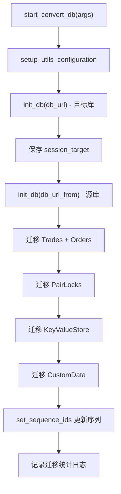

# db_commands.py

## 概述

`freqtrade/commands/db_commands.py` 提供数据库迁移功能，对应 `freqtrade convert-db` 子命令。它能将一个 Freqtrade 数据库中的所有数据（交易记录、订单、交易对锁定、键值对、自定义数据）迁移到另一个数据库，支持不同数据库引擎之间的迁移（如从 SQLite 到 PostgreSQL）。

## 架构图

## 核心类/函数

### start_convert_db(args: dict[str, Any]) -> None

数据库迁移的入口函数。

- **参数**：`args` — CLI 参数字典，需包含 `db_url`（目标数据库）和 `db_url_from`（源数据库）
- **返回值**：`None`
- **职责**：
  1. 以 `RunMode.UTIL_NO_EXCHANGE` 模式初始化配置
  2. 先用 `init_db(config["db_url"])` 初始化目标数据库，获取 `session_target`
  3. 再用 `init_db(config["db_url_from"])` 初始化源数据库（此时 `Trade.session` 指向源库）
  4. 迁移四类数据：
     - **Trades（含 Orders）**：遍历所有交易记录，使用 `make_transient` 解除 SQLAlchemy session 绑定，添加到目标 session
     - **PairLocks**：迁移所有交易对锁定记录
     - **KeyValueStore**：迁移键值对存储
     - **CustomData**：迁移自定义数据
  5. 更新目标数据库的序列 ID（确保自增序列从正确的值开始）
  6. 记录迁移统计信息

- **关键逻辑**：
  - 使用 `make_transient()` 将 ORM 对象从源 session 分离，使其可以添加到目标 session
  - 迁移完成后通过 `set_sequence_ids` 确保 PostgreSQL 等数据库的自增序列正确
  - 每种数据类型迁移后都调用 `session_target.commit()` 提交事务

## 依赖关系

### 内部依赖（本项目模块）
- `freqtrade.enums.RunMode` — 运行模式枚举
- `freqtrade.configuration.config_setup.setup_utils_configuration` — 配置初始化（延迟导入）
- `freqtrade.persistence` — `Order`, `Trade`, `init_db`（延迟导入）
- `freqtrade.persistence.custom_data._CustomData` — 自定义数据 ORM 模型（延迟导入）
- `freqtrade.persistence.key_value_store._KeyValueStoreModel` — 键值存储 ORM 模型（延迟导入）
- `freqtrade.persistence.migrations.set_sequence_ids` — 序列 ID 设置（延迟导入）
- `freqtrade.persistence.pairlock.PairLock` — 交易对锁定 ORM 模型（延迟导入）

### 外部依赖（第三方库）
- `logging` — 标准库，日志记录
- `sqlalchemy.func` — SQLAlchemy 聚合函数（`max`）
- `sqlalchemy.select` — SQLAlchemy 查询构建
- `sqlalchemy.orm.make_transient` — 将 ORM 对象从 session 分离

### 被依赖（谁引用了本文件）
- `freqtrade.commands.__init__` — 导出 `start_convert_db`
