# deploy_commands.py

## 概述

`freqtrade/commands/deploy_commands.py` 提供部署相关的 CLI 命令，包括创建用户数据目录、生成新策略文件、安装 FreqUI 前端界面。对应 `freqtrade create-userdir`、`freqtrade new-strategy`、`freqtrade install-ui` 三个子命令。策略生成功能使用 Jinja2 模板系统，支持 `minimal`、`full`、`advanced` 三种模板。

## 架构图

```mermaid
flowchart TD
    subgraph create_userdir
        A1["start_create_userdir"] --> A2{"user_data_dir 提供?"}
        A2 -->|是| A3["create_userdata_dir"]
        A3 --> A4["copy_sample_files"]
        A2 -->|否| A5["警告并退出"]
    end

    subgraph new_strategy
        B1["start_new_strategy"] --> B2["setup_utils_configuration"]
        B2 --> B3{"strategy 名称提供?"}
        B3 -->|是| B4{"策略文件已存在?"}
        B4 -->|否| B5["deploy_new_strategy"]
        B4 -->|是| B6["抛出 OperationalException"]
        B3 -->|否| B7["抛出 ConfigurationError"]
    end

    subgraph deploy_new_strategy
        C1["deploy_new_strategy(name, path, template)"] --> C2["render_template_with_fallback x 6"]
        C2 --> C3["render_template(base_strategy.py.j2)"]
        C3 --> C4["write_text 写入文件"]
    end

    subgraph install_ui
        D1["start_install_ui"] --> D2["get_ui_download_url"]
        D2 --> D3["read_ui_version"]
        D3 --> D4{"版本已最新?"}
        D4 -->|是| D5["跳过"]
        D4 -->|否| D6["clean_ui_subdir"]
        D6 --> D7{"仅清除?"}
        D7 -->|否| D8["download_and_install_ui"]
        D7 -->|是| D9["完成"]
    end
```

## 核心类/函数

### start_create_userdir(args: dict[str, Any]) -> None

创建用户数据目录的入口函数（对应 `freqtrade create-userdir`）。

- **参数**：`args` — CLI 参数字典，需包含 `user_data_dir`
- **职责**：
  1. 调用 `create_userdata_dir` 创建目录结构
  2. 调用 `copy_sample_files` 复制示例文件（`args["reset"]` 控制是否覆盖已有文件）
- **异常处理**：如果未提供 `--userdir` 参数，打印警告并以退出码 1 退出

### deploy_new_strategy(strategy_name: str, strategy_path: Path, subtemplate: str) -> None

从 Jinja2 模板部署新策略文件。

- **参数**：
  - `strategy_name` — 策略类名
  - `strategy_path` — 输出文件路径
  - `subtemplate` — 模板类型（`minimal` / `full` / `advanced`）
- **职责**：
  1. 依次渲染 6 个子模板（带 fallback 到 `full` 模板）：
     - `strategy_attributes` — 策略属性
     - `indicators` — 指标计算
     - `buy_trend` — 买入逻辑
     - `sell_trend` — 卖出逻辑
     - `plot_config` — 绘图配置
     - `additional_methods` — 额外方法（fallback 到空模板）
  2. 使用 `base_strategy.py.j2` 主模板组装最终策略文件
  3. 写入目标路径

### start_new_strategy(args: dict[str, Any]) -> None

创建新策略文件的入口函数（对应 `freqtrade new-strategy`）。

- **职责**：
  1. 初始化配置
  2. 确定策略输出目录（优先使用 `--strategy-path`，否则使用 `user_data_dir/strategies`）
  3. 检查同名策略文件是否已存在
  4. 调用 `deploy_new_strategy` 生成策略文件
- **异常**：策略文件已存在时抛出 `OperationalException`，未提供策略名时抛出 `ConfigurationError`

### start_install_ui(args: dict[str, Any]) -> None

安装 FreqUI 前端的入口函数（对应 `freqtrade install-ui`）。

- **职责**：
  1. 确定安装目标目录：`freqtrade/rpc/api_server/ui/installed/`
  2. 调用 `get_ui_download_url` 获取下载链接和最新版本号
  3. 检查当前安装版本，如果已是最新则跳过
  4. 清理旧版本目录
  5. 如果不是 `--erase` 模式，则下载并安装新版本

## 依赖关系

### 内部依赖（本项目模块）
- `freqtrade.constants.USERPATH_STRATEGIES` — 策略目录名常量
- `freqtrade.enums.RunMode` — 运行模式枚举
- `freqtrade.exceptions` — `ConfigurationError`, `OperationalException`
- `freqtrade.configuration.directory_operations` — `copy_sample_files`, `create_userdata_dir`（延迟导入）
- `freqtrade.configuration.setup_utils_configuration` — 配置初始化（延迟导入）
- `freqtrade.util` — `render_template`, `render_template_with_fallback`（延迟导入）
- `freqtrade.commands.deploy_ui` — `clean_ui_subdir`, `download_and_install_ui`, `get_ui_download_url`, `read_ui_version`（延迟导入）

### 外部依赖（第三方库）
- `logging` — 标准库，日志记录
- `sys` — 标准库，系统退出
- `pathlib.Path` — 标准库，路径处理

### 被依赖（谁引用了本文件）
- `freqtrade.commands.__init__` — 导出 `start_create_userdir`, `start_install_ui`, `start_new_strategy`
