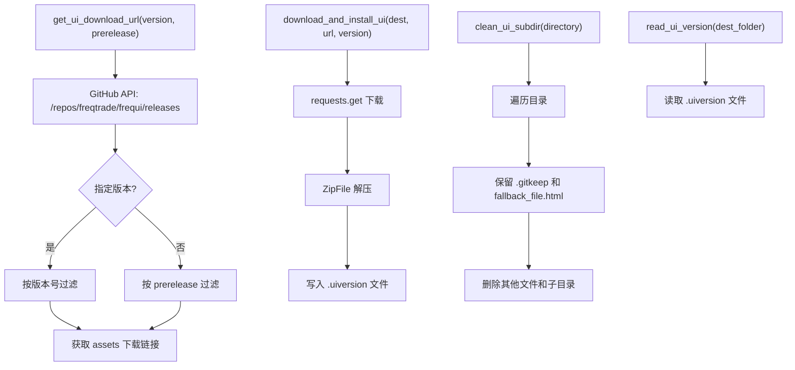

# deploy_ui.py

## 概述

`freqtrade/commands/deploy_ui.py` 提供 FreqUI 前端界面的下载、安装和管理功能。包含四个工具函数：清理 UI 目录、读取当前 UI 版本、下载并安装 UI、获取 UI 下载地址。这些函数被 `deploy_commands.py` 中的 `start_install_ui` 调用，也被 `rpc/api_server/web_ui.py` 引用来检查 UI 版本。

## 架构图

## 核心类/函数

### clean_ui_subdir(directory: Path) -> None

清理 UI 安装目录中的所有内容（保留特殊文件）。

- **参数**：`directory` — UI 安装目录路径
- **职责**：
  1. 从叶子到根遍历目录内容（`reversed` + `glob("**/*")`）
  2. 保留 `.gitkeep` 和 `fallback_file.html`
  3. 删除其他所有文件和空目录

### read_ui_version(dest_folder: Path) -> str | None

读取当前安装的 UI 版本号。

- **参数**：`dest_folder` — UI 安装目录
- **返回值**：版本号字符串，如果 `.uiversion` 文件不存在则返回 `None`
- **关键逻辑**：版本信息存储在 `.uiversion` 文件中

### download_and_install_ui(dest_folder: Path, dl_url: str, version: str) -> None

下载并安装 FreqUI。

- **参数**：
  - `dest_folder` — 安装目标目录
  - `dl_url` — 下载 URL
  - `version` — 版本号
- **职责**：
  1. 使用 `requests.get` 下载 ZIP 文件
  2. 创建目标目录（如果不存在）
  3. 使用 `ZipFile` 解压到目标目录
  4. 写入 `.uiversion` 文件记录版本号

### get_ui_download_url(version: str | None, prerelease: bool) -> tuple[str, str]

从 GitHub API 获取 FreqUI 的下载地址。

- **参数**：
  - `version` — 指定版本号，`None` 表示最新版
  - `prerelease` — 是否包含预发布版本
- **返回值**：`(下载URL, 版本号)` 元组
- **职责**：
  1. 请求 GitHub Releases API
  2. 如果指定了版本号，按版本过滤；否则按 prerelease 标记过滤
  3. 未指定版本时，按创建时间降序排列取最新
  4. 从 release assets 中提取下载链接
  5. 如果 assets 为空，尝试从 `assets_url` 获取
- **异常**：找不到指定版本时抛出 `ValueError`

## 依赖关系

### 内部依赖（本项目模块）
无

### 外部依赖（第三方库）
- `logging` — 标准库，日志记录
- `pathlib.Path` — 标准库，路径处理
- `requests` — HTTP 请求库，用于下载 UI 和访问 GitHub API
- `io.BytesIO` — 标准库，内存字节流（延迟导入）
- `zipfile.ZipFile` — 标准库，ZIP 解压（延迟导入）

### 被依赖（谁引用了本文件）
- `freqtrade.commands.deploy_commands` — `start_install_ui` 调用本文件中的所有四个函数
- `freqtrade.rpc.api_server.web_ui` — 导入 `read_ui_version` 检查 UI 版本
- `tests/commands/test_commands.py` — 测试中直接导入并测试这些函数
