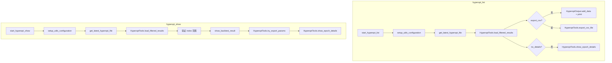

# hyperopt_commands.py

## 概述

`freqtrade/commands/hyperopt_commands.py` 提供 Hyperopt（超参数优化）结果查看相关的 CLI 命令。包含两个入口函数：`start_hyperopt_list` 用于列出和筛选历史 Hyperopt 优化结果，`start_hyperopt_show` 用于显示某个特定 epoch 的详细信息。对应 `freqtrade hyperopt-list` 和 `freqtrade hyperopt-show` 子命令。

## 架构图

## 核心类/函数

### start_hyperopt_list(args: dict[str, Any]) -> None

列出 Hyperopt 历史结果的入口函数。

- **参数**：`args` — CLI 参数字典
- **返回值**：`None`
- **职责**：
  1. 以 `RunMode.UTIL_NO_EXCHANGE` 模式初始化配置
  2. 从配置中获取显示选项：`print_colorized`, `print_json`, `export_csv`, `no_details`
  3. 通过 `get_latest_hyperopt_file` 定位结果文件
  4. 使用 `HyperoptTools.load_filtered_results` 加载并筛选结果
  5. 如果未指定 CSV 导出：使用 `HyperoptOutput` 格式化输出结果列表
  6. 如果未禁用详情：显示最佳 epoch 的详细信息（按 loss 排序取第一个）
  7. 如果指定了 `export_csv`：导出到 CSV 文件

### start_hyperopt_show(args: dict[str, Any]) -> None

显示特定 Hyperopt epoch 详情的入口函数。

- **参数**：`args` — CLI 参数字典
- **返回值**：`None`
- **职责**：
  1. 初始化配置
  2. 加载并筛选 Hyperopt 结果
  3. 获取要显示的 epoch 索引 `n`（支持正数和负数索引）
  4. 验证索引范围（超出范围抛出 `OperationalException`）
  5. 如果结果中包含 `strategy_name`：调用 `show_backtest_result` 显示回测指标
  6. 调用 `HyperoptTools.try_export_params` 导出参数
  7. 调用 `HyperoptTools.show_epoch_details` 显示 epoch 详情
- **关键逻辑**：
  - 索引转换：正数索引从 1 开始（人类可读），需要减 1 转为 Python 索引
  - 负数索引直接使用（Python 原生支持）

## 依赖关系

### 内部依赖（本项目模块）
- `freqtrade.enums.RunMode` — 运行模式枚举
- `freqtrade.exceptions.OperationalException` — 操作异常（索引超出范围时）
- `freqtrade.configuration.setup_utils_configuration` — 配置初始化（延迟导入）
- `freqtrade.data.btanalysis.get_latest_hyperopt_file` — 获取最新 Hyperopt 结果文件（延迟导入）
- `freqtrade.optimize.hyperopt.hyperopt_output.HyperoptOutput` — Hyperopt 结果输出格式化（延迟导入）
- `freqtrade.optimize.hyperopt_tools.HyperoptTools` — Hyperopt 工具类，提供结果加载、过滤、展示功能（延迟导入）
- `freqtrade.optimize.optimize_reports.show_backtest_result` — 回测结果展示（延迟导入）

### 外部依赖（第三方库）
- `logging` — 标准库，日志记录
- `operator.itemgetter` — 标准库，用于排序时提取字典键值

### 被依赖（谁引用了本文件）
- `freqtrade.commands.__init__` — 导出 `start_hyperopt_list`, `start_hyperopt_show`
