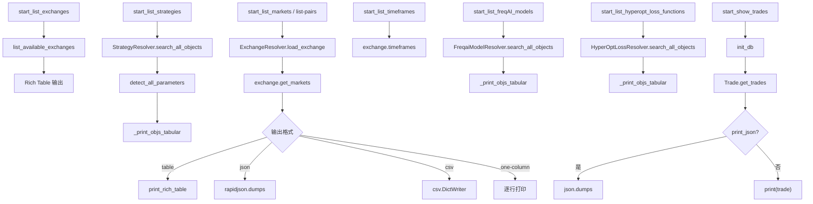

# list_commands.py

## 概述

`freqtrade/commands/list_commands.py` 提供各种列表查看功能的 CLI 命令，是 Freqtrade 中功能最丰富的命令文件之一。包含列出交易所、时间周期、交易对/市场、策略、FreqAI 模型、Hyperopt 损失函数、交易记录等功能。对应 `list-exchanges`、`list-timeframes`、`list-markets`、`list-pairs`、`list-strategies`、`list-freqaimodels`、`list-hyperoptloss`、`show-trades` 等子命令。

## 架构图

## 核心类/函数

### start_list_exchanges(args: dict[str, Any]) -> None

列出可用交易所（对应 `freqtrade list-exchanges`）。

- **职责**：
  1. 调用 `list_available_exchanges` 获取所有交易所信息
  2. 支持多种过滤条件：`--all`（包括不受支持的）、`--trading-mode`（按交易模式过滤）、`--dex-exchanges`（仅 DEX）
  3. 使用 Rich Table 输出，显示名称、类名、支持的市场类型、备注等
  4. 支持的交易所标记为绿色粗体并附加 "(Supported)"
  5. 别名交易所显示删除线，并提示使用原始名称
  6. `--one-column` 模式仅输出类名列表

### _print_objs_tabular(objs: list, print_colorized: bool) -> None

内部辅助函数，以表格形式打印对象列表（策略、模型、损失函数等）。

- **职责**：
  1. 处理每个对象的显示状态：OK（绿色）、LOAD FAILED（红色）、DUPLICATE NAME（黄色）
  2. 如果对象包含 `hyperoptable` 信息，追加显示参数空间统计
  3. 使用 Rich Table 输出

### start_list_strategies(args: dict[str, Any]) -> None

列出可用策略（对应 `freqtrade list-strategies`）。

- **职责**：
  1. 使用 `StrategyResolver.search_all_objects` 搜索所有策略
  2. 对每个成功加载的策略，调用 `detect_all_parameters` 检测可优化参数
  3. 按名称排序
  4. `--one-column` 模式输出名称列表，否则调用 `_print_objs_tabular`

### start_list_freqAI_models(args: dict[str, Any]) -> None

列出可用 FreqAI 模型（对应 `freqtrade list-freqaimodels`）。

- **职责**：类似 `start_list_strategies`，使用 `FreqaiModelResolver` 搜索模型

### start_list_hyperopt_loss_functions(args: dict[str, Any]) -> None

列出可用 Hyperopt 损失函数（对应 `freqtrade list-hyperoptloss`）。

- **职责**：类似 `start_list_strategies`，使用 `HyperOptLossResolver` 搜索损失函数

### start_list_timeframes(args: dict[str, Any]) -> None

列出交易所支持的时间周期（对应 `freqtrade list-timeframes`）。

- **职责**：
  1. 初始化交易所实例（`config["timeframe"]` 设为 `None` 以不使用配置中的值）
  2. 输出 `exchange.timeframes` 列表

### start_list_markets(args: dict[str, Any], pairs_only: bool = False) -> None

列出交易所上的交易对或市场（对应 `freqtrade list-markets` 和 `freqtrade list-pairs`）。

- **参数**：`pairs_only` — `True` 仅显示交易对（`list-pairs`），`False` 显示所有市场（`list-markets`）
- **职责**：
  1. 加载交易所，按基础币种/报价币种/活跃状态过滤
  2. 获取 ticker 信息以计算最小质押金额
  3. 构建详细数据表（Id, Symbol, Base, Quote, Active, Spot, Margin, Future, Leverage, Min Stake）
  4. 支持五种输出格式：Rich Table、列表、单列、JSON、CSV

### start_show_trades(args: dict[str, Any]) -> None

显示交易记录（对应 `freqtrade show-trades`）。

- **职责**：
  1. 初始化数据库连接
  2. 按 `trade_ids` 过滤（可选）
  3. 输出交易记录（JSON 或字符串格式）

## 依赖关系

### 内部依赖（本项目模块）
- `freqtrade.enums.RunMode` — 运行模式枚举
- `freqtrade.exceptions` — `ConfigurationError`, `DependencyException`, `OperationalException`
- `freqtrade.exchange` — `list_available_exchanges`, `market_is_active`（延迟导入）
- `freqtrade.ft_types.ValidExchangesType` — 交易所类型定义（延迟导入）
- `freqtrade.loggers.rich_console.get_rich_console` — Rich Console 实例（延迟导入）
- `freqtrade.configuration.setup_utils_configuration` — 配置初始化（延迟导入）
- `freqtrade.resolvers` — `StrategyResolver`, `ExchangeResolver`（延迟导入）
- `freqtrade.resolvers.freqaimodel_resolver.FreqaiModelResolver` — FreqAI 模型解析器（延迟导入）
- `freqtrade.resolvers.hyperopt_resolver.HyperOptLossResolver` — Hyperopt 损失函数解析器（延迟导入）
- `freqtrade.strategy.hyper.detect_all_parameters` — 检测策略可优化参数（延迟导入）
- `freqtrade.persistence` — `Trade`, `init_db`（延迟导入）
- `freqtrade.misc` — `plural`, `safe_value_fallback`, `parse_db_uri_for_logging`（延迟导入）
- `freqtrade.util.print_rich_table` — 表格输出（延迟导入）

### 外部依赖（第三方库）
- `logging` — 标准库，日志记录
- `csv` — 标准库，CSV 输出
- `sys` — 标准库，stdout 输出
- `json` — 标准库，JSON 格式化
- `rapidjson` — 高性能 JSON 库（延迟导入）
- `rich.table.Table` — Rich 表格组件（延迟导入）
- `rich.text.Text` — Rich 文本组件（延迟导入）

### 被依赖（谁引用了本文件）
- `freqtrade.commands.__init__` — 导出 `start_list_exchanges`, `start_list_freqAI_models`, `start_list_hyperopt_loss_functions`, `start_list_markets`, `start_list_strategies`, `start_list_timeframes`, `start_show_trades`
- `tests/commands/test_commands.py` — 命令测试
