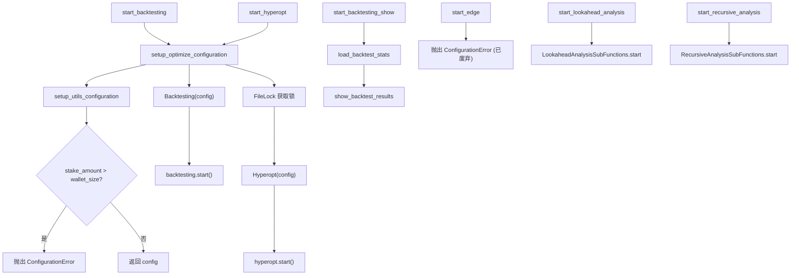

# optimize_commands.py

## 概述

`freqtrade/commands/optimize_commands.py` 提供策略优化和分析相关的 CLI 命令，是 Freqtrade 最核心的功能入口之一。包含回测（backtesting）、超参数优化（hyperopt）、前瞻偏差分析（lookahead-analysis）、递归分析（recursive-analysis）以及 Edge（已废弃）等功能的启动入口。对应 `freqtrade backtesting`、`freqtrade hyperopt`、`freqtrade backtesting-show`、`freqtrade lookahead-analysis`、`freqtrade recursive-analysis` 等子命令。

## 架构图

## 核心类/函数

### setup_optimize_configuration(args: dict[str, Any], method: RunMode) -> dict[str, Any]

优化模块通用的配置准备函数。

- **参数**：
  - `args` — CLI 参数字典
  - `method` — 运行模式（`RunMode.BACKTEST` 或 `RunMode.HYPEROPT`）
- **返回值**：配置字典
- **职责**：
  1. 调用 `setup_utils_configuration` 初始化配置
  2. 对回测和超参数优化模式，验证 `stake_amount` 不超过可用钱包余额
  3. 钱包余额计算公式：`dry_run_wallet * tradable_balance_ratio`
  4. 如果 `stake_amount` 为 `unlimited` 则跳过验证
- **异常**：起始余额小于 `stake_amount` 时抛出 `ConfigurationError`

### start_backtesting(args: dict[str, Any]) -> None

启动回测的入口函数（对应 `freqtrade backtesting`）。

- **职责**：
  1. 调用 `setup_optimize_configuration` 以 `RunMode.BACKTEST` 初始化配置
  2. 创建 `Backtesting` 实例并调用 `start()`
- **关键逻辑**：`Backtesting` 模块在函数内部导入，避免启动时加载不必要的依赖

### start_backtesting_show(args: dict[str, Any]) -> None

显示历史回测结果（对应 `freqtrade backtesting-show`）。

- **职责**：
  1. 以 `RunMode.UTIL_NO_EXCHANGE` 模式初始化配置
  2. 调用 `load_backtest_stats` 从文件加载回测结果
  3. 调用 `show_backtest_results` 展示详细结果
  4. 调用 `show_sorted_pairlist` 显示排序后的交易对列表

### start_hyperopt(args: dict[str, Any]) -> None

启动超参数优化的入口函数（对应 `freqtrade hyperopt`）。

- **职责**：
  1. 导入 `filelock` 和 `Hyperopt`（如果缺少依赖则抛出 `OperationalException`）
  2. 调用 `setup_optimize_configuration` 以 `RunMode.HYPEROPT` 初始化配置
  3. 使用 `FileLock` 确保同一时间只有一个 Hyperopt 实例运行
  4. 降低 `hyperopt.tpe` 和 `filelock` 的日志级别以减少噪音
  5. 创建 `Hyperopt` 实例并调用 `start()`
- **关键逻辑**：
  - 文件锁防止多个 Hyperopt 进程同时运行（Hyperopt 是资源密集型操作）
  - 锁超时（1秒）后友好提示用户

### start_edge(args: dict[str, Any]) -> None

Edge 模块入口（已废弃，对应 `freqtrade edge`）。

- **职责**：直接抛出 `ConfigurationError`，告知用户 Edge 模块已在 2023.9 废弃并在 2025.6 移除

### start_lookahead_analysis(args: dict[str, Any]) -> None

启动前瞻偏差分析（对应 `freqtrade lookahead-analysis`）。

- **职责**：
  1. 以 `RunMode.UTIL_NO_EXCHANGE` 模式初始化配置
  2. 调用 `LookaheadAnalysisSubFunctions.start(config)` 执行分析
- **用途**：检测策略中是否存在前瞻偏差（look-ahead bias），即使用了未来数据

### start_recursive_analysis(args: dict[str, Any]) -> None

启动递归公式分析（对应 `freqtrade recursive-analysis`）。

- **职责**：
  1. 以 `RunMode.UTIL_NO_EXCHANGE` 模式初始化配置
  2. 调用 `RecursiveAnalysisSubFunctions.start(config)` 执行分析
- **用途**：检测策略中是否存在递归公式问题

## 依赖关系

### 内部依赖（本项目模块）
- `freqtrade.constants` — `UNLIMITED_STAKE_AMOUNT`
- `freqtrade.enums.RunMode` — 运行模式枚举
- `freqtrade.exceptions` — `ConfigurationError`, `OperationalException`
- `freqtrade.configuration.setup_utils_configuration` — 配置初始化（延迟导入）
- `freqtrade.util` — `fmt_coin`, `get_dry_run_wallet`（延迟导入）
- `freqtrade.optimize.backtesting.Backtesting` — 回测引擎（延迟导入）
- `freqtrade.optimize.hyperopt.Hyperopt` — 超参数优化引擎（延迟导入）
- `freqtrade.data.btanalysis.load_backtest_stats` — 加载回测统计（延迟导入）
- `freqtrade.optimize.optimize_reports` — `show_backtest_results`, `show_sorted_pairlist`（延迟导入）
- `freqtrade.optimize.analysis.lookahead_helpers.LookaheadAnalysisSubFunctions` — 前瞻分析（延迟导入）
- `freqtrade.optimize.analysis.recursive_helpers.RecursiveAnalysisSubFunctions` — 递归分析（延迟导入）

### 外部依赖（第三方库）
- `logging` — 标准库，日志记录
- `filelock` — 文件锁库，确保 Hyperopt 单实例运行（延迟导入，可选依赖）

### 被依赖（谁引用了本文件）
- `freqtrade.commands.__init__` — 导出 `start_backtesting`, `start_backtesting_show`, `start_edge`, `start_hyperopt`, `start_lookahead_analysis`, `start_recursive_analysis`
- `tests/optimize/test_backtesting.py` — 导入 `setup_optimize_configuration`, `start_backtesting`
- `tests/optimize/test_hyperopt.py` — 导入 `setup_optimize_configuration`, `start_hyperopt`
- `tests/optimize/test_lookahead_analysis.py` — 导入 `start_lookahead_analysis`
- `tests/optimize/test_recursive_analysis.py` — 导入 `start_recursive_analysis`
- `tests/freqai/test_freqai_backtesting.py` — 导入 `setup_optimize_configuration`
- `tests/data/test_entryexitanalysis.py` — 导入 `start_backtesting`
