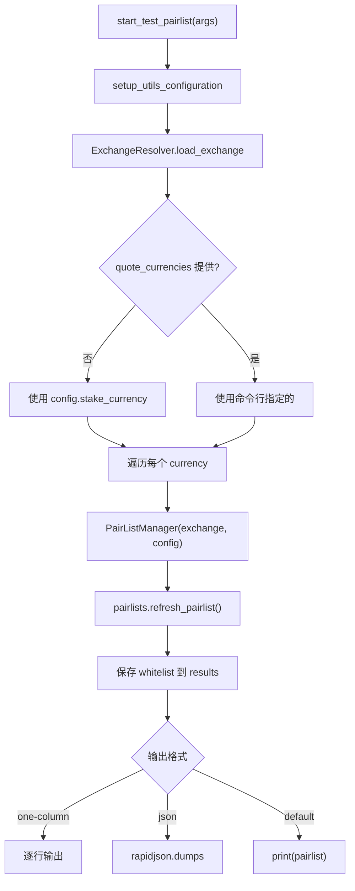

# pairlist_commands.py

## 概述

`freqtrade/commands/pairlist_commands.py` 提供交易对列表配置测试功能，对应 `freqtrade test-pairlist` 子命令。该命令允许用户在不启动交易的情况下验证其 pairlist 配置是否正确，并查看最终生成的交易对列表。支持同时测试多个报价币种（quote currencies）。

## 架构图

## 核心类/函数

### start_test_pairlist(args: dict[str, Any]) -> None

交易对列表测试的入口函数。

- **参数**：`args` — CLI 参数字典
- **返回值**：`None`
- **职责**：
  1. 以 `RunMode.UTIL_EXCHANGE` 模式初始化配置（需要交易所连接）
  2. 加载交易所实例（`validate=False`，不进行完整验证）
  3. 确定要测试的报价币种列表：
     - 如果命令行指定了 `--quote`，使用指定值
     - 否则使用配置中的 `stake_currency`
  4. 在 `FtNoDBContext` 上下文中运行（不需要数据库）
  5. 对每个报价币种：
     - 临时设置 `config["stake_currency"]` 为当前币种
     - 创建 `PairListManager` 实例
     - 调用 `refresh_pairlist()` 刷新交易对列表
     - 保存白名单结果
  6. 按指定格式输出结果：
     - `--one-column`：每行一个交易对
     - `--print-json`：JSON 格式
     - 默认：Python 列表格式

- **关键逻辑**：
  - 使用 `FtNoDBContext` 避免数据库初始化开销
  - 支持多报价币种批量测试

## 依赖关系

### 内部依赖（本项目模块）
- `freqtrade.enums.RunMode` — 运行模式枚举
- `freqtrade.configuration.setup_utils_configuration` — 配置初始化（延迟导入）
- `freqtrade.persistence.FtNoDBContext` — 无数据库上下文管理器（延迟导入）
- `freqtrade.plugins.pairlistmanager.PairListManager` — 交易对列表管理器（延迟导入）
- `freqtrade.resolvers.ExchangeResolver` — 交易所解析器（延迟导入）

### 外部依赖（第三方库）
- `logging` — 标准库，日志记录
- `rapidjson` — 高性能 JSON 序列化库

### 被依赖（谁引用了本文件）
- `freqtrade.commands.__init__` — 导出 `start_test_pairlist`
