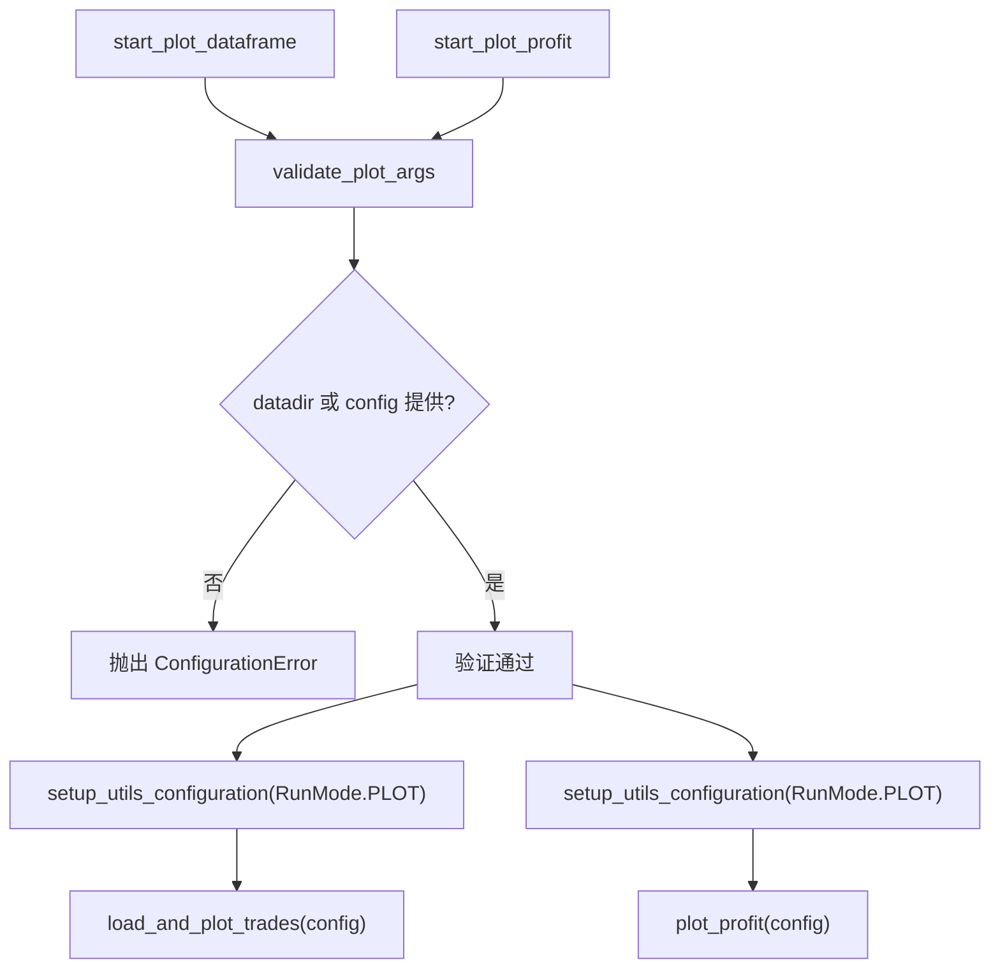

# plot_commands.py

## 概述

`freqtrade/commands/plot_commands.py` 提供数据可视化相关的 CLI 命令，包含 K 线图绘制和利润图绘制功能。对应 `freqtrade plot-dataframe` 和 `freqtrade plot-profit` 两个子命令。该文件还包含一个公共参数验证函数。所有绘图依赖（plotly 等）均采用延迟导入策略。

## 架构图

## 核心类/函数

### validate_plot_args(args: dict[str, Any]) -> None

绘图参数验证函数。

- **参数**：`args` — CLI 参数字典
- **职责**：验证 `--datadir` 和 `--config` 至少提供一个
- **异常**：两者都未提供时抛出 `ConfigurationError`

### start_plot_dataframe(args: dict[str, Any]) -> None

K 线数据绘图的入口函数（对应 `freqtrade plot-dataframe`）。

- **参数**：`args` — CLI 参数字典
- **返回值**：`None`
- **职责**：
  1. 调用 `validate_plot_args` 验证参数
  2. 以 `RunMode.PLOT` 模式初始化配置
  3. 调用 `load_and_plot_trades(config)` 加载数据并生成交互式 K 线图
- **生成内容**：包含 OHLCV K 线、买卖信号、自定义指标的交互式 HTML 图表

### start_plot_profit(args: dict[str, Any]) -> None

利润图绘制的入口函数（对应 `freqtrade plot-profit`）。

- **参数**：`args` — CLI 参数字典
- **返回值**：`None`
- **职责**：
  1. 调用 `validate_plot_args` 验证参数
  2. 以 `RunMode.PLOT` 模式初始化配置
  3. 调用 `plot_profit(config)` 生成利润曲线图
- **生成内容**：显示策略利润随时间变化的交互式 HTML 图表

## 依赖关系

### 内部依赖（本项目模块）
- `freqtrade.enums.RunMode` — 运行模式枚举
- `freqtrade.exceptions.ConfigurationError` — 配置异常
- `freqtrade.configuration.setup_utils_configuration` — 配置初始化（延迟导入）
- `freqtrade.plot.plotting` — `load_and_plot_trades`, `plot_profit`（延迟导入）

### 外部依赖（第三方库）
无直接依赖（绘图库 plotly 等在 `freqtrade.plot.plotting` 中按需加载）

### 被依赖（谁引用了本文件）
- `freqtrade.commands.__init__` — 导出 `start_plot_dataframe`, `start_plot_profit`
- `tests/test_plotting.py` — 导入并测试绘图命令
