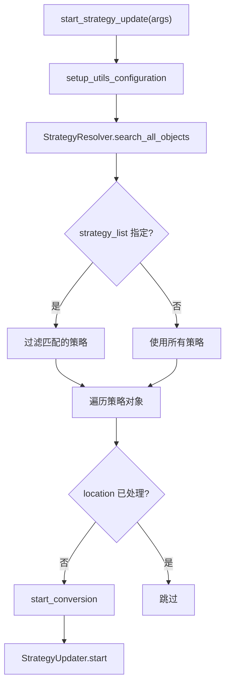

# strategy_utils_commands.py

## 概述

`freqtrade/commands/strategy_utils_commands.py` 提供策略文件更新功能，对应 `freqtrade strategy-updater` 子命令。该命令用于将使用旧版 API 编写的策略文件自动迁移到当前版本的 API 格式。支持批量处理所有策略或通过 `--strategy-list` 指定特定策略。

## 架构图

## 核心类/函数

### start_strategy_update(args: dict[str, Any]) -> None

策略更新脚本的入口函数。

- **参数**：`args` — CLI 参数字典
- **返回值**：`None`
- **职责**：
  1. 以 `RunMode.UTIL_NO_EXCHANGE` 模式初始化配置
  2. 调用 `StrategyResolver.search_all_objects` 搜索所有策略文件（`enum_failed=False` 表示不列出加载失败的策略）
  3. 如果指定了 `--strategy-list`，按名称过滤策略
  4. 使用 `processed_locations` 集合去重（同一文件可能包含多个策略类，避免重复处理）
  5. 对每个未处理的策略调用 `start_conversion`
- **关键逻辑**：支持 `--recursive-strategy-search` 递归搜索子目录

### start_conversion(strategy_obj, config) -> None

执行单个策略文件的转换。

- **参数**：
  - `strategy_obj` — 策略对象字典（包含 `name`, `location` 等键）
  - `config` — 配置字典
- **职责**：
  1. 创建 `StrategyUpdater` 实例
  2. 记录开始时间
  3. 调用 `instance_strategy_updater.start(config, strategy_obj)` 执行更新
  4. 输出转换耗时

## 依赖关系

### 内部依赖（本项目模块）
- `freqtrade.enums.RunMode` — 运行模式枚举
- `freqtrade.configuration.setup_utils_configuration` — 配置初始化（延迟导入）
- `freqtrade.resolvers.StrategyResolver` — 策略解析器（延迟导入）
- `freqtrade.strategy.strategyupdater.StrategyUpdater` — 策略更新器（延迟导入）

### 外部依赖（第三方库）
- `logging` — 标准库，日志记录
- `time` — 标准库，性能计时
- `pathlib.Path` — 标准库，路径处理

### 被依赖（谁引用了本文件）
- `freqtrade.commands.__init__` — 导出 `start_strategy_update`
- `tests/test_strategy_updater.py` — 导入 `start_strategy_update` 进行测试
