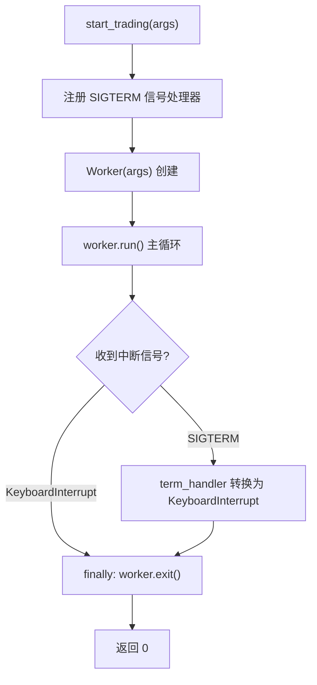

# trade_commands.py

## 概述

`freqtrade/commands/trade_commands.py` 是 Freqtrade 实盘/模拟交易模式的入口点，对应 `freqtrade trade` 子命令。这是整个 Freqtrade 系统最核心的命令——启动交易机器人。该文件非常简洁，核心逻辑委托给 `Worker` 类处理，同时实现了优雅的信号处理机制。

## 架构图

## 核心类/函数

### start_trading(args: dict[str, Any]) -> int

交易模式的主入口函数。

- **参数**：`args` — CLI 参数字典
- **返回值**：`int` — 退出码（正常退出返回 0）
- **职责**：
  1. 定义 `term_handler` 信号处理器，将 SIGTERM 转换为 `KeyboardInterrupt`
  2. 注册 `signal.SIGTERM` 信号处理器（支持 systemd 等进程管理器的优雅停止）
  3. 创建 `Worker` 实例并调用 `run()` 启动主循环
  4. `finally` 块确保无论何种退出方式（正常退出、Ctrl-C、SIGTERM）都会调用 `worker.exit()` 进行清理
- **关键逻辑**：
  - `Worker` 模块在函数内部导入，避免在其他命令（如 backtesting）启动时加载交易相关依赖
  - SIGTERM 被转换为 KeyboardInterrupt，使得两种退出方式共用同一套清理逻辑
  - `worker.exit()` 负责关闭交易所连接、保存状态等清理工作

### term_handler(signum, frame) (局部函数)

SIGTERM 信号处理器。

- **职责**：将系统 SIGTERM 信号转换为 Python `KeyboardInterrupt` 异常
- **用途**：使 systemd `systemctl stop` 等操作能触发优雅关闭流程

## 依赖关系

### 内部依赖（本项目模块）
- `freqtrade.worker.Worker` — 交易工作进程类（延迟导入）

### 外部依赖（第三方库）
- `logging` — 标准库，日志记录
- `signal` — 标准库，信号处理（SIGTERM）

### 被依赖（谁引用了本文件）
- `freqtrade.commands.__init__` — 导出 `start_trading`
- `freqtrade.commands.arguments` — 在 `_build_subcommands` 中绑定到 `trade` 子命令
