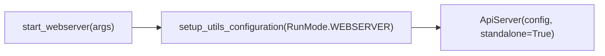

# webserver_commands.py

## 概述

`freqtrade/commands/webserver_commands.py` 提供独立 Web 服务器模式的入口，对应 `freqtrade webserver` 子命令。该命令启动一个独立的 API 服务器（不绑定交易机器人），可用于查看回测结果、管理配置等 Web 界面操作。文件非常简洁，仅包含一个入口函数。

## 架构图

## 核心类/函数

### start_webserver(args: dict[str, Any]) -> None

独立 Web 服务器的入口函数。

- **参数**：`args` — CLI 参数字典
- **返回值**：`None`
- **职责**：
  1. 以 `RunMode.WEBSERVER` 模式初始化配置
  2. 创建 `ApiServer` 实例，`standalone=True` 表示独立模式（不与交易机器人关联）
- **关键逻辑**：
  - 独立模式下，ApiServer 自行管理生命周期
  - 配置中的 `api_server` 部分决定监听地址、端口、认证信息等

## 依赖关系

### 内部依赖（本项目模块）
- `freqtrade.enums.RunMode` — 运行模式枚举
- `freqtrade.configuration.setup_utils_configuration` — 配置初始化（延迟导入）
- `freqtrade.rpc.api_server.ApiServer` — API 服务器类（延迟导入）

### 外部依赖（第三方库）
无

### 被依赖（谁引用了本文件）
- `freqtrade.commands.__init__` — 导出 `start_webserver`
- `freqtrade.commands.arguments` — 在 `_build_subcommands` 中绑定到 `webserver` 子命令
