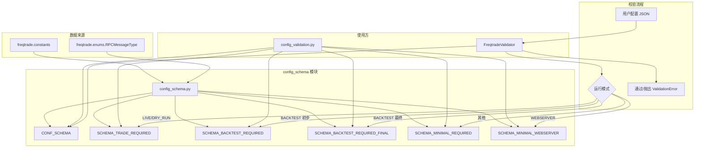
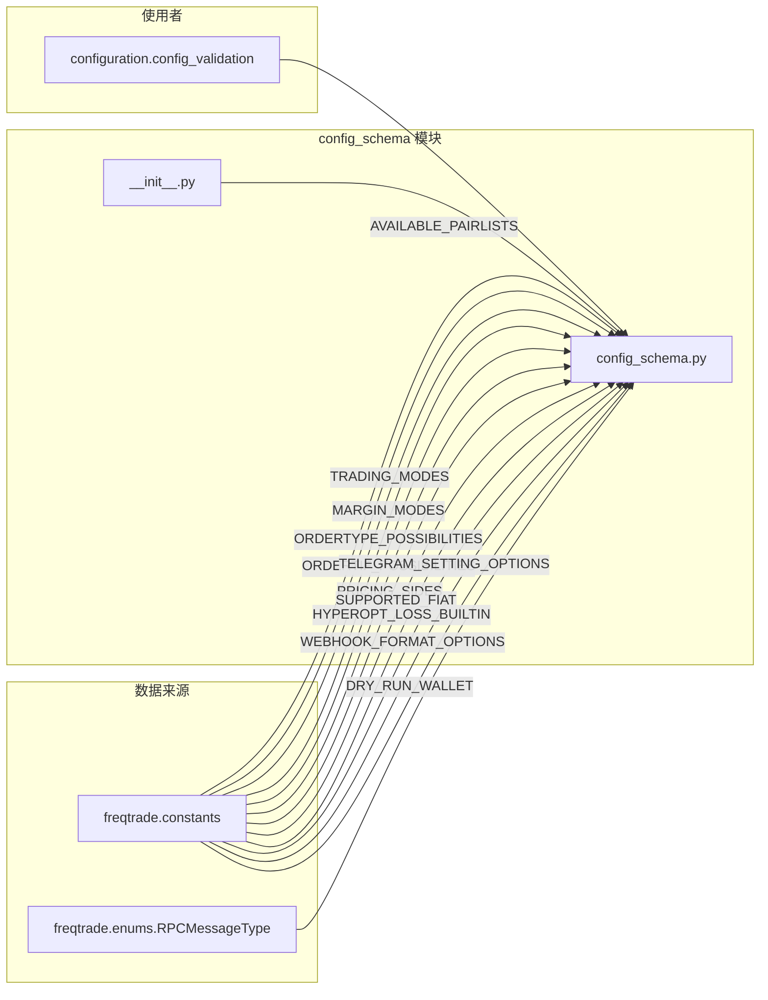
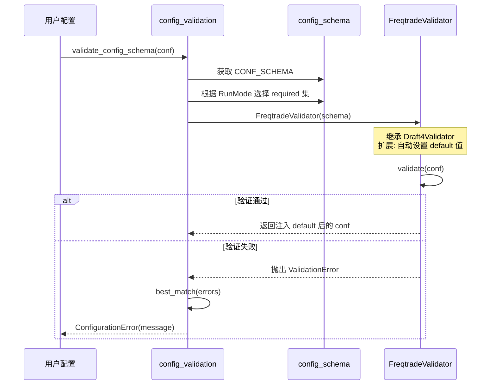

# Freqtrade 配置 Schema 定义模块源码文档

## 1. 模块概述

`freqtrade/config_schema/` 模块定义了 Freqtrade 配置文件的完整 JSON Schema。该 Schema 用于:
- 验证用户提供的配置文件的结构和类型正确性
- 为配置项提供默认值(通过自定义的 `FreqtradeValidator` 自动注入)
- 为 IDE/编辑器提供自动补全和提示信息(每个字段都包含 `description`)
- 根据不同运行模式(Trading/Backtesting/Webserver)定义不同的必填字段集

该模块是 Freqtrade 配置体系的"合同层",定义了系统能接受的所有合法配置项及其约束条件。

## 2. 目录结构

| 文件 | 功能说明 |
|------|---------|
| `__init__.py` | 模块入口,导出 `CONF_SCHEMA` 供外部使用 |
| `config_schema.py` | Schema 定义主文件,包含 `CONF_SCHEMA` 字典和各运行模式的 required 字段列表 |

## 3. 架构图



## 4. 核心类/函数说明

### 4.1 `CONF_SCHEMA` - 主配置 Schema

`CONF_SCHEMA` 是一个标准的 JSON Schema 对象(Draft 4),`type` 为 `"object"`。它包含了 Freqtrade 所有可配置项的定义。以下按功能分组说明各配置块:

#### 4.1.1 基础交易参数

| Schema 键 | 类型 | 默认值 | 约束 | 描述 |
|-----------|------|--------|------|------|
| `max_open_trades` | integer/number | - | minimum: -1 | 最大同时开仓数量,-1 为无限制 |
| `timeframe` | string | - | - | K 线时间周期(如 `1m`, `5m`, `1h`) |
| `stake_currency` | string | - | - | 计价货币(如 USDT, BTC) |
| `stake_amount` | number/string | - | minimum: 0.0001, pattern: "unlimited" | 每笔交易的 stake 金额 |
| `tradable_balance_ratio` | number | 0.99 | 0.0 ~ 1.0 | 可用于交易的余额比例 |
| `available_capital` | number | - | minimum: 0 | 可用交易资本总额 |
| `amend_last_stake_amount` | boolean | false | - | 是否调整最后一笔 stake 金额 |
| `last_stake_amount_min_ratio` | number | 0.5 | 0.0 ~ 1.0 | 最后一笔 stake 的最小比例 |
| `dry_run` | boolean | - | - | 是否启用模拟模式 |
| `dry_run_wallet` | number/object | 1000 | - | 模拟模式初始余额,支持多币种对象 |

#### 4.1.2 止损与追踪止损

| Schema 键 | 类型 | 约束 | 描述 |
|-----------|------|------|------|
| `stoploss` | number | maximum: 0 (exclusive) | 止损比例(负数,如 -0.1 表示 10%) |
| `trailing_stop` | boolean | - | 启用追踪止损 |
| `trailing_stop_positive` | number | 0 ~ 1 | 追踪止损的正向偏移量 |
| `trailing_stop_positive_offset` | number | 0 ~ 1 | 触发追踪止损的最小利润 |
| `trailing_only_offset_is_reached` | boolean | - | 仅在达到 offset 后启用追踪止损 |
| `minimal_roi` | object | patternProperties: "^[0-9.]+$" | 最小 ROI 表,键为分钟数,值为收益比例 |

#### 4.1.3 定价配置

`entry_pricing` 和 `exit_pricing` 子对象:

| 子键 | 类型 | 默认值 | 描述 |
|------|------|--------|------|
| `price_side` | string (enum) | "same" | 使用的价格侧: ask/bid/same/other |
| `price_last_balance` | number | - | 最新价格的权重(0~1) |
| `use_order_book` | boolean | - | 是否使用 Order Book 定价 |
| `order_book_top` | integer | - | Order Book 深度(1~50) |
| `check_depth_of_market` | object | - | 市场深度检查(enabled + bids_to_ask_delta) |

#### 4.1.4 订单配置

`order_types` 子对象:

| 子键 | 类型 | 可选值 | 描述 |
|------|------|--------|------|
| `entry` | string | limit/market | 入场订单类型 |
| `exit` | string | limit/market | 出场订单类型 |
| `emergency_exit` | string | limit/market | 紧急退出订单类型 |
| `force_exit` | string | limit/market | 强制退出订单类型 |
| `force_entry` | string | limit/market | 强制入场订单类型 |
| `stoploss` | string | limit/market | 止损订单类型 |
| `stoploss_on_exchange` | boolean | - | 是否在交易所设置止损 |
| `stoploss_price_type` | string | last/mark/index | 止损价格类型(Futures) |
| `stoploss_on_exchange_interval` | number | - | 止损订单刷新间隔(秒) |
| `stoploss_on_exchange_limit_ratio` | number | 0~1 | 止损限价订单的价格偏移比例 |

`order_time_in_force` 子对象:

| 子键 | 类型 | 可选值 |
|------|------|--------|
| `entry` | string | GTC/FOK/IOC/PO(及小写形式) |
| `exit` | string | GTC/FOK/IOC/PO(及小写形式) |

`unfilledtimeout` 子对象:

| 子键 | 类型 | 描述 |
|------|------|------|
| `entry` | number | 入场订单超时时间 |
| `exit` | number | 出场订单超时时间 |
| `exit_timeout_count` | number (default: 0) | 退出重试次数 |
| `unit` | string (default: "minutes") | 超时单位(minutes/seconds) |

#### 4.1.5 交易所配置

`exchange` 子对象:

| 子键 | 类型 | 描述 |
|------|------|------|
| `name` | string | 交易所名称 |
| `key` | string | API Key |
| `secret` | string | API Secret |
| `password` | string | API Password(部分交易所) |
| `uid` | string | 用户 ID |
| `pair_whitelist` | array | 交易对白名单 |
| `pair_blacklist` | array | 交易对黑名单 |
| `ccxt_config` | object | ccxt 全局配置 |
| `ccxt_sync_config` | object | ccxt 同步配置 |
| `ccxt_async_config` | object | ccxt 异步配置 |
| `outdated_offset` | integer (default: 300) | 数据过期偏移(秒) |
| `markets_refresh_interval` | integer (default: 3600) | 市场数据刷新间隔(秒) |
| `unknown_fee_rate` | number | 未知手续费率 |
| `skip_open_order_update` | boolean | 跳过启动时的订单更新 |
| `use_public_trades` | boolean | 使用公共交易数据 |

#### 4.1.6 Pairlist 配置

`pairlists` 是一个对象数组,每个对象包含:

| 子键 | 类型 | 描述 |
|------|------|------|
| `method` | string (enum) | Pairlist 方法名(16 种内置方法) |

支持的内置 Pairlist 方法:
- **生成器**: StaticPairList, VolumePairList, PercentChangePairList, ProducerPairList, RemotePairList, MarketCapPairList, CrossMarketPairList
- **过滤器**: AgeFilter, DelistFilter, FullTradesFilter, OffsetFilter, PerformanceFilter, PrecisionFilter, PriceFilter, RangeStabilityFilter, ShuffleFilter, SpreadFilter, VolatilityFilter

#### 4.1.7 Telegram 配置

`telegram` 子对象:

| 子键 | 类型 | 描述 |
|------|------|------|
| `enabled` | boolean | 是否启用 Telegram |
| `token` | string | Bot Token |
| `chat_id` | string | Chat ID |
| `allow_custom_messages` | boolean (default: true) | 允许策略发送自定义消息 |
| `balance_dust_level` | number (default: 0.0) | 余额粉尘阈值 |
| `notification_settings` | object | 通知设置(每种消息类型的开关) |
| `reload` | boolean | 支持 `/reload` 命令 |
| `force_enter` | boolean | 支持强制入场命令 |

#### 4.1.8 API Server 配置

`api_server` 子对象:

| 子键 | 类型 | 默认值 | 描述 |
|------|------|--------|------|
| `enabled` | boolean | false | 是否启用 API 服务器 |
| `listen_ip_address` | string | "127.0.0.1" | 监听 IP 地址 |
| `listen_port` | integer | 8080 | 监听端口(1024~65535) |
| `verbosity` | string | "error" | API 日志级别 |
| `enable_openapi` | boolean | false | 启用 OpenAPI 文档 |
| `jwt_secret_key` | string | - | JWT 密钥 |
| `ws_token` | string/array | - | WebSocket 认证 Token |
| `CORS_origins` | array | - | CORS 允许的源列表 |
| `username` | string | - | 用户名 |
| `password` | string | - | 密码 |

#### 4.1.9 Futures 特定配置

| Schema 键 | 类型 | 描述 |
|-----------|------|------|
| `trading_mode` | string (enum: spot/margin/futures) | 交易模式 |
| `margin_mode` | string (enum: cross/isolated/"") | 保证金模式 |
| `liquidation_buffer` | number (0~0.99) | 清算缓冲比例 |
| `proxy_coin` | string | 代理币种(如 BNFCR) |

#### 4.1.10 FreqAI 配置

`freqai` 子对象包含:

| 子键 | 类型 | 描述 |
|------|------|------|
| `enabled` | boolean | 是否启用 FreqAI |
| `keras` | boolean | 使用 Keras 框架 |
| `conv_width` | integer | 卷积宽度 |
| `train_period_days` | integer | 训练周期(天) |
| `backtest_period_days` | number | 回测周期(天) |
| `identifier` | string | 模型标识符 |
| `feature_parameters` | object | 特征参数(含 include_timeframes、indicator_periods 等) |
| `data_split_parameters` | object | 数据分割参数 |
| `model_training_parameters` | object | 模型训练参数 |
| `rl_config` | object | 强化学习配置 |

#### 4.1.11 Hyperopt 配置

| Schema 键 | 类型 | 默认值 | 描述 |
|-----------|------|--------|------|
| `hyperopt_path` | string | - | Hyperopt Loss 函数路径 |
| `epochs` | integer | - | 训练轮数(minimum: 1) |
| `early_stop` | integer | - | 早停轮数(0 禁用) |
| `spaces` | array | ["default"] | 优化空间 |
| `hyperopt_jobs` | integer | -1 | 并行工作进程数 |
| `hyperopt_random_state` | integer | - | 随机种子 |
| `hyperopt_min_trades` | integer | - | 最小交易数 |
| `hyperopt_loss` | string | - | 损失函数名 |

### 4.2 Required 字段集

不同运行模式需要不同的必填字段:

#### `SCHEMA_TRADE_REQUIRED` (Live/Dry-run 交易模式)

```python
SCHEMA_TRADE_REQUIRED = [
    "exchange",
    "max_open_trades",
    "stake_currency",
    "stake_amount",
    "tradable_balance_ratio",
    "last_stake_amount_min_ratio",
    "dry_run",
    "dry_run_wallet",
    "exit_pricing",
    "entry_pricing",
    "cancel_open_orders_on_exit",
]
```

#### `SCHEMA_BACKTEST_REQUIRED` (初步回测校验)

```python
SCHEMA_BACKTEST_REQUIRED = [
    "exchange",
    "stake_currency",
    "stake_amount",
    "dry_run_wallet",
    "dry_run",
]
```

#### `SCHEMA_BACKTEST_REQUIRED_FINAL` (最终回测校验 - 包含策略设置)

```python
SCHEMA_BACKTEST_REQUIRED_FINAL = SCHEMA_BACKTEST_REQUIRED + [
    "stoploss",
    "minimal_roi",
    "max_open_trades",
]
```

#### `SCHEMA_MINIMAL_REQUIRED` (工具命令)

```python
SCHEMA_MINIMAL_REQUIRED = ["exchange"]
```

#### `SCHEMA_MINIMAL_WEBSERVER` (Web 服务器)

```python
SCHEMA_MINIMAL_WEBSERVER = SCHEMA_MINIMAL_REQUIRED + ["api_server"]
```

### 4.3 `__MESSAGE_TYPE_DICT`

```python
__MESSAGE_TYPE_DICT: dict[str, dict[str, str]] = {x: {"type": "object"} for x in RPCMessageType}
```

为 Telegram notification_settings 中的每种 RPC 消息类型(如 `entry`, `exit`, `status` 等)生成 Schema 定义,用于支持为每种消息类型配置独立的通知行为(`on`/`off`/`silent`)。

## 5. 依赖关系



## 6. Schema 校验流程



## 7. Schema 特殊模式

### 7.1 `patternProperties`

Schema 中使用 `patternProperties` 来支持动态键名:
- `minimal_roi`: `"^[0-9.]+$"` - 允许数字键(分钟数作为键)
- `dry_run_wallet`: `"^[a-zA-Z0-9]+$"` - 允许多币种钱包配置

### 7.2 条件默认值

通过 `FreqtradeValidator` 扩展,Schema 中定义的 `default` 值会在验证时自动注入到配置字典中。例如:
- `tradable_balance_ratio` 默认 0.99
- `cancel_open_orders_on_exit` 默认 false
- `dry_run_wallet` 默认 1000

### 7.3 `description` 字段

每个 Schema 属性都包含 `description` 字段,提供:
- 配置项的用途说明
- 是否通常在 Strategy 中定义(标记 `__IN_STRATEGY`)
- 是否建议通过环境变量设置(标记 `__VIA_ENV`)
