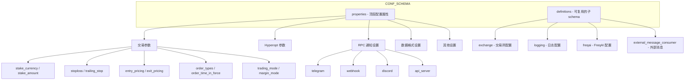

# config_schema/config_schema.py

## 概述
`freqtrade/config_schema/config_schema.py` 定义了 freqtrade 配置文件的完整 JSON Schema (`CONF_SCHEMA`)。这个 schema 描述了所有可配置选项的数据类型、取值范围、默认值、必填字段和嵌套结构。它是配置文件验证的权威规范，覆盖了交易参数、交易所设置、入场/出场定价、订单类型、止损、Hyperopt、Telegram/Webhook/Discord 通知、API Server、FreqAI、外部消息消费等全部配置维度。

## 架构图

## 核心数据结构

### CONF_SCHEMA
- **类型**: `dict` (JSON Schema 格式)
- **顶层结构**: `{ "type": "object", "properties": {...}, "definitions": {...} }`

### 顶层配置属性（properties）分类

#### 交易核心参数
| 配置项 | 类型 | 说明 |
|--------|------|------|
| `max_open_trades` | integer/number | 最大同时持仓数，-1 表示无限 |
| `timeframe` | string | K 线时间框架（如 1m, 5m, 1h） |
| `stake_currency` | string | 计价货币 |
| `stake_amount` | number/string | 单笔下注金额，支持 "unlimited" |
| `tradable_balance_ratio` | number | 可交易余额比例（0-1），默认 0.99 |
| `available_capital` | number | 可用资金总额 |
| `dry_run` | boolean | 是否启用模拟运行 |
| `dry_run_wallet` | number/object | 模拟钱包金额，默认 1000，支持多币种对象 |
| `trading_mode` | string | 交易模式: spot, margin, futures |
| `margin_mode` | string | 保证金模式: cross, isolated |
| `proxy_coin` | string | 代理币种（特定期货模式使用） |

#### 策略参数（通常在策略中指定）
| 配置项 | 类型 | 说明 |
|--------|------|------|
| `stoploss` | number | 止损比例（负数，如 -0.1 表示 10%） |
| `trailing_stop` | boolean | 是否启用追踪止损 |
| `trailing_stop_positive` | number | 追踪止损正偏移 |
| `trailing_stop_positive_offset` | number | 追踪止损激活偏移 |
| `minimal_roi` | object | 最小 ROI 配置（时间 -> 利润率映射） |
| `use_exit_signal` | boolean | 是否使用退出信号 |
| `exit_profit_only` | boolean | 仅在盈利时退出 |
| `position_adjustment_enable` | boolean | 是否启用仓位调整 |

#### 入场/出场定价
| 配置项 | 子属性 | 说明 |
|--------|--------|------|
| `entry_pricing` | `price_side`, `use_order_book`, `order_book_top`, `check_depth_of_market` | 入场定价策略 |
| `exit_pricing` | `price_side`, `use_order_book`, `order_book_top` | 出场定价策略 |
| `custom_price_max_distance_ratio` | - | 自定义价格与当前价格的最大偏离比例，默认 0.02 |

#### 订单配置
| 配置项 | 子属性 | 说明 |
|--------|--------|------|
| `order_types` | entry, exit, stoploss, stoploss_on_exchange, emergency_exit 等 | 各场景的订单类型 |
| `order_time_in_force` | entry, exit | 订单有效期策略 |
| `unfilledtimeout` | entry, exit, exit_timeout_count, unit | 未成交订单超时 |

#### Hyperopt 参数
| 配置项 | 类型 | 说明 |
|--------|------|------|
| `hyperopt_loss` | string | 损失函数类名 |
| `epochs` | integer | 训练 epoch 数 |
| `early_stop` | integer | 无改善时提前停止的 epoch 数 |
| `spaces` | array | 优化空间列表 |
| `hyperopt_jobs` | integer | 并行 worker 数，默认 -1（所有 CPU） |
| `hyperopt_random_state` | integer | 随机种子 |

#### RPC 通知
| 配置项 | 说明 |
|--------|------|
| `telegram` | Telegram 机器人设置（token, chat_id, notification_settings 等） |
| `webhook` | Webhook 通知（url, format, 各消息类型配置） |
| `discord` | Discord 通知（webhook_url, 自定义消息模板） |
| `api_server` | REST API 服务器（listen_ip, port, 认证, CORS, WebSocket） |

#### 数据与回测
| 配置项 | 类型 | 说明 |
|--------|------|------|
| `dataformat_ohlcv` | string | OHLCV 数据格式，默认 feather |
| `dataformat_trades` | string | 交易数据格式，默认 feather |
| `backtest_breakdown` | array | 回测分解维度 |
| `backtest_cache` | string | 回测结果缓存策略 |

#### 其他
| 配置项 | 说明 |
|--------|------|
| `pairlists` | 交易对列表配置（数组，每项指定 method） |
| `internals` | 内部设置（process_throttle_secs, sd_notify） |
| `orderflow` | 订单流分析设置 |
| `coingecko` | CoinGecko API 配置 |
| `bot_name` | Bot 名称 |
| `fee` | 自定义手续费（用于回测模拟滑点） |

### definitions（可复用子 schema）

#### exchange
交易所配置，包含：
- `name`: 交易所名称（必填）
- `key` / `secret` / `password` / `uid`: API 凭据（建议通过环境变量配置）
- `wallet_address` / `private_key`: DEX 交易所使用
- `pair_whitelist` / `pair_blacklist`: 交易对白名单/黑名单
- `ccxt_config` / `ccxt_async_config` / `ccxt_sync_config`: CCXT 底层配置
- `enable_ws`: 是否启用 WebSocket
- `log_responses`: 是否记录交易所响应
- `markets_refresh_interval`: 市场数据刷新间隔（默认 60 分钟）

#### logging
日志配置，遵循 Python `logging.config` 标准格式（version, formatters, handlers, root）

#### freqai
FreqAI 机器学习配置，包含：
- 训练参数: train_period_days, backtest_period_days, live_retrain_hours
- 特征工程: feature_parameters（相关交易对、时间框架、指标周期等）
- 数据拆分: data_split_parameters
- 模型训练: model_training_parameters
- 强化学习: rl_config（模型类型、策略类型、网络架构等）

#### external_message_consumer
外部消息消费者配置：
- `producers`: 生产者列表（name, host, port, ws_token）
- `wait_timeout` / `sleep_time` / `ping_timeout`: 连接超时设置
- `initial_candle_limit`: 初始 K 线数量限制（默认 1500）

### 必填字段列表

#### `SCHEMA_TRADE_REQUIRED` — 实盘/模拟交易必填
exchange, timeframe, max_open_trades, stake_currency, stake_amount, tradable_balance_ratio, last_stake_amount_min_ratio, dry_run, dry_run_wallet, exit_pricing, entry_pricing, stoploss, minimal_roi, pairlists, internals, dataformat_ohlcv, dataformat_trades

#### `SCHEMA_BACKTEST_REQUIRED` — 回测必填
exchange, stake_currency, stake_amount, pairlists, dry_run_wallet, dataformat_ohlcv, dataformat_trades

#### `SCHEMA_BACKTEST_REQUIRED_FINAL` — 回测最终必填
在 SCHEMA_BACKTEST_REQUIRED 基础上增加: stoploss, minimal_roi, max_open_trades

#### `SCHEMA_MINIMAL_REQUIRED` — 最小必填
exchange, dry_run, dataformat_ohlcv, dataformat_trades

#### `SCHEMA_MINIMAL_WEBSERVER` — Web 服务最小必填
在 SCHEMA_MINIMAL_REQUIRED 基础上增加: api_server

## 依赖关系

### 内部依赖（本项目模块）
- `freqtrade.constants` — 大量枚举列表和默认值：
  - AVAILABLE_DATAHANDLERS, AVAILABLE_PAIRLISTS, BACKTEST_BREAKDOWNS 等
  - TRADING_MODES, MARGIN_MODES, PRICING_SIDES 等
  - UNLIMITED_STAKE_AMOUNT, DRY_RUN_WALLET 等
- `freqtrade.enums.RPCMessageType` — 用于生成消息类型字典

### 外部依赖（第三方库）
- 无

### 被依赖（谁引用了本文件）
- `freqtrade.config_schema.__init__` — 重新导出 CONF_SCHEMA
- `freqtrade.configuration.config_validation` — 使用 CONF_SCHEMA 和 SCHEMA_*_REQUIRED 列表验证配置
- `build_helpers/extract_config_json_schema.py` — 提取 schema 生成文档
