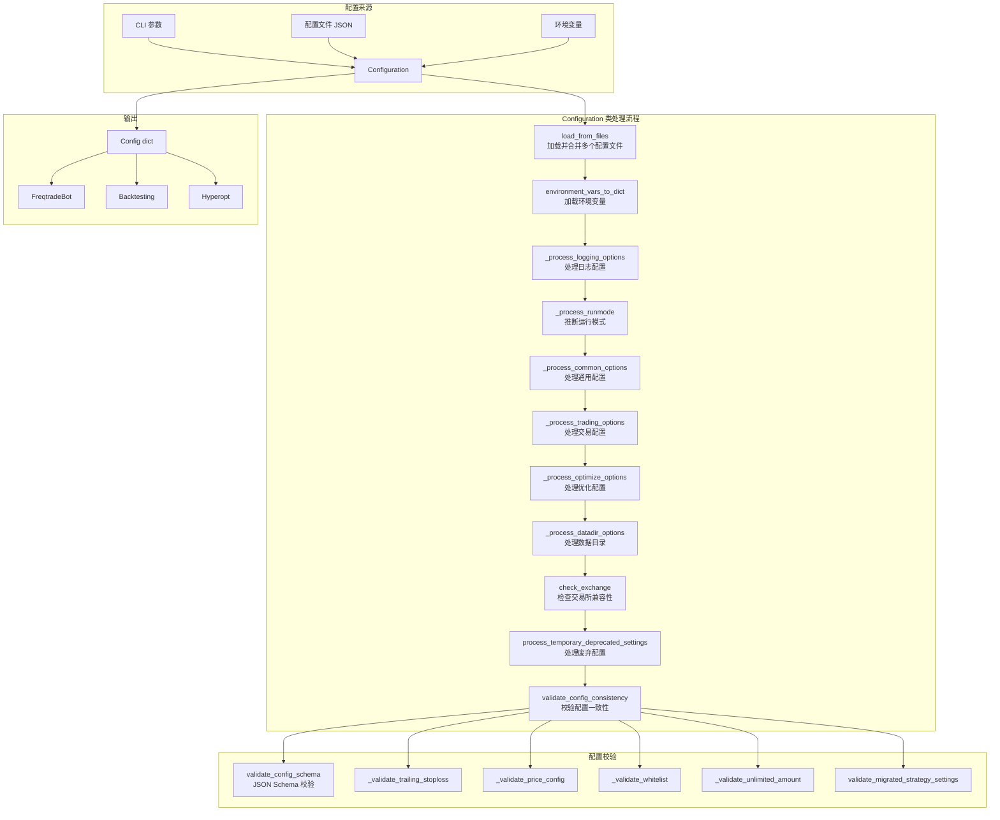
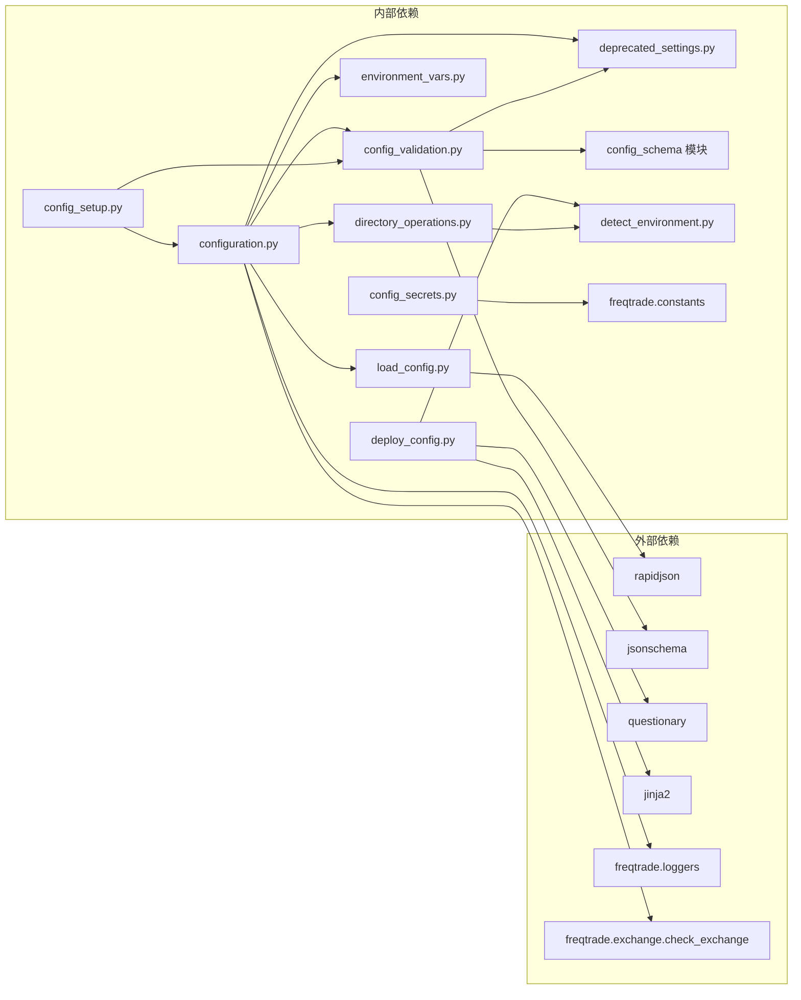
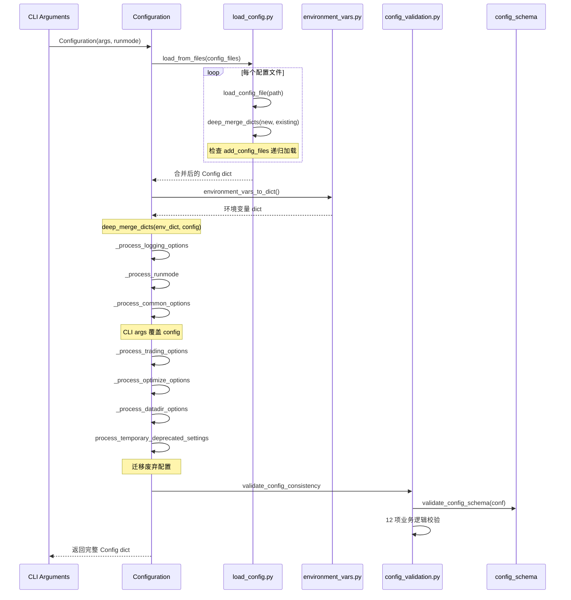

# Freqtrade 配置管理模块源码文档

## 1. 模块概述

`freqtrade/configuration/` 模块是 Freqtrade 配置系统的核心,负责从多个来源加载、合并、验证和处理配置信息。该模块实现了一套灵活的多层配置体系:

- **多文件合并**: 支持加载多个配置文件,后加载的配置覆盖先加载的(last definition wins)。
- **环境变量注入**: 支持通过 `FREQTRADE__` 前缀的环境变量覆盖配置项,适合容器化部署。
- **命令行参数覆盖**: CLI 参数具有最高优先级,可覆盖配置文件和环境变量中的设置。
- **JSON Schema 校验**: 使用 jsonschema 对配置进行严格的类型和约束校验。
- **废弃设置迁移**: 自动检测并迁移已废弃的配置项,保持向后兼容性。
- **敏感信息保护**: 在日志输出和配置展示时自动脱敏 API 密钥等敏感信息。

配置优先级(从高到低):
1. 命令行参数 (CLI Arguments)
2. 环境变量 (`FREQTRADE__*`)
3. 后加载的配置文件
4. 先加载的配置文件
5. JSON Schema 中的 default 值

## 2. 目录结构

| 文件 | 功能说明 |
|------|---------|
| `__init__.py` | 模块入口,导出核心类和函数:`Configuration`、`TimeRange`、`setup_utils_configuration`、`validate_config_consistency`、`sanitize_config`、`remove_exchange_credentials`、`running_in_docker` |
| `configuration.py` | 核心配置类 `Configuration`,实现配置加载、合并和处理的完整流程 |
| `config_setup.py` | 工具配置函数 `setup_utils_configuration`,为非交易命令(如 backtesting、list)准备配置 |
| `config_validation.py` | 配置验证函数集合,包括 JSON Schema 校验和业务逻辑一致性校验 |
| `config_secrets.py` | 敏感信息处理:配置脱敏 `sanitize_config` 和交易所凭证移除 `remove_exchange_credentials` |
| `load_config.py` | 配置文件加载器:支持 JSON 文件加载、多文件递归合并、stdin 读取 |
| `environment_vars.py` | 环境变量解析器:将 `FREQTRADE__SECTION__KEY` 格式的环境变量转换为嵌套字典 |
| `deprecated_settings.py` | 废弃配置处理:检测冲突、迁移旧配置、删除已移除设置 |
| `detect_environment.py` | 环境检测:判断是否运行在 Docker 容器中 |
| `directory_operations.py` | 目录管理:创建数据目录、用户目录结构和复制模板文件 |
| `timerange.py` | 时间范围类 `TimeRange`:解析和管理回测/数据下载的时间区间 |
| `deploy_config.py` | 配置部署:交互式创建新配置文件(使用 questionary + Jinja2 模板) |

## 3. 架构图



## 4. 核心类/函数说明

### 4.1 `Configuration` 类 (`configuration.py`)

```python
class Configuration:
    def __init__(self, args: dict[str, Any], runmode: RunMode | None = None) -> None:
    def get_config(self) -> Config:
    def load_config(self) -> dict[str, Any]:
    @staticmethod
    def from_files(files: list[str]) -> dict[str, Any]:
```

配置管理的核心类,设计特点:

- **惰性加载**: `get_config()` 采用懒初始化模式,首次调用时才执行 `load_config()`。
- **静态工厂方法**: `from_files()` 提供便捷的静态方法,适用于交互式环境(如 Jupyter Notebook)。
- **处理流水线**: `load_config()` 按固定顺序执行 8 个处理步骤,确保配置的完整性和一致性。

#### `_args_to_config` 方法

```python
def _args_to_config(self, config, argname, logstring, logfun=None, deprecated_msg=None):
```

CLI 参数到配置字典的映射通用方法:
- 仅当参数存在且非 None/False 时才写入配置
- 支持自定义日志格式函数(如 `logfun=len` 只打印长度)
- 支持废弃参数警告

#### `_process_datadir_options` 方法

目录配置处理逻辑:
1. 如果 CLI 指定了 exchange,更新配置中的 exchange name
2. 设置 `user_data_dir`(优先级: CLI > config > 默认 `cwd/user_data`)
3. 创建 `datadir`(默认为 `user_data/data/{exchange_name}`)
4. 处理 `--export-filename` 和 `--backtest-directory`(包含废弃警告)

#### `_resolve_pairs_list` 方法

交易对列表解析优先级:
1. `-p/--pairs` CLI 参数
2. `--pairs-file` 指定的文件
3. 配置文件中的 `exchange.pair_whitelist`
4. `datadir/pairs.json` 文件

### 4.2 `setup_utils_configuration` (`config_setup.py`)

```python
def setup_utils_configuration(args, method: RunMode, *, set_dry=True) -> dict[str, Any]:
```

为非交易模式(backtesting、hyperopt、list 等)准备配置的快捷函数:
- 创建 `Configuration` 实例并获取配置
- 默认强制设置 `dry_run = True`(通过 `set_dry` 参数控制)
- 执行初步配置验证(`preliminary=True`,使用宽松的 Schema)

### 4.3 配置验证 (`config_validation.py`)

#### `validate_config_schema`

```python
def validate_config_schema(conf: dict[str, Any], preliminary: bool = False) -> dict[str, Any]:
```

使用扩展的 JSON Schema Validator 验证配置:
- `FreqtradeValidator` 继承自 `Draft4Validator`,增加了自动设置 default 值的功能
- 根据 `RunMode` 选择不同的 required 字段集:
  - `TRADE_REQUIRED`: 交易模式(要求完整配置)
  - `BACKTEST_REQUIRED`: 回测模式(初步验证)
  - `BACKTEST_REQUIRED_FINAL`: 回测模式(最终验证,含策略配置)
  - `MINIMAL_WEBSERVER`: Web 服务器模式
  - `MINIMAL_REQUIRED`: 工具模式(最小配置)

#### `validate_config_consistency`

执行 12 项业务逻辑一致性校验:

| 校验函数 | 校验内容 |
|---------|---------|
| `_validate_trailing_stoploss` | Trailing Stoploss 参数一致性(offset > positive) |
| `_validate_price_config` | Market Order 时 price_side 必须是 "other" |
| `_validate_edge` | Edge 模块已废弃,禁止启用 |
| `_validate_whitelist` | StaticPairList 必须配置 pair_whitelist |
| `_validate_unlimited_amount` | max_open_trades 和 stake_amount 不能同时为 unlimited |
| `_validate_ask_orderbook` | order_book_min/max 废弃迁移 |
| `_validate_freqai_hyperopt` | FreqAI 不支持 analyze_per_epoch |
| `_validate_freqai_backtest` | FreqAI 回测参数组合校验 |
| `_validate_freqai_include_timeframes` | FreqAI 时间周期不能小于主时间周期 |
| `_validate_consumers` | External Message Consumer 配置校验 |
| `validate_migrated_strategy_settings` | 旧版策略设置迁移校验 |
| `_validate_orderflow` | Orderflow 配置必须与 public_trades 同时存在 |

### 4.4 配置文件加载 (`load_config.py`)

```python
def load_from_files(files: list[str], base_path=None, level=0) -> dict[str, Any]:
def load_config_file(path: str) -> dict[str, Any]:
def load_file(path: Path) -> dict[str, Any]:
```

关键特性:
- 使用 `rapidjson` 进行高性能 JSON 解析(支持注释和尾逗号)
- **递归配置加载**: 配置文件中可通过 `add_config_files` 字段引用其他配置文件(最大递归深度 5 层)
- **stdin 读取**: 当路径为 "-" 时,从标准输入读取配置(适合管道操作)
- 当没有配置文件时,返回 `MINIMAL_CONFIG` 默认最小配置
- 错误定位: `log_config_error_range` 在 JSON 解析错误时显示错误位置附近的 80 字符上下文

### 4.5 环境变量解析 (`environment_vars.py`)

```python
def environment_vars_to_dict() -> dict[str, Any]:
def _flat_vars_to_nested_dict(env_dict, prefix) -> dict[str, Any]:
def _get_var_typed(val):
```

环境变量命名规则:
- 前缀: `FREQTRADE__`
- 层级分隔: `__`(双下划线)
- 示例: `FREQTRADE__EXCHANGE__KEY` -> `{"exchange": {"key": "..."}}`

自动类型推断:
- 整数: `"123"` -> `123`
- 浮点数: `"1.5"` -> `1.5`
- 布尔值: `"true"/"t"` -> `True`, `"false"/"f"` -> `False`
- JSON 数组: `'["a","b"]'` -> `["a", "b"]`
- 其他保持字符串类型

特殊处理:
- `CHAT_ID` 和 `PASSWORD` 字段不进行类型转换(保持字符串)
- ccxt 配置键名保留原始大小写(其他键名一律小写化)

### 4.6 敏感信息管理 (`config_secrets.py`)

```python
_SENSITIVE_KEYS = [
    "exchange.key", "exchange.secret", "exchange.password",
    "exchange.private_key", "exchange.wallet_address",
    "telegram.token", "telegram.chat_id",
    "discord.webhook_url", "api_server.password", "webhook.url",
]

def sanitize_config(config, *, show_sensitive=False) -> Config:
def remove_exchange_credentials(exchange_config, dry_run) -> None:
```

两层敏感信息保护:
1. **`sanitize_config`**: 用于日志和 API 输出,将敏感字段替换为 "REDACTED"
2. **`remove_exchange_credentials`**: 在 Dry-run/Backtesting 模式下,从内存中移除交易所凭证(设为空字符串)

### 4.7 废弃配置处理 (`deprecated_settings.py`)

```python
def process_deprecated_setting(config, section_old, name_old, section_new, name_new):
def process_removed_setting(config, section1, name1, section2, name2):
def check_conflicting_settings(config, section_old, name_old, section_new, name_new):
def process_temporary_deprecated_settings(config):
```

三种废弃级别:
1. **冲突检测**: 新旧配置同时存在时抛出 `OperationalException`
2. **自动迁移**: 旧配置存在时自动迁移到新路径,并输出 DEPRECATED 警告
3. **已移除**: 旧配置存在时直接抛出 `ConfigurationError`

当前处理的废弃迁移:

| 旧配置路径 | 新配置路径 | 类型 |
|-----------|-----------|------|
| `ask_strategy.*` | `exit_pricing.*` | 自动迁移 |
| `bid_strategy.*` | `entry_pricing.*` | 自动迁移 |
| `order_types.buy/sell` | `order_types.entry/exit` | 自动迁移 |
| `unfilledtimeout.buy/sell` | `unfilledtimeout.entry/exit` | 自动迁移 |
| `telegram.notification_settings.buy/sell` | `.entry/exit` | 自动迁移 |
| `webhook.webhookbuy` | `webhook.webhookentry` | 自动迁移 |
| `forcebuy_enable` | `force_entry_enable` | 自动迁移 |
| `ticker_interval` | `timeframe` | 已移除(报错) |
| `protections` (config level) | Strategy level | 已移除(报错) |

### 4.8 `TimeRange` 类 (`timerange.py`)

```python
class TimeRange:
    def __init__(self, starttype=None, stoptype=None, startts=0, stopts=0):
    @classmethod
    def parse_timerange(cls, text: str | None) -> Self:
    def subtract_start(self, seconds: int) -> None:
    def adjust_start_if_necessary(self, timeframe_secs, startup_candles, min_date) -> None:
```

支持的时间范围格式:
- `YYYYMMDD-YYYYMMDD` (8 位日期)
- `TIMESTAMP-TIMESTAMP` (10 位 Unix 时间戳)
- `TIMESTAMP_MS-TIMESTAMP_MS` (13 位毫秒时间戳)
- 开放区间: `YYYYMMDD-` 或 `-YYYYMMDD`

关键方法:
- `subtract_start(seconds)`: 向前扩展时间范围(用于加载 startup candles)
- `adjust_start_if_necessary(...)`: 根据实际数据的最早日期和 startup_candles 数量自动调整起始时间

### 4.9 目录管理 (`directory_operations.py`)

```python
def create_userdata_dir(directory, create_dir=False) -> Path:
def create_datadir(config, datadir=None) -> Path:
def copy_sample_files(directory, overwrite=False) -> None:
def chown_user_directory(directory) -> None:
```

用户数据目录标准结构:
```
user_data/
  |- backtest_results/
  |- data/
  |- hyperopts/
  |- hyperopt_results/
  |- logs/
  |- notebooks/
  |- plot/
  |- strategies/
  |- freqaimodels/
```

Docker 环境下会自动使用 `sudo chown` 修正目录权限(通过 `chown_user_directory`)。

### 4.10 配置部署 (`deploy_config.py`)

```python
def ask_user_config() -> dict[str, Any]:
def deploy_new_config(config_path, selections) -> None:
```

交互式配置生成器:
- 使用 `questionary` 库提供交互式问答界面
- 条件显示(如只有在非 Dry-run 模式下才询问 API Key)
- 自动生成 JWT token 和 WebSocket token
- 根据交易所名称选择对应的 Jinja2 模板(每个交易所有独立的 exchange 配置模板)

## 5. 依赖关系



## 6. 数据流


