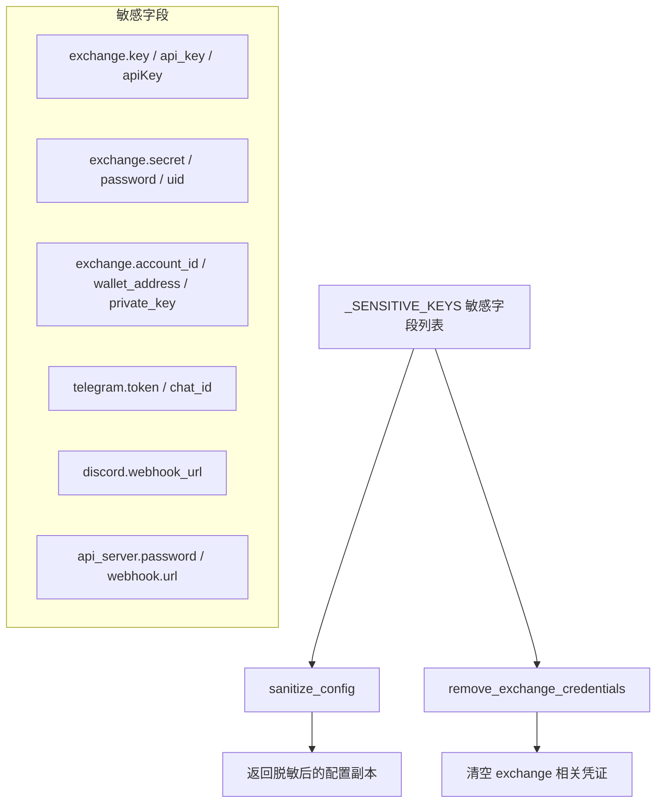

# config_secrets.py

## 概述

`freqtrade/configuration/config_secrets.py` 负责处理配置中的敏感信息（如交易所 API 密钥、Telegram token 等）。提供两个核心功能：脱敏配置（用于日志记录和展示）以及在 dry-run 模式下移除交易所凭证。

## 架构图

## 核心类/函数

### `_SENSITIVE_KEYS`

模块级常量，定义了所有被视为敏感信息的配置键路径列表。支持点号分隔的嵌套路径格式（如 `exchange.key`）。包含以下类别：

- **交易所凭证**：`exchange.key`, `exchange.api_key`, `exchange.apiKey`, `exchange.secret`, `exchange.password`, `exchange.uid`, `exchange.account_id`, `exchange.accountId`, `exchange.wallet_address`, `exchange.walletAddress`, `exchange.private_key`, `exchange.privateKey`
- **Telegram**：`telegram.token`, `telegram.chat_id`
- **Discord**：`discord.webhook_url`
- **API 服务器**：`api_server.password`
- **Webhook**：`webhook.url`

### `sanitize_config(config, *, show_sensitive=False) -> Config`

对配置字典进行脱敏处理，将所有敏感字段的值替换为 `"REDACTED"`。

- **参数**：
  - `config: Config` — 原始配置字典
  - `show_sensitive: bool` — 如果为 `True`，直接返回原始配置不做脱敏
- **返回值**：脱敏后的配置字典（深拷贝，不修改原始配置）
- **关键逻辑**：
  1. 如果 `show_sensitive=True`，直接返回原配置
  2. 对配置进行深拷贝
  3. 遍历 `_SENSITIVE_KEYS`，对每个嵌套路径逐层定位到目标字段
  4. 如果目标字段存在，将其值替换为 `"REDACTED"`

### `remove_exchange_credentials(exchange_config, dry_run) -> None`

在 dry-run 模式下移除交易所的敏感凭证。用于回测、超参数优化等不需要真实凭证的场景。

- **参数**：
  - `exchange_config: ExchangeConfig` — 交易所配置字典（将被就地修改）
  - `dry_run: bool` — 是否为 dry-run 模式
- **返回值**：`None`（就地修改输入字典）
- **关键逻辑**：
  1. 如果不是 dry-run 模式，直接返回不做处理
  2. 筛选出以 `exchange.` 开头的敏感键
  3. 去掉 `exchange.` 前缀后，将对应字段设为空字符串

## 依赖关系

### 内部依赖（本项目模块）
- `freqtrade.constants` — 提供 `Config` 和 `ExchangeConfig` 类型定义

### 外部依赖（第三方库）
- `copy.deepcopy` — 用于深拷贝配置字典，避免修改原始数据

### 被依赖（谁引用了本文件）
- `freqtrade.configuration.__init__` — 将 `sanitize_config` 和 `remove_exchange_credentials` 导出到包级别
