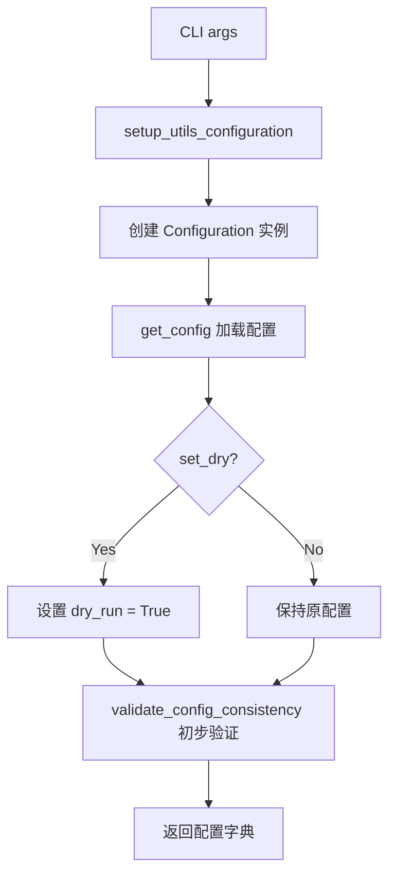

# config_setup.py

## 概述

`freqtrade/configuration/config_setup.py` 提供工具子命令（如数据下载、列表展示等非交易类命令）的配置初始化功能。它封装了 `Configuration` 类的使用流程，自动设置 dry-run 模式并进行初步配置验证。

## 架构图

## 核心类/函数

### `setup_utils_configuration(args, method, *, set_dry=True) -> dict[str, Any]`

为工具子命令准备配置。

- **参数**：
  - `args: dict[str, Any]` — 来自 CLI 参数解析器（`Arguments()`）的参数字典
  - `method: RunMode` — 机器人运行模式（如 `RunMode.UTIL_EXCHANGE`、`RunMode.UTIL_NO_EXCHANGE`）
  - `set_dry: bool` — 是否强制设置 dry-run 模式（默认 `True`）
- **返回值**：`dict[str, Any]` — 完整的配置字典
- **关键逻辑**：
  1. 使用传入的 `args` 和 `method` 创建 `Configuration` 实例
  2. 调用 `get_config()` 加载并处理所有配置
  3. 如果 `set_dry=True`，强制将 `dry_run` 设为 `True`（工具命令默认不需要真实交易）
  4. 调用 `validate_config_consistency` 进行初步验证（`preliminary=True`）

## 依赖关系

### 内部依赖（本项目模块）
- `freqtrade.enums.RunMode` — 运行模式枚举
- `freqtrade.configuration.config_validation.validate_config_consistency` — 配置一致性验证
- `freqtrade.configuration.configuration.Configuration` — 核心配置加载类

### 外部依赖（第三方库）
- `logging` — 日志记录

### 被依赖（谁引用了本文件）
- `freqtrade.configuration.__init__` — 导出到包级别
- `freqtrade.commands.build_config_commands` — 构建配置命令
- `freqtrade.commands.db_commands` — 数据库相关命令
- `tests.data.test_download_data` — 数据下载测试
