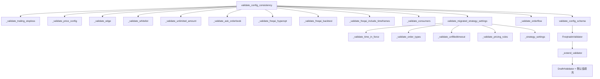

# config_validation.py

## 概述

`freqtrade/configuration/config_validation.py` 是 Freqtrade 配置验证的核心模块。它包含两大类验证功能：

1. **JSON Schema 验证**：使用 `jsonschema` 库验证配置是否符合预定义的 JSON Schema，并在验证过程中自动填充默认值。
2. **逻辑一致性验证**：检查配置项之间的逻辑关系，如追踪止损参数互斥、价格配置与订单类型匹配、FreqAI 相关约束等。

此模块还负责处理旧配置格式到新格式的迁移（如 `buy/sell` 改为 `entry/exit`）。

## 架构图

## 核心类/函数

### `_extend_validator(validator_class)`

扩展 JSON Schema 验证器，在验证属性时自动为缺失字段设置默认值。

- **参数**：`validator_class` — 基础验证器类（`Draft4Validator`）
- **返回值**：扩展后的验证器类
- **关键逻辑**：拦截 `properties` 验证，遍历所有属性定义，若 schema 中有 `default` 且实例中缺失该属性，则调用 `instance.setdefault()` 自动填充

### `FreqtradeValidator`

模块级变量，由 `_extend_validator(Draft4Validator)` 生成的自定义验证器类。

### `validate_config_schema(conf, preliminary=False) -> dict[str, Any]`

根据运行模式选择对应的 required 字段集，然后用 `FreqtradeValidator` 验证配置。

- **参数**：
  - `conf: dict` — 配置字典
  - `preliminary: bool` — 是否为初步验证（回测模式下区分初步和最终验证）
- **返回值**：验证通过的配置字典
- **运行模式与 Schema 要求**：
  - `DRY_RUN / LIVE` → `SCHEMA_TRADE_REQUIRED`
  - `BACKTEST / HYPEROPT`（初步）→ `SCHEMA_BACKTEST_REQUIRED`
  - `BACKTEST / HYPEROPT`（最终）→ `SCHEMA_BACKTEST_REQUIRED_FINAL`
  - `WEBSERVER` → `SCHEMA_MINIMAL_WEBSERVER`
  - 其他 → `SCHEMA_MINIMAL_REQUIRED`

### `validate_config_consistency(conf, *, preliminary=False) -> None`

配置一致性综合验证入口，依次调用所有子验证函数。应在配置和策略都加载完毕后运行。

- **参数**：
  - `conf: dict` — 配置字典
  - `preliminary: bool` — 是否为初步验证
- **抛出异常**：`ConfigurationError` — 当配置不一致时

### `_validate_trailing_stoploss(conf) -> None`

验证追踪止损相关配置的合理性。

- **规则**：
  - `stoploss` 不能为 0
  - 如果启用 `trailing_only_offset_is_reached`，则 `trailing_stop_positive_offset` 必须大于 0
  - `trailing_stop_positive_offset` 必须大于 `trailing_stop_positive`
  - `trailing_stop_positive` 不能为 0

### `_validate_price_config(conf) -> None`

验证市价单的价格方向配置。

- **规则**：
  - Market entry 订单要求 `entry_pricing.price_side` 为 `"ask"` 或 `"other"`
  - Market exit 订单要求 `exit_pricing.price_side` 为 `"bid"` 或 `"other"`

### `_validate_edge(conf) -> None`

检测 Edge 功能是否启用。Edge 已在 Freqtrade 2025.6 中被移除。

### `_validate_whitelist(conf) -> None`

当使用 `StaticPairList` 时，要求 `pair_whitelist` 必须非空。

### `_validate_unlimited_amount(conf) -> None`

`max_open_trades` 和 `stake_amount` 不能同时为 unlimited。

### `_validate_ask_orderbook(conf) -> None`

验证 `exit_pricing` 的 order book 配置。如果 `order_book_min != order_book_max`，抛出错误；否则迁移到 `order_book_top`。

### `_validate_freqai_hyperopt(conf) -> None`

FreqAI 策略不支持 `analyze_per_epoch` 参数。

### `_validate_freqai_include_timeframes(conf, preliminary) -> None`

FreqAI 的 `include_timeframes` 中的所有时间框架不能小于主时间框架，且主时间框架必须包含在列表中。

### `_validate_freqai_backtest(conf) -> None`

FreqAI 回测相关约束：`freqai_backtest_live_models` 不能与 `timerange` 同时使用，且必须配合 FreqAI 策略。

### `_validate_consumers(conf) -> None`

外部消息消费者配置验证：至少需要一个 producer，且 producer 名称不能重复。

### `_validate_orderflow(conf) -> None`

使用公共交易数据时必须配置 `orderflow`。

### `validate_migrated_strategy_settings(conf) -> None`

处理策略配置中从旧命名（buy/sell）到新命名（entry/exit）的迁移。

### `_strategy_settings(conf) -> None`

迁移顶层策略设置：`use_sell_signal` → `use_exit_signal`，`sell_profit_only` → `exit_profit_only` 等。

## 依赖关系

### 内部依赖（本项目模块）
- `freqtrade.config_schema.config_schema` — 提供 JSON Schema 定义（`CONF_SCHEMA`, `SCHEMA_*`）
- `freqtrade.configuration.deprecated_settings` — 提供 `process_deprecated_setting` 用于旧配置迁移
- `freqtrade.constants` — 提供 `UNLIMITED_STAKE_AMOUNT` 常量
- `freqtrade.enums` — 提供 `RunMode`, `TradingMode` 枚举
- `freqtrade.exceptions` — 提供 `ConfigurationError` 异常
- `freqtrade.exchange` — 延迟导入 `timeframe_to_seconds`（用于 FreqAI 时间框架验证）

### 外部依赖（第三方库）
- `jsonschema` — JSON Schema 验证库，使用 `Draft4Validator`、`validators`、`ValidationError`、`best_match`
- `collections.Counter` — 用于检测重复的 producer 名称
- `copy.deepcopy` — 深拷贝 Schema 避免修改原始定义

### 被依赖（谁引用了本文件）
- `freqtrade.configuration.__init__` — 导出 `validate_config_consistency`
- `freqtrade.configuration.config_setup` — 在工具配置初始化时调用验证
- `freqtrade.resolvers.strategy_resolver` — 策略加载后进行二次验证
- `freqtrade.rpc.api_server.api_backtest` — 回测 API 中进行验证
