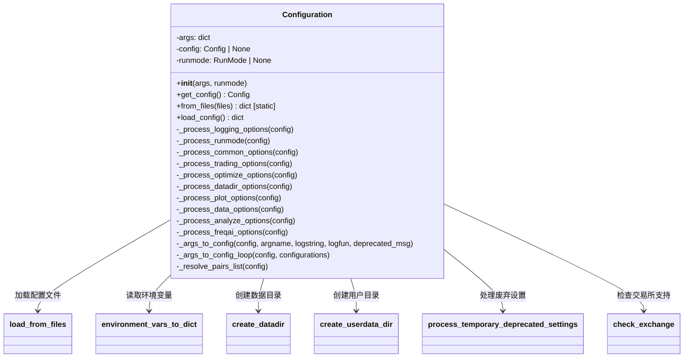
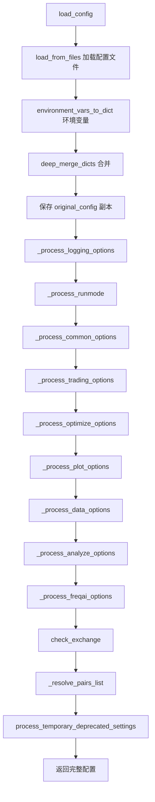

# configuration.py

## 概述

`freqtrade/configuration/configuration.py` 包含 `Configuration` 类，是 Freqtrade 配置系统的核心。该类负责从多个来源（配置文件、CLI 参数、环境变量）加载并合并配置，处理各种配置选项（日志、交易、优化、绘图、数据、FreqAI 等），最终产生一个完整的配置字典供整个应用使用。

## 架构图

## 核心类/函数

### `class Configuration`

Freqtrade 配置加载和初始化的主类。被机器人、回测、超参数优化及所有需要配置的脚本复用。

#### `__init__(self, args, runmode=None)`

- **参数**：
  - `args: dict[str, Any]` — CLI 参数字典
  - `runmode: RunMode | None` — 运行模式，如果为 `None` 则根据 `dry_run` 配置自动推断

#### `get_config(self) -> Config`

获取配置的主入口方法。采用懒加载模式，首次调用时加载配置并缓存。

#### `from_files(files) -> dict[str, Any]` (staticmethod)

从文件列表加载配置的便捷静态方法。用于交互式环境（如 Jupyter Notebook）。后面定义的文件中的参数会覆盖前面文件中的同名参数（last definition wins）。

#### `load_config(self) -> dict[str, Any]`

配置加载的核心流程，按以下顺序执行：
1. 从配置文件加载（`load_from_files`）
2. 合并环境变量（`environment_vars_to_dict`）
3. 初始化 `internals` 字段
4. 保存 `original_config` 深拷贝
5. 依次处理各类配置选项
6. 检查交易所支持
7. 解析交易对列表
8. 处理废弃配置项

#### `_process_logging_options(self, config)`

处理日志相关配置：verbosity 等级、日志文件路径、颜色输出开关。最后调用 `setup_logging` 初始化日志系统。

#### `_process_runmode(self, config)`

确定运行模式。如果构造时未指定 `runmode`，则根据 `dry_run` 配置推断为 `DRY_RUN` 或 `LIVE`。

#### `_process_common_options(self, config)`

处理通用选项：strategy、strategy_path、db_url、force_entry_enable、sd_notify。

#### `_process_trading_options(self, config)`

处理交易模式选项。仅在 `TRADE_MODES`（LIVE/DRY_RUN）下执行。根据 dry_run 状态设置数据库 URL。

#### `_process_datadir_options(self, config)`

处理数据目录配置：user_data_dir、datadir、exportdirectory、exportfilename。负责创建必要的目录结构。

#### `_process_optimize_options(self, config)`

处理优化相关选项，数量最多，包括：
- 基础参数：timeframe、position_stacking、enable_protections、max_open_trades、stake_amount
- 回测参数：timerange、fee、dry_run_wallet、export、backtest_cache
- Hyperopt 参数：epochs、spaces、early_stop、hyperopt_loss 等大量超参数优化相关配置

#### `_process_plot_options(self, config)`

处理绘图和数据下载相关选项：pairs、indicators、trade_ids、plot_limit、dataformat 等。

#### `_process_data_options(self, config)`

处理数据选项：trading_mode、candle_type_def、margin_mode。设置交易模式的默认值。

#### `_process_analyze_options(self, config)`

处理分析选项：analysis_groups、enter/exit_reason_list、indicator_list、lookahead 分析参数等。

#### `_process_freqai_options(self, config)`

处理 FreqAI 选项：freqaimodel 和 freqaimodel_path。

#### `_args_to_config(self, config, argname, logstring, logfun=None, deprecated_msg=None)`

将 CLI 参数转移到配置字典的通用方法。仅当参数存在且非 `None`/`False` 时才进行转移，同时输出日志。

#### `_args_to_config_loop(self, config, configurations)`

批量调用 `_args_to_config` 的辅助方法，接受 `(argname, logstring)` 元组列表。

#### `_resolve_pairs_list(self, config)`

解析交易对列表，优先级为：
1. `-p` 参数直接指定的 pairs
2. `--pairs-file` 指定的文件
3. 配置文件中的 `exchange.pair_whitelist`
4. 数据目录下的 `pairs.json` 文件

## 依赖关系

### 内部依赖（本项目模块）
- `freqtrade.constants` — 提供各种常量（`DEFAULT_DB_PROD_URL`, `DEFAULT_DB_DRYRUN_URL` 等）和 `Config` 类型
- `freqtrade.configuration.deprecated_settings` — `process_temporary_deprecated_settings`
- `freqtrade.configuration.directory_operations` — `create_datadir`, `create_userdata_dir`
- `freqtrade.configuration.environment_vars` — `environment_vars_to_dict`
- `freqtrade.configuration.load_config` — `load_file`, `load_from_files`
- `freqtrade.enums` — `NON_UTIL_MODES`, `TRADE_MODES`, `CandleType`, `MarginMode`, `RunMode`, `TradingMode`
- `freqtrade.exceptions` — `OperationalException`
- `freqtrade.loggers` — `setup_logging`
- `freqtrade.misc` — `deep_merge_dicts`, `parse_db_uri_for_logging`, `safe_value_fallback`
- `freqtrade.exchange.check_exchange` — 延迟导入，检查交易所支持
- `freqtrade.commands.arguments` — 延迟导入 `NO_CONF_ALLOWED`

### 外部依赖（第三方库）
- `logging` — 日志记录
- `warnings` — 废弃警告
- `pathlib.Path` — 路径操作
- `copy.deepcopy` — 深拷贝配置

### 被依赖（谁引用了本文件）
- `freqtrade.configuration.__init__` — 导出 `Configuration` 到包级别
- `freqtrade.configuration.config_setup` — 在 `setup_utils_configuration` 中创建 `Configuration` 实例
