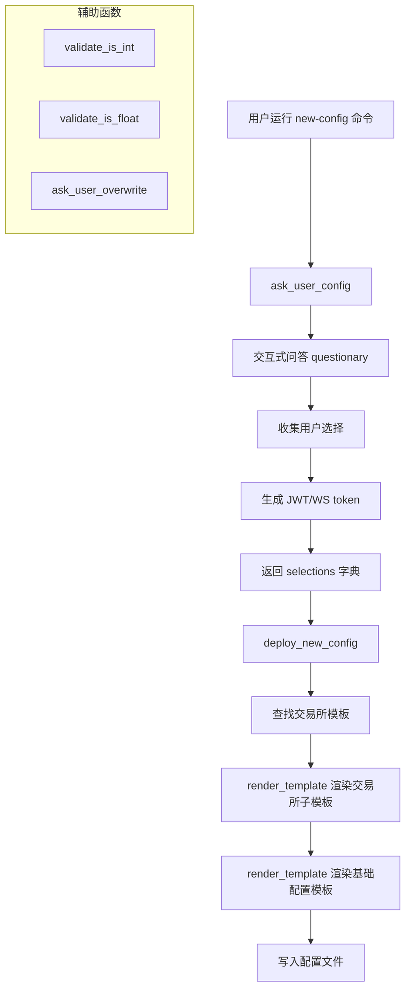

# deploy_config.py

## 概述

`freqtrade/configuration/deploy_config.py` 提供交互式配置文件创建功能。通过命令行问答方式引导用户设置交易所、交易模式、Telegram、API 服务器等参数，然后使用 Jinja2 模板生成配置文件。这是 `freqtrade new-config` 命令的核心实现。

## 架构图

## 核心类/函数

### `validate_is_int(val) -> bool`

验证输入值是否可转换为整数。

### `validate_is_float(val) -> bool`

验证输入值是否可转换为浮点数。

### `ask_user_overwrite(config_path) -> bool`

当配置文件已存在时，询问用户是否覆盖。

- **参数**：`config_path: Path` — 目标配置文件路径
- **返回值**：`bool` — 用户是否选择覆盖

### `ask_user_config() -> dict[str, Any]`

通过交互式问答收集用户配置。使用 `questionary` 库构建交互式 CLI 界面。

- **收集的配置项**：
  - `dry_run` — 是否启用模拟交易
  - `stake_currency` — 基础货币（默认 USDT）
  - `stake_amount` — 下注金额（支持 `unlimited`）
  - `max_open_trades` — 最大同时开仓数
  - `timeframe` — 时间框架（可选覆盖策略设置）
  - `fiat_display_currency` — 法币展示货币
  - `exchange_name` — 交易所选择（binance, gate, okx 等主流交易所或自定义）
  - `trading_mode` — 交易模式（spot/futures）
  - 交易所 API 凭证（非 dry-run 模式下）
  - Telegram 配置（可选）
  - API 服务器配置（包含 FreqUI，可选）
- **自动生成**：
  - `api_server_jwt_key` — 使用 `secrets.token_hex()` 生成
  - `api_server_ws_token` — 使用 `secrets.token_urlsafe(25)` 生成
  - `margin_mode` — 根据 trading_mode 自动设为 `"isolated"` 或空

### `deploy_new_config(config_path, selections) -> None`

将用户选择应用到 Jinja2 模板并写入配置文件。

- **参数**：
  - `config_path: Path` — 新配置文件的目标路径
  - `selections: dict` — 用户选择的配置字典
- **关键逻辑**：
  1. 根据交易所名称查找对应模板（通过 `MAP_EXCHANGE_CHILDCLASS` 映射）
  2. 先渲染交易所子模板（`subtemplates/exchange_{name}.j2`），如果找不到则使用通用模板（`exchange_generic.j2`）
  3. 再渲染基础配置模板（`base_config.json.j2`）
  4. 将渲染结果写入配置文件

## 依赖关系

### 内部依赖（本项目模块）
- `freqtrade.constants` — `UNLIMITED_STAKE_AMOUNT` 常量
- `freqtrade.exceptions` — `OperationalException` 异常
- `freqtrade.configuration.detect_environment` — `running_in_docker`（延迟导入，用于设置 API 监听地址默认值）
- `freqtrade.exchange` — `available_exchanges`（延迟导入）、`MAP_EXCHANGE_CHILDCLASS`（延迟导入）
- `freqtrade.util` — `render_template`（延迟导入，Jinja2 模板渲染）

### 外部依赖（第三方库）
- `questionary` — 交互式 CLI 问答库（`Separator`, `prompt`）
- `secrets` — 安全随机 token 生成
- `jinja2` — Jinja2 模板引擎（延迟导入 `TemplateNotFound` 异常）
- `pathlib.Path` — 路径操作
- `logging` — 日志记录

### 被依赖（谁引用了本文件）
- `freqtrade.commands.build_config_commands` — 在 `start_new_config` 命令中调用
