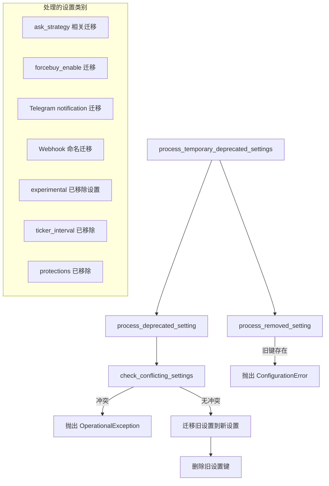

# deprecated_settings.py

## 概述

`freqtrade/configuration/deprecated_settings.py` 负责处理 Freqtrade 配置中已废弃（deprecated）和已移除（removed）的设置项。它提供了一套机制来检测旧设置、发出警告、自动迁移到新设置名，以及在使用已完全移除的设置时抛出错误。这确保了配置的向后兼容性和平滑迁移。

## 架构图

## 核心类/函数

### `check_conflicting_settings(config, section_old, name_old, section_new, name_new) -> None`

检查新旧配置是否同时存在，如果同时存在则抛出异常。

- **参数**：
  - `config: Config` — 配置字典
  - `section_old: str | None` — 旧设置所在的 section（如果为 `None` 则在顶层查找）
  - `name_old: str` — 旧设置名
  - `section_new: str | None` — 新设置所在的 section
  - `name_new: str` — 新设置名
- **抛出异常**：`OperationalException` — 新旧设置同时存在时

### `process_removed_setting(config, section1, name1, section2, name2) -> None`

检测已完全移除的设置。如果用户仍在使用，直接抛出错误要求迁移。

- **参数**：
  - `section1: str` — 已移除设置所在的 section
  - `name1: str` — 已移除设置名
  - `section2: str | None` — 新设置所在的 section
  - `name2: str` — 新设置名
- **抛出异常**：`ConfigurationError` — 当检测到已移除的设置时

### `process_deprecated_setting(config, section_old, name_old, section_new, name_new) -> None`

处理废弃但尚未移除的设置。先检查冲突，然后将旧设置的值迁移到新位置并删除旧键。

- **参数**：与 `check_conflicting_settings` 相同
- **关键逻辑**：
  1. 调用 `check_conflicting_settings` 检查冲突
  2. 如果旧设置存在，输出 DEPRECATED 警告日志
  3. 将旧设置的值复制到新位置
  4. 删除旧设置键

### `process_temporary_deprecated_settings(config) -> None`

综合处理所有当前活跃的废弃和已移除设置。在配置加载流程的最后阶段被调用。

处理的迁移项目包括：

**废弃设置迁移（deprecated）**：
- `ask_strategy.ignore_buying_expired_candle_after` → 顶层 `ignore_buying_expired_candle_after`
- `forcebuy_enable` → `force_entry_enable`
- Telegram notification 设置：`sell` → `exit`, `buy` → `entry` 及其 `_fill`、`_cancel` 变体
- Webhook 设置：`webhookbuy` → `webhookentry` 等全系列 buy/sell → entry/exit 迁移

**已移除设置（removed）**：
- `experimental.use_sell_signal` → `use_exit_signal`
- `experimental.sell_profit_only` → `exit_profit_only`
- `experimental.ignore_roi_if_buy_signal` → `ignore_roi_if_entry_signal`
- `ask_strategy.use_sell_signal` → `use_exit_signal` 等
- `ticker_interval`（应使用 `timeframe`）
- `protections`（在配置中设置已废弃）

## 依赖关系

### 内部依赖（本项目模块）
- `freqtrade.constants` — `Config` 类型定义
- `freqtrade.exceptions` — `ConfigurationError`, `OperationalException`

### 外部依赖（第三方库）
- `logging` — 日志记录

### 被依赖（谁引用了本文件）
- `freqtrade.configuration.config_validation` — 在配置验证时调用 `process_deprecated_setting`
- `freqtrade.configuration.configuration` — 在 `load_config` 中调用 `process_temporary_deprecated_settings`
