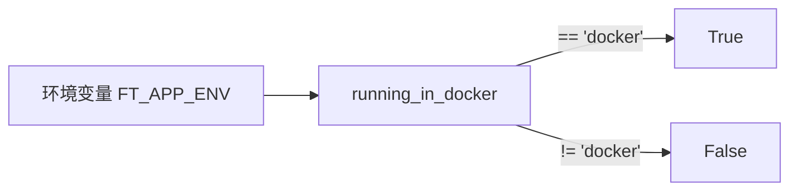

# detect_environment.py

## 概述

`freqtrade/configuration/detect_environment.py` 是一个极为简洁的工具模块，仅包含一个函数，用于检测当前是否运行在 Docker 容器环境中。检测方式是读取环境变量 `FT_APP_ENV`。

## 架构图

## 核心类/函数

### `running_in_docker() -> bool`

检测是否在 Docker 容器中运行。

- **参数**：无
- **返回值**：`bool` — 如果环境变量 `FT_APP_ENV` 的值为 `"docker"`，返回 `True`；否则返回 `False`
- **关键逻辑**：通过 `os.environ.get("FT_APP_ENV")` 读取环境变量并与字符串 `"docker"` 比较

## 依赖关系

### 内部依赖（本项目模块）
- 无

### 外部依赖（第三方库）
- `os` — 读取环境变量

### 被依赖（谁引用了本文件）
- `freqtrade.configuration.__init__` — 导出到包级别
- `freqtrade.configuration.deploy_config` — 在 `ask_user_config` 中用于设置 API 服务器监听地址默认值（Docker 中使用 `0.0.0.0`，否则 `127.0.0.1`）
- `freqtrade.configuration.directory_operations` — 在 `chown_user_directory` 中判断是否需要执行 `sudo chown`
