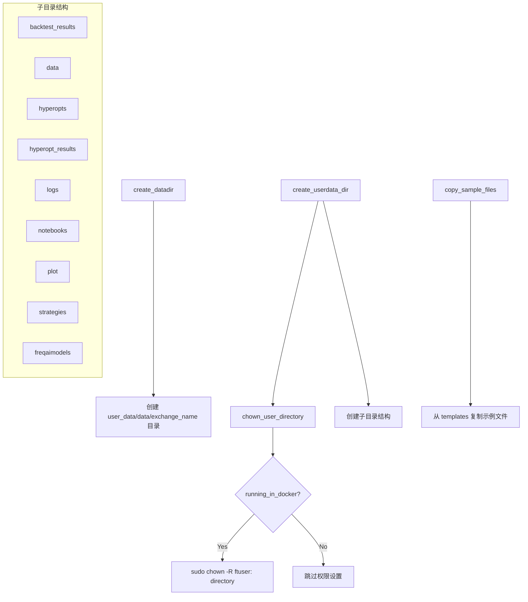

# directory_operations.py

## 概述

`freqtrade/configuration/directory_operations.py` 负责 Freqtrade 用户数据目录的创建和管理。包括数据存储目录（按交易所名称组织）、用户数据目录（包含策略、回测结果、日志等子目录）的创建，以及示例文件的复制和 Docker 环境下的目录权限处理。

## 架构图

## 核心类/函数

### `create_datadir(config, datadir=None) -> Path`

创建数据存储目录。

- **参数**：
  - `config: Config` — 配置字典
  - `datadir: str | None` — 自定义数据目录路径（可选）
- **返回值**：`Path` — 数据目录路径
- **关键逻辑**：
  - 如果未指定 `datadir`，默认路径为 `{user_data_dir}/data/{exchange_name}`
  - 如果指定了自定义路径，直接使用该路径
  - 目录不存在时自动创建（包括父目录）

### `chown_user_directory(directory) -> None`

在 Docker 环境中修改目录所有权。

- **参数**：`directory: Path` — 需要修改权限的目录
- **关键逻辑**：
  - 仅在 Docker 环境中执行（通过 `running_in_docker()` 判断）
  - 使用 `sudo chown -R ftuser: {directory}` 递归修改所有权
  - 如果命令失败，仅记录警告日志，不抛出异常

### `create_userdata_dir(directory, create_dir=False) -> Path`

创建用户数据目录及其完整的子目录结构。

- **参数**：
  - `directory: str` — 用户数据目录路径
  - `create_dir: bool` — 如果目录不存在是否创建（默认 `False`）
- **返回值**：`Path` — 用户数据目录路径
- **抛出异常**：`OperationalException` — 目录不存在且 `create_dir=False` 时；或子目录位置已存在同名文件（非目录）时
- **创建的子目录**：
  - `backtest_results` — 回测结果
  - `data` — 数据存储
  - `hyperopts` — 超参数优化器
  - `hyperopt_results` — 超参数优化结果
  - `logs` — 日志
  - `notebooks` — Jupyter notebooks
  - `plot` — 图表
  - `strategies` — 策略
  - `freqaimodels` — FreqAI 模型

### `copy_sample_files(directory, overwrite=False) -> None`

从模板目录复制示例文件到用户数据目录。

- **参数**：
  - `directory: Path` — 目标用户数据目录
  - `overwrite: bool` — 是否覆盖已存在的文件（默认 `False`）
- **关键逻辑**：
  - 源目录为 `freqtrade/templates/`
  - 文件映射关系定义在 `constants.USER_DATA_FILES`
  - 默认不覆盖已存在的文件，输出警告日志

## 依赖关系

### 内部依赖（本项目模块）
- `freqtrade.configuration.detect_environment` — `running_in_docker` 判断 Docker 环境
- `freqtrade.constants` — `USER_DATA_FILES`（示例文件映射）、`USERPATH_*`（子目录路径常量）、`Config` 类型
- `freqtrade.exceptions` — `OperationalException`

### 外部依赖（第三方库）
- `pathlib.Path` — 路径操作
- `shutil` — 文件复制
- `logging` — 日志记录
- `subprocess` — Docker 环境中执行 `sudo chown`（延迟导入）

### 被依赖（谁引用了本文件）
- `freqtrade.configuration.configuration` — `Configuration._process_datadir_options` 中调用 `create_datadir` 和 `create_userdata_dir`
- `freqtrade.commands.deploy_commands` — 部署命令中调用 `create_userdata_dir` 和 `copy_sample_files`
- `freqtrade.commands.build_config_commands` — 构建配置命令中调用
- `freqtrade.rpc.api_server.api_pairlists` — API 服务器中调用
