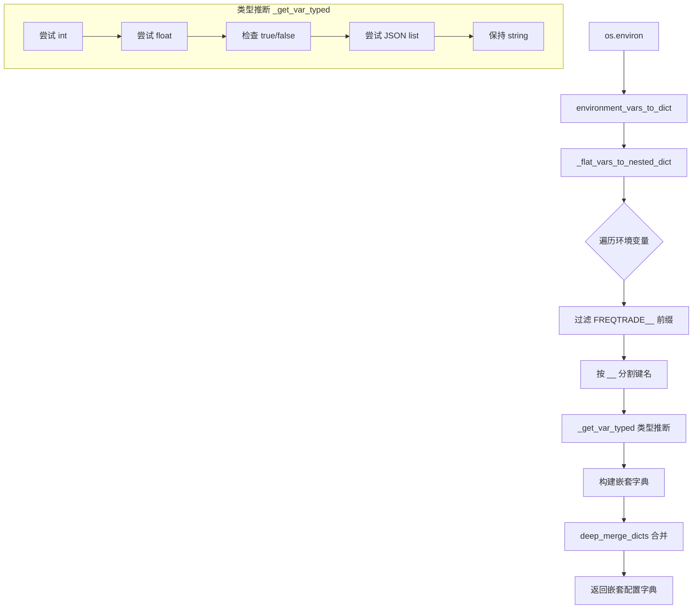

# environment_vars.py

## 概述

`freqtrade/configuration/environment_vars.py` 负责从操作系统环境变量中读取 Freqtrade 配置。支持将以 `FREQTRADE__` 为前缀的扁平化环境变量转换为嵌套字典结构，自动进行类型推断（int、float、bool、list），从而允许用户通过环境变量覆盖配置文件中的设置。这在容器化部署中尤为重要。

## 架构图

## 核心类/函数

### `_get_var_typed(val)`

自动推断环境变量值的类型。

- **参数**：`val` — 环境变量的原始字符串值
- **返回值**：`int | float | bool | list | str` — 类型转换后的值
- **转换优先级**：
  1. `int` — 如 `"42"` → `42`
  2. `float` — 如 `"3.14"` → `3.14`
  3. `bool` — `"t"/"true"` → `True`，`"f"/"false"` → `False`（大小写不敏感）
  4. `list` — 尝试通过 `rapidjson.loads` 解析 JSON 数组
  5. `str` — 以上都不匹配时保持为字符串

### `_flat_vars_to_nested_dict(env_dict, prefix) -> dict[str, Any]`

将扁平化的环境变量转换为嵌套字典。

- **参数**：
  - `env_dict: dict` — 环境变量字典（通常为 `os.environ` 的副本）
  - `prefix: str` — 前缀过滤条件（通常为 `"FREQTRADE__"`）
- **返回值**：嵌套字典
- **命名约定**：
  - 环境变量格式：`FREQTRADE__{SECTION}__{KEY}`
  - 双下划线 `__` 用于分隔嵌套层级
  - 键名自动转为小写（除非涉及 ccxt_config 相关键的最终值部分保持原始大小写）
- **特殊处理**：
  - `no_convert` 列表（`CHAT_ID`, `PASSWORD`）中的键不进行类型转换，保持为字符串
  - `ccxt_config_keys` 列表中的配置键（`ccxt_config`, `ccxt_sync_config`, `ccxt_async_config`）保持最终键的大小写，以兼容 CCXT 库的配置格式
- **示例**：
  - `FREQTRADE__EXCHANGE__NAME=binance` → `{"exchange": {"name": "binance"}}`
  - `FREQTRADE__DRY_RUN=true` → `{"dry_run": true}`

### `environment_vars_to_dict() -> dict[str, Any]`

顶层便捷函数，读取当前进程的环境变量并返回相关配置字典。

- **返回值**：基于 `FREQTRADE__` 前缀环境变量构建的嵌套配置字典

## 依赖关系

### 内部依赖（本项目模块）
- `freqtrade.constants` — `ENV_VAR_PREFIX`（即 `"FREQTRADE__"`）
- `freqtrade.misc` — `deep_merge_dicts` 深度合并字典

### 外部依赖（第三方库）
- `os` — 读取环境变量
- `rapidjson` — JSON 解析（用于尝试解析 list 类型的环境变量值）
- `logging` — 日志记录

### 被依赖（谁引用了本文件）
- `freqtrade.configuration.configuration` — 在 `Configuration.load_config` 中调用 `environment_vars_to_dict` 将环境变量合并到配置中
