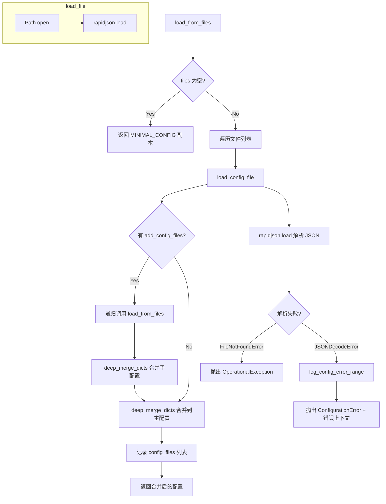

# load_config.py

## 概述

`freqtrade/configuration/load_config.py` 负责从文件系统加载 JSON 配置文件。支持注释和尾逗号的 JSON 格式（通过 `rapidjson` 的宽松解析模式），支持从标准输入读取配置，支持递归加载子配置文件（通过 `add_config_files` 字段），以及多个配置文件的层级合并（后文件覆盖前文件的同名参数）。

## 架构图

## 核心类/函数

### `CONFIG_PARSE_MODE`

模块级常量，定义 `rapidjson` 的解析模式：`PM_COMMENTS | PM_TRAILING_COMMAS`。允许 JSON 文件中包含注释（`//` 和 `/* */`）和尾逗号。

### `log_config_error_range(path, errmsg) -> str`

当 JSON 解析失败时，提取错误位置附近的配置文本片段，帮助用户定位问题。

- **参数**：
  - `path: str` — 配置文件路径（如果为 `"-"` 表示标准输入，跳过处理）
  - `errmsg: str` — 错误信息字符串
- **返回值**：`str` — 错误位置附近的文本片段（约 80 字符上下文）
- **关键逻辑**：
  1. 使用正则表达式从错误信息中提取 offset 值
  2. 读取配置文件内容
  3. 截取 offset 前后各 80 个字符的文本
  4. 去掉首尾可能被截断的行

### `load_file(path) -> dict[str, Any]`

从指定路径加载 JSON 文件（简洁版本，不含错误上下文提取）。

- **参数**：`path: Path` — 文件路径对象
- **返回值**：解析后的字典
- **抛出异常**：`OperationalException` — 文件不存在时

### `load_config_file(path) -> dict[str, Any]`

从指定路径加载配置文件（完整版本，含错误处理和上下文提取）。

- **参数**：`path: str` — 文件路径字符串。特殊值 `"-"` 表示从标准输入读取
- **返回值**：解析后的配置字典
- **抛出异常**：
  - `OperationalException` — 文件不存在
  - `ConfigurationError` — JSON 语法错误（附带错误位置上下文信息）

### `load_from_files(files, base_path=None, level=0) -> dict[str, Any]`

递归加载多个配置文件并合并。

- **参数**：
  - `files: list[str]` — 配置文件路径列表
  - `base_path: Path | None` — 基础路径（用于相对路径解析，递归调用时传入）
  - `level: int` — 递归深度（防止循环引用，最大 5 层）
- **返回值**：合并后的完整配置字典
- **关键逻辑**：
  1. 如果 `files` 为空，返回 `MINIMAL_CONFIG` 的深拷贝
  2. 如果 `level > 5`，抛出 `ConfigurationError("Config loop detected.")`
  3. 遍历文件列表：
     - 如果路径为 `"-"`，直接从标准输入加载并返回
     - 如果有 `base_path`，将其前置到文件路径（支持相对路径）
     - 加载文件后检查是否有 `add_config_files` 字段，如有则递归加载子配置
     - 使用 `deep_merge_dicts` 合并所有配置（后定义覆盖先定义）
  4. 记录所有已加载的文件路径到 `config["config_files"]`

## 依赖关系

### 内部依赖（本项目模块）
- `freqtrade.constants` — `MINIMAL_CONFIG`（最小化默认配置）、`Config` 类型
- `freqtrade.exceptions` — `ConfigurationError`, `OperationalException`
- `freqtrade.misc` — `deep_merge_dicts` 深度字典合并

### 外部依赖（第三方库）
- `rapidjson` — 高性能 JSON 解析库，支持注释和尾逗号
- `pathlib.Path` — 路径操作
- `re` — 正则表达式（解析错误 offset）
- `sys` — 标准输入（`sys.stdin`）
- `copy.deepcopy` — 深拷贝
- `logging` — 日志记录

### 被依赖（谁引用了本文件）
- `freqtrade.configuration.configuration` — `Configuration.load_config` 和 `_resolve_pairs_list` 中调用 `load_from_files` 和 `load_file`
- `freqtrade.plugins.pairlist.RemotePairList` — 远程交易对列表加载
