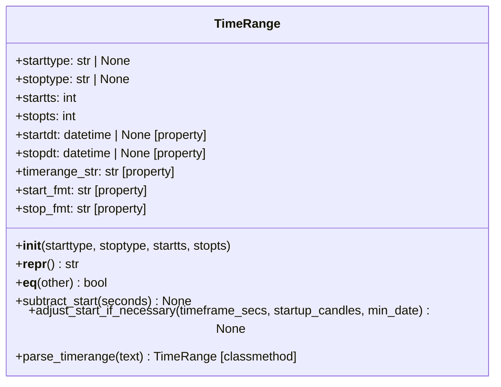
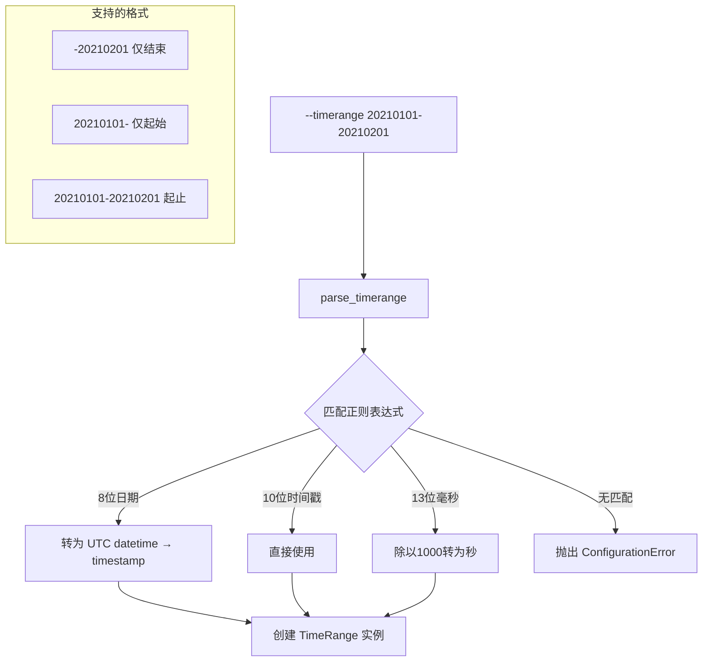

# timerange.py

## 概述

`freqtrade/configuration/timerange.py` 定义了 `TimeRange` 类，用于表示和解析时间范围。它是 Freqtrade 回测、数据下载等功能中时间范围参数（`--timerange`）的核心数据结构。支持多种时间格式（8 位日期 `YYYYMMDD`、10 位 Unix 秒时间戳、13 位毫秒时间戳），支持开放范围（仅指定起始或结束时间）。

## 架构图

## 核心类/函数

### `class TimeRange`

时间范围对象，定义回测/数据下载的起止时间。

#### `__init__(self, starttype=None, stoptype=None, startts=0, stopts=0)`

- **参数**：
  - `starttype: str | None` — 起始时间类型（`"date"` 或 `None`）
  - `stoptype: str | None` — 结束时间类型（`"date"` 或 `None`）
  - `startts: int` — 起始 Unix 时间戳（秒）
  - `stopts: int` — 结束 Unix 时间戳（秒）

#### `startdt -> datetime | None` (property)

将 `startts` 转换为 `datetime` 对象。如果 `startts` 为 0，返回 `None`。

#### `stopdt -> datetime | None` (property)

将 `stopts` 转换为 `datetime` 对象。如果 `stopts` 为 0，返回 `None`。

#### `timerange_str -> str` (property)

返回 `YYYYMMDD-YYYYMMDD` 格式的字符串表示，缺失部分留空（如 `"20210101-"`）。

#### `start_fmt -> str` (property)

返回格式化的起始日期字符串。如果未设置，返回 `"unbounded"`。

#### `stop_fmt -> str` (property)

返回格式化的结束日期字符串。如果未设置，返回 `"unbounded"`。

#### `subtract_start(self, seconds) -> None`

从起始时间戳中减去指定秒数。用于扩展数据加载范围以包含 startup candles。

- **参数**：`seconds: int` — 需要减去的秒数
- **注意**：仅在 `startts` 非零时生效，就地修改对象

#### `adjust_start_if_necessary(self, timeframe_secs, startup_candles, min_date) -> None`

根据 startup candles 数量调整起始时间。当没有足够的历史数据来满足 startup candles 需求时，向后推迟起始时间。

- **参数**：
  - `timeframe_secs: int` — 时间框架的秒数（如 5 分钟 = 300）
  - `startup_candles: int` — 启动所需的历史 K 线数量
  - `min_date: datetime` — 实际加载数据的最早日期
- **关键逻辑**：如果未设置 `starttype`，或实际数据起始日期晚于等于请求的起始时间，则将 `startts` 设为 `min_date + timeframe_secs * startup_candles`

#### `parse_timerange(cls, text) -> Self` (classmethod)

解析 `--timerange` 参数值。

- **参数**：`text: str | None` — 时间范围字符串
- **返回值**：`TimeRange` 实例
- **支持的格式**：
  - 8 位日期：`YYYYMMDD-YYYYMMDD`、`YYYYMMDD-`、`-YYYYMMDD`
  - 10 位 Unix 时间戳：`NNNNNNNNNN-NNNNNNNNNN`、`NNNNNNNNNN-`、`-NNNNNNNNNN`
  - 13 位毫秒时间戳：`NNNNNNNNNNNNN-NNNNNNNNNNNNN`、`NNNNNNNNNNNNN-`、`-NNNNNNNNNNNNN`
- **抛出异常**：
  - `ConfigurationError` — 格式不正确
  - `ConfigurationError` — 起始日期晚于结束日期

## 依赖关系

### 内部依赖（本项目模块）
- `freqtrade.constants` — `DATETIME_PRINT_FORMAT` 日期格式化字符串
- `freqtrade.exceptions` — `ConfigurationError`
- `freqtrade.util` — `dt_from_ts` 时间戳转 datetime 工具函数

### 外部依赖（第三方库）
- `re` — 正则表达式用于解析时间范围字符串
- `datetime` — `datetime`, `UTC` 时间处理
- `typing.Self` — 用于 classmethod 的返回类型注解
- `logging` — 日志记录

### 被依赖（谁引用了本文件）
- `freqtrade.configuration.__init__` — 导出到包级别
- 被大量模块通过 `from freqtrade.configuration import TimeRange` 使用，包括：
  - `freqtrade.data.history.*` — 历史数据处理
  - `freqtrade.optimize.backtesting` — 回测引擎
  - `freqtrade.commands.*` — CLI 命令
  - `freqtrade.exchange.exchange` — 交易所接口
  - `freqtrade.freqai.*` — FreqAI 模块
  - `freqtrade.rpc.api_server.*` — API 服务器
  - `freqtrade.plot.plotting` — 绘图模块
