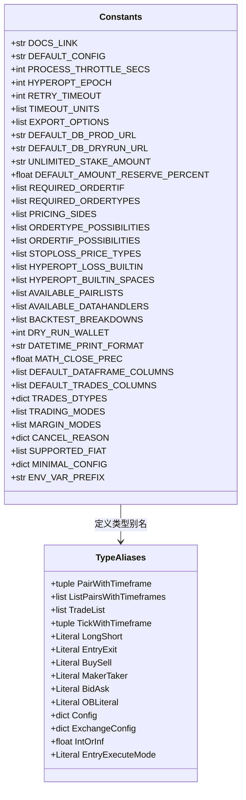

# constants.py

## 概述
`freqtrade/constants.py` 是 freqtrade 项目的常量定义文件，集中管理了 bot 运行所需的各种配置默认值、枚举选项、数据格式定义以及类型别名。这些常量被项目中几乎所有模块广泛引用，是整个项目的配置基石。

## 架构图

## 核心常量分类

### 系统运行参数
| 常量名 | 值 | 说明 |
|--------|-----|------|
| `PROCESS_THROTTLE_SECS` | `5` | 主循环节流时间（秒） |
| `HYPEROPT_EPOCH` | `100` | Hyperopt 默认 epoch 数 |
| `RETRY_TIMEOUT` | `30` | 重试超时时间（秒） |
| `DRY_RUN_WALLET` | `1000` | 模拟运行初始钱包金额 |
| `MATH_CLOSE_PREC` | `1e-14` | 浮点数比较精度 |
| `FULL_DATAFRAME_THRESHOLD` | `100` | 完整 DataFrame 阈值 |
| `CUSTOM_TAG_MAX_LENGTH` | `255` | 自定义标签最大长度 |
| `ENV_VAR_PREFIX` | `"FREQTRADE__"` | 环境变量前缀 |

### 数据库与文件路径
| 常量名 | 值 | 说明 |
|--------|-----|------|
| `DEFAULT_CONFIG` | `"config.json"` | 默认配置文件名 |
| `DEFAULT_DB_PROD_URL` | `"sqlite:///tradesv3.sqlite"` | 生产数据库 URL |
| `DEFAULT_DB_DRYRUN_URL` | `"sqlite:///tradesv3.dryrun.sqlite"` | 模拟运行数据库 URL |
| `USERPATH_STRATEGIES` | `"strategies"` | 策略文件目录 |
| `USERPATH_HYPEROPTS` | `"hyperopts"` | Hyperopt 文件目录 |
| `USERPATH_NOTEBOOKS` | `"notebooks"` | Notebook 目录 |
| `USERPATH_FREQAIMODELS` | `"freqaimodels"` | FreqAI 模型目录 |

### 订单与交易相关
| 常量名 | 说明 |
|--------|------|
| `UNLIMITED_STAKE_AMOUNT` | 值为 `"unlimited"`，表示不限制单笔下注金额 |
| `REQUIRED_ORDERTYPES` | 必需的订单类型: entry, exit, stoploss, stoploss_on_exchange |
| `ORDERTYPE_POSSIBILITIES` | 可选订单类型: limit, market |
| `ORDERTIF_POSSIBILITIES` | 订单有效期选项: GTC, FOK, IOC, PO（及其小写形式） |
| `PRICING_SIDES` | 定价方向: ask, bid, same, other |
| `CANCELED_EXCHANGE_STATES` | 已取消的交易所状态元组 |
| `NON_OPEN_EXCHANGE_STATES` | 非开放的交易所状态（包含已取消和已关闭） |
| `CANCEL_REASON` | 订单取消原因字典，包含超时、部分成交、强制退出等原因 |

### DataFrame 列定义
| 常量名 | 说明 |
|--------|------|
| `DEFAULT_DATAFRAME_COLUMNS` | OHLCV 标准列: date, open, high, low, close, volume |
| `DEFAULT_TRADES_COLUMNS` | 交易数据列: timestamp, id, type, side, price, amount, cost |
| `DEFAULT_ORDERFLOW_COLUMNS` | 订单流列: level, bid, ask, delta |
| `TRADES_DTYPES` | 交易数据各列的数据类型定义 |

### Hyperopt 相关
| 常量名 | 说明 |
|--------|------|
| `HYPEROPT_LOSS_BUILTIN` | 12 种内置 Hyperopt 损失函数名列表 |
| `HYPEROPT_BUILTIN_SPACES` | 内置优化空间: buy, sell, enter, exit, roi, stoploss, trailing, protection, trades |

### Pairlist 相关
| 常量名 | 说明 |
|--------|------|
| `AVAILABLE_PAIRLISTS` | 可用的交易对列表插件，包括 StaticPairList, VolumePairList 以及各种 Filter |

### 数据格式与回测
| 常量名 | 说明 |
|--------|------|
| `AVAILABLE_DATAHANDLERS` | 可用数据处理格式: json, jsongz, feather, parquet |
| `BACKTEST_BREAKDOWNS` | 回测分解维度: day, week, month, year, weekday |
| `BACKTEST_CACHE_AGE` | 回测缓存过期策略: none, day, week, month |

### 币种与法币
| 常量名 | 说明 |
|--------|------|
| `SUPPORTED_FIAT` | 支持的法币列表（30+ 种），包含主要的加密货币计价币 |
| `DECIMALS_PER_COIN` | 各币种的小数精度，如 BTC=8, ETH=5 |
| `DUST_PER_COIN` | 粉尘级别金额阈值 |
| `PairPrefixes` | 低价币前缀: 1000, 1000000, 1M, K |

### 类型别名（Type Aliases）
| 类型名 | 定义 | 说明 |
|--------|------|------|
| `Config` | `dict[str, Any]` | 配置字典类型 |
| `ExchangeConfig` | `dict[str, Any]` | 交易所配置类型 |
| `IntOrInf` | `float` | 整数或无穷大 |
| `PairWithTimeframe` | `tuple[str, str, CandleType]` | 交易对+时间框架+K线类型 |
| `LongShort` | `Literal["long", "short"]` | 多空方向 |
| `EntryExit` | `Literal["entry", "exit"]` | 开仓平仓 |
| `BuySell` | `Literal["buy", "sell"]` | 买卖方向 |
| `EntryExecuteMode` | `Literal["initial", "pos_adjust", "replace"]` | 入场执行模式 |

## 依赖关系

### 内部依赖（本项目模块）
- `freqtrade.enums.CandleType` — K线类型枚举
- `freqtrade.enums.PriceType` — 价格类型枚举

### 外部依赖（第三方库）
- `typing.Any` / `typing.Literal` — 类型注解

### 被依赖（谁引用了本文件）
- 被项目中几乎所有模块引用，是最核心的依赖之一
- `freqtrade.freqtradebot` — 使用 Config、交易常量、取消原因等
- `freqtrade.worker` — 使用 PROCESS_THROTTLE_SECS、RETRY_TIMEOUT 等
- `freqtrade.wallets` — 使用 UNLIMITED_STAKE_AMOUNT、Config、IntOrInf
- `freqtrade.config_schema` — 使用大量枚举列表用于 JSON Schema 校验
- `freqtrade.exchange` — 使用交易模式、订单类型等常量
- `freqtrade.optimize` — 使用 Hyperopt 和回测相关常量
- `freqtrade.data` — 使用数据格式和 DataFrame 列定义
