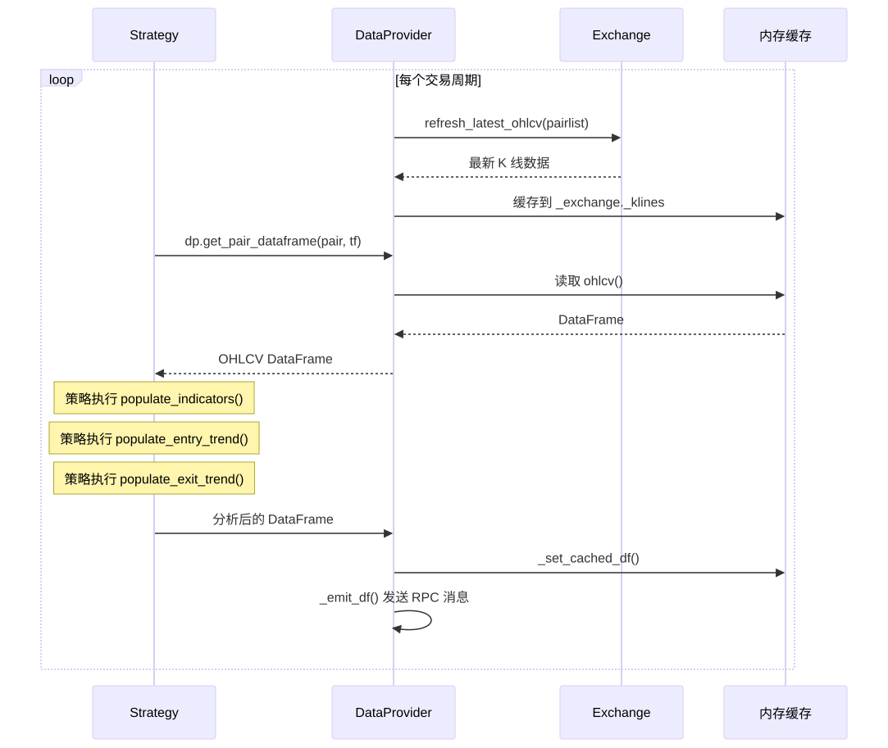
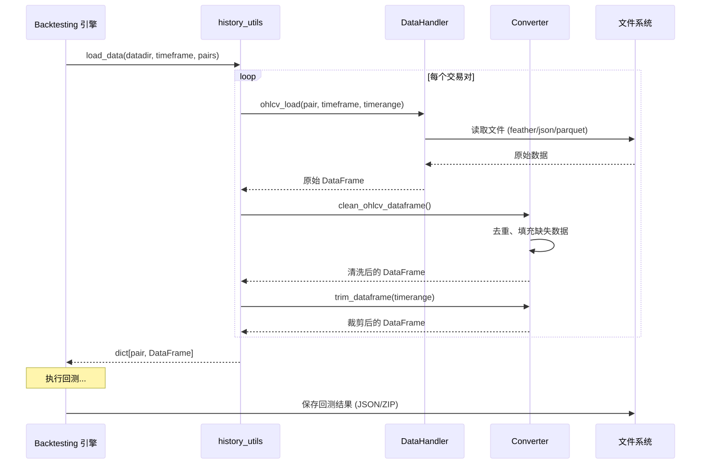
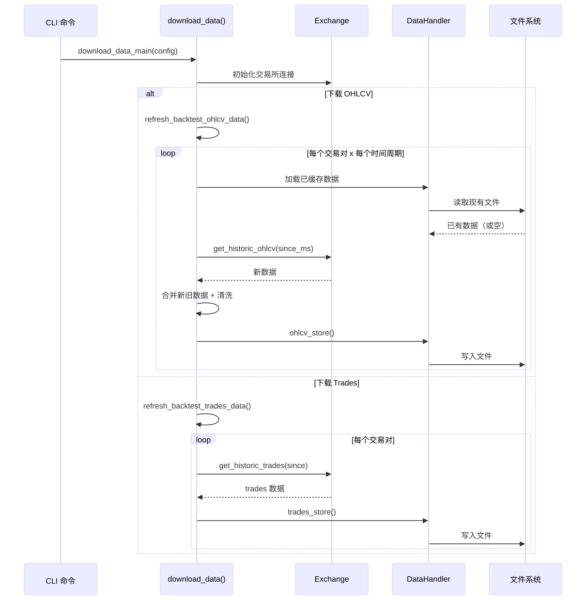

# Freqtrade 数据模块 (`freqtrade/data/`)

## 1. 模块概述

`freqtrade/data/` 是 Freqtrade 交易机器人的**数据层总入口**，负责所有与市场数据相关的操作，包括：

- **数据获取**：从交易所实时获取 OHLCV（Open/High/Low/Close/Volume）K 线数据、Ticker、OrderBook 订单簿和 Trades 成交记录
- **数据转换**：在不同数据格式之间转换（如 trades 转 OHLCV、JSON 转 Feather 等），以及 orderflow 订单流数据的计算
- **数据存储**：将历史数据持久化到磁盘，支持多种文件格式（JSON、Feather、Parquet）
- **数据供给**：通过 `DataProvider` 类为策略（Strategy）和机器人核心提供统一的数据访问接口
- **回测分析**：加载回测结果、计算交易并行度、分析进出场原因等
- **性能指标**：计算 Sharpe Ratio、Sortino Ratio、Calmar Ratio、Maximum Drawdown、SQN 等交易评估指标

该模块是 Freqtrade 架构中的基础设施层，几乎所有上层模块（策略引擎、回测引擎、优化器、REST API 等）都依赖此模块来获取和处理数据。

## 2. 目录结构

```
freqtrade/data/
├── __init__.py              # 模块初始化，导出 converter 子模块
├── dataprovider.py          # 核心数据供给器，为策略和机器人提供统一数据接口
├── entryexitanalysis.py     # 进出场原因分析工具，处理回测信号与指标
├── metrics.py               # 交易性能指标计算（Sharpe、Sortino、Drawdown 等）
├── btanalysis/              # 回测分析子模块
│   ├── __init__.py          # 导出所有回测分析函数
│   ├── bt_fileutils.py      # 回测文件读写工具（加载回测结果、元数据管理等）
│   ├── historic_precision.py # 历史价格精度分析
│   └── trade_parallelism.py # 交易并行度分析
├── converter/               # 数据格式转换子模块
│   ├── __init__.py          # 导出所有转换函数
│   ├── converter.py         # OHLCV 数据转换（格式清洗、缺失填充、格式转换等）
│   ├── orderflow.py         # 订单流数据处理（trades 转 volume profile、imbalance 检测等）
│   ├── trade_converter.py   # 交易数据转换（trades 列表转 DataFrame、trades 转 OHLCV 等）
│   └── trade_converter_kraken.py  # Kraken 交易所 CSV 交易数据导入
└── history/                 # 历史数据管理子模块
    ├── __init__.py          # 导出历史数据管理函数
    ├── history_utils.py     # 历史数据下载、加载、验证等核心工具
    └── datahandlers/        # 数据格式处理器
        ├── __init__.py      # 导出 IDataHandler 和 get_datahandler
        ├── idatahandler.py  # 数据处理器抽象基类 + 工厂函数
        ├── jsondatahandler.py    # JSON/JSON.GZ 格式处理器
        ├── featherdatahandler.py # Apache Feather 格式处理器（默认格式）
        └── parquetdatahandler.py # Apache Parquet 格式处理器
```

## 3. 架构图



## 4. 核心类/函数说明

### 4.1 DataProvider 类 (`dataprovider.py`)

`DataProvider` 是数据模块的**核心门面类**，通过 `self.dp` 暴露给策略使用。它统一了实时模式和回测模式下的数据访问。

```python
class DataProvider:
    def __init__(self, config: Config, exchange: Exchange | None, pairlists=None, rpc=None)
```

**关键方法：**

| 方法 | 功能 | 模式 |
|------|------|------|
| `get_pair_dataframe(pair, timeframe)` | 获取交易对 K 线数据，自动区分实时/回测模式 | 全部 |
| `get_analyzed_dataframe(pair, timeframe)` | 获取经策略分析后的 DataFrame | 全部 |
| `ohlcv(pair, timeframe)` | 获取实时 OHLCV 数据 | Live/Dry-run |
| `trades(pair, timeframe)` | 获取成交记录数据 | 全部 |
| `historic_ohlcv(pair, timeframe)` | 从磁盘加载历史 OHLCV 数据 | Backtest |
| `orderbook(pair, maximum)` | 获取 L2 订单簿 | Live/Dry-run |
| `ticker(pair)` | 获取最新 Ticker | Live/Dry-run |
| `funding_rate(pair)` | 获取资金费率 | Live/Dry-run |
| `send_msg(message)` | 发送自定义 RPC 通知 | Live/Dry-run |
| `current_whitelist()` | 获取当前白名单交易对 | 全部 |
| `refresh(pairlist)` | 刷新数据（每个周期调用） | Live/Dry-run |

**内部缓存机制：**

- `__cached_pairs`: 缓存已分析的 DataFrame（实时模式），键为 `(pair, timeframe, candle_type)`
- `__cached_pairs_backtesting`: 缓存回测用历史数据（回测模式）
- `__producer_pairs_df`: 外部数据生产者的 DataFrame 缓存（用于 FreqAI 等外部消费者场景）
- `__slice_index` / `__slice_date`: 回测模式下用于防止 lookahead bias 的切片索引

**外部数据消费者支持：**

DataProvider 支持从外部数据生产者（Producer）接收数据，通过 `_add_external_df()` 和 `_replace_external_df()` 方法实现增量或全量数据替换，包含自动的缺失 K 线检测机制。

### 4.2 entryexitanalysis.py - 进出场分析

提供回测后的进出场原因分析能力：

| 函数 | 功能 |
|------|------|
| `process_entry_exit_reasons(config)` | 主入口，处理并输出进出场分析结果 |
| `_process_candles_and_indicators(...)` | 将 K 线指标与交易记录关联 |
| `_analyze_candles_and_indicators(...)` | 分析单个交易对的 K 线与指标 |
| `_do_group_table_output(...)` | 按分组输出汇总表（共 6 种分组方式） |
| `prepare_results(...)` | 准备分析结果 DataFrame |
| `print_results(...)` | 格式化输出分析结果 |

**分组方式（Group 0-5）：**

- **Group 0**: 按 enter_tag 汇总胜率/败率
- **Group 1**: 按 enter_tag 汇总利润
- **Group 2**: 按 enter_tag + exit_reason 汇总利润
- **Group 3**: 按 pair + enter_tag 汇总利润
- **Group 4**: 按 pair + enter_tag + exit_reason 汇总利润
- **Group 5**: 按 exit_reason 汇总利润

### 4.3 metrics.py - 性能指标计算

提供全面的交易系统评估指标：

| 函数 | 功能 | 返回值 |
|------|------|--------|
| `calculate_market_change(data, column)` | 计算市场整体变动百分比 | `float` |
| `combine_dataframes_by_column(data, column)` | 合并多交易对数据 | `DataFrame` |
| `combined_dataframes_with_rel_mean(data, ...)` | 合并并计算相对均值 | `DataFrame` |
| `create_cum_profit(df, trades, col_name, tf)` | 计算累计利润曲线 | `DataFrame` |
| `calculate_underwater(trades, ...)` | 计算水下曲线（drawdown series） | `DataFrame` |
| `calculate_max_drawdown(trades, ...)` | 计算最大回撤 | `DrawDownResult` |
| `calculate_csum(trades, starting_balance)` | 计算累计和最小/最大值 | `tuple[float, float]` |
| `calculate_cagr(days, start_bal, end_bal)` | 计算复合年增长率 CAGR | `float` |
| `calculate_expectancy(trades)` | 计算期望值和期望比率 | `tuple[float, float]` |
| `calculate_sortino(trades, ...)` | 计算 Sortino Ratio | `float` |
| `calculate_sharpe(trades, ...)` | 计算 Sharpe Ratio | `float` |
| `calculate_calmar(trades, ...)` | 计算 Calmar Ratio | `float` |
| `calculate_sqn(trades, starting_balance)` | 计算 SQN（System Quality Number） | `float` |

**DrawDownResult 数据类：**

```python
@dataclass
class DrawDownResult:
    drawdown_abs: float           # 最大绝对回撤
    high_date: pd.Timestamp       # 最高点日期
    low_date: pd.Timestamp        # 最低点日期
    high_value: float             # 最高值
    low_value: float              # 最低值
    relative_account_drawdown: float  # 相对账户回撤
    current_high_date: pd.Timestamp   # 当前高点日期
    current_high_value: float         # 当前高点值
    current_drawdown_abs: float       # 当前绝对回撤
    current_relative_account_drawdown: float  # 当前相对回撤
```

## 5. 依赖关系

### 5.1 外部依赖

| 库 | 用途 |
|----|------|
| `pandas` | 核心数据结构（DataFrame）和数据处理 |
| `numpy` | 数值计算 |
| `pyarrow` | Feather 和 Parquet 格式的底层读写支持 |
| `joblib` | 回测分析数据的序列化/反序列化（pickle） |
| `zipfile` | 回测结果 zip 文件读取 |

### 5.2 内部依赖



### 5.3 被依赖关系（谁使用了 data 模块）

| 模块 | 使用方式 |
|------|---------|
| `freqtrade.strategy` | 通过 `self.dp` 访问 `DataProvider` |
| `freqtrade.optimize.backtesting` | 使用 `load_data()` 加载历史数据 |
| `freqtrade.optimize.hyperopt` | 使用 `load_data()` 加载优化数据 |
| `freqtrade.freqtradebot` | 创建并使用 `DataProvider` 实例 |
| `freqtrade.commands` | CLI 命令调用 `download_data_main()` 等 |
| `freqtrade.rpc.api_server` | 通过 `DataProvider` 提供数据 API |
| `freqtrade.plot` | 使用 `btanalysis` 加载绘图数据 |

## 6. 数据流

### 6.1 实时交易数据流



### 6.2 回测数据流



### 6.3 数据下载流程



### 6.4 数据格式转换流程



## 7. 配置参数

data 模块相关的主要配置项：

| 配置键 | 说明 | 默认值 |
|--------|------|--------|
| `datadir` | 数据存储目录 | `user_data/data/<exchange>` |
| `dataformat_ohlcv` | OHLCV 数据存储格式 | `feather` |
| `dataformat_trades` | Trades 数据存储格式 | `feather` |
| `timeframe` | 默认时间周期 | `5m` |
| `startup_candle_count` | 启动预热 K 线数量 | `0` |
| `candle_type_def` | 默认 K 线类型 | `CandleType.SPOT` |
| `trading_mode` | 交易模式 (spot/futures) | `spot` |
| `new_pairs_days` | 新交易对默认下载天数 | `30` |
| `download_trades` | 是否下载 trades 数据 | `false` |
