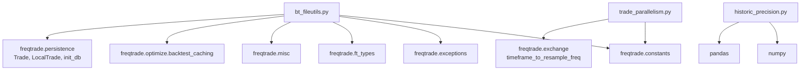
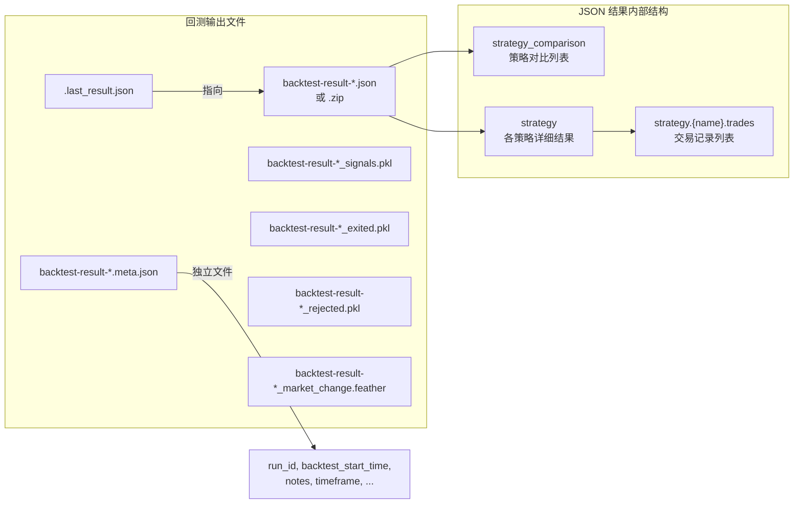
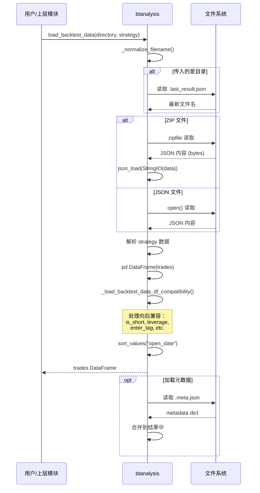
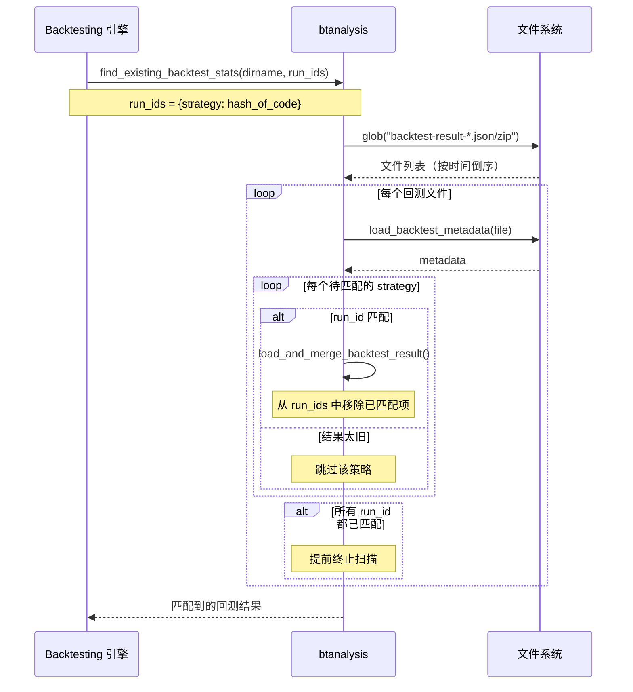
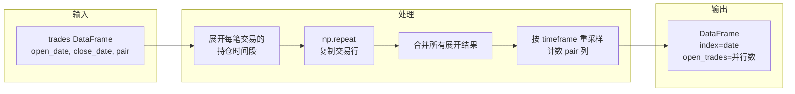

# Freqtrade 回测分析模块 (`freqtrade/data/btanalysis/`)

## 1. 模块概述

`freqtrade/data/btanalysis/` 是 Freqtrade 的**回测分析工具模块**，提供了一套完整的回测结果读取、解析和分析功能。该模块是连接回测引擎输出和上层可视化/报告工具之间的桥梁。

其核心能力包括：

- **回测结果文件管理**：定位最新的回测结果文件（JSON/ZIP 格式），读取、合并和删除回测结果
- **元数据管理**：读写回测元数据（策略名称、运行 ID、回测时间范围等），支持增量更新
- **交易数据加载**：从回测结果文件或数据库加载交易记录，转换为标准 DataFrame 格式
- **回测缓存匹配**：通过 run_id 匹配机制查找已有的回测结果，避免重复回测
- **市场变化数据读取**：加载回测期间的市场整体变化数据
- **交易并行度分析**：计算在回测期间任意时刻同时持有的交易数量
- **历史价格精度分析**：追踪交易对价格精度随时间的变化（tick size）

## 2. 目录结构

```
freqtrade/data/btanalysis/
├── __init__.py              # 模块初始化，统一导出所有公共接口
├── bt_fileutils.py          # 回测文件读写核心工具（约 580 行）
├── historic_precision.py    # 历史价格精度分析工具（约 31 行）
└── trade_parallelism.py     # 交易并行度分析工具（约 61 行）
```

### 文件功能详解

| 文件 | 行数 | 核心功能 |
|------|------|---------|
| `__init__.py` | ~30 | 从三个子模块导出所有公共 API |
| `bt_fileutils.py` | ~582 | 回测结果文件的读取、加载、合并、删除、元数据管理 |
| `historic_precision.py` | ~31 | 计算 OHLCV 数据中价格的有效位数随时间变化 |
| `trade_parallelism.py` | ~61 | 分析回测交易的时间重叠（并行持仓数量） |

## 3. 架构图

```mermaid
graph TB
    subgraph "外部输入"
        BT_JSON["回测结果文件<br/>(JSON/ZIP)"]
        BT_META["元数据文件<br/>(.meta.json)"]
        BT_PKL["分析数据文件<br/>(.pkl)"]
        BT_FEATHER["市场变化数据<br/>(.feather)"]
        SQL_DB["SQLite 数据库<br/>(tradesv3.sqlite)"]
        OHLCV_DF["OHLCV DataFrame"]
    end

    subgraph "btanalysis 模块"
        subgraph "bt_fileutils.py"
            FN_LATEST["get_latest_backtest_filename()<br/>定位最新回测文件"]
            FN_STATS["load_backtest_stats()<br/>加载回测统计"]
            FN_DATA["load_backtest_data()<br/>加载交易数据"]
            FN_META["load_backtest_metadata()<br/>加载元数据"]
            FN_ANALYSIS["load_backtest_analysis_data()<br/>加载分析数据"]
            FN_TRADES_DB["load_trades_from_db()<br/>从 DB 加载交易"]
            FN_TRADES["load_trades()<br/>统一加载入口"]
            FN_FIND["find_existing_backtest_stats()<br/>查找已有结果"]
            FN_MERGE["load_and_merge_backtest_result()<br/>合并多策略结果"]
            FN_DELETE["delete_backtest_result()<br/>删除回测结果"]
            FN_UPDATE["update_backtest_metadata()<br/>更新元数据"]
            FN_MARKET["get_backtest_market_change()<br/>市场变化数据"]
            FN_CONVERT["trade_list_to_dataframe()<br/>Trade 对象转 DataFrame"]
            FN_EXTRACT["extract_trades_of_period()<br/>提取时段交易"]
            FN_RESULTLIST["get_backtest_resultlist()<br/>获取结果列表"]
        end

        subgraph "historic_precision.py"
            FN_TICK["get_tick_size_over_time()<br/>计算价格精度变化"]
        end

        subgraph "trade_parallelism.py"
            FN_PARALLEL["analyze_trade_parallelism()<br/>分析交易并行度"]
            FN_EVAL["evaluate_result_multi()<br/>检查超额持仓"]
        end
    end

    subgraph "上层消费者"
        PLOT["plot 绘图模块"]
        API_SERVER["REST API Server"]
        CLI_CMD["CLI 命令<br/>(backtesting-analysis)"]
        EEA["entryexitanalysis.py<br/>进出场分析"]
        BT_ENGINE["Backtesting 引擎"]
        HYPEROPT["Hyperopt 优化器"]
    end

    BT_JSON --> FN_LATEST
    BT_JSON --> FN_STATS
    BT_META --> FN_META
    BT_PKL --> FN_ANALYSIS
    BT_FEATHER --> FN_MARKET
    SQL_DB --> FN_TRADES_DB
    OHLCV_DF --> FN_TICK

    FN_LATEST --> FN_STATS
    FN_STATS --> FN_DATA
    FN_META --> FN_UPDATE
    FN_META --> FN_FIND

    FN_TRADES_DB --> FN_TRADES
    FN_DATA --> FN_TRADES

    PLOT --> FN_DATA
    PLOT --> FN_EXTRACT
    PLOT --> FN_TICK
    API_SERVER --> FN_RESULTLIST
    API_SERVER --> FN_DELETE
    API_SERVER --> FN_UPDATE
    CLI_CMD --> EEA
    EEA --> FN_DATA
    EEA --> FN_STATS
    EEA --> FN_ANALYSIS
    BT_ENGINE --> FN_FIND
    BT_ENGINE --> FN_PARALLEL
    HYPEROPT --> FN_FIND
```



## 4. 核心类/函数说明

### 4.1 bt_fileutils.py - 回测文件工具

这是 btanalysis 模块最核心的文件，包含所有回测数据的 I/O 操作。

#### 4.1.1 常量定义

```python
BT_DATA_COLUMNS = [
    "pair", "stake_amount", "max_stake_amount", "amount",
    "open_date", "close_date", "open_rate", "close_rate",
    "fee_open", "fee_close", "trade_duration",
    "profit_ratio", "profit_abs", "exit_reason",
    "initial_stop_loss_abs", "initial_stop_loss_ratio",
    "stop_loss_abs", "stop_loss_ratio",
    "min_rate", "max_rate", "is_open", "enter_tag",
    "leverage", "is_short",
    "open_timestamp", "close_timestamp",
    "orders", "funding_fees",
]
```

此列表定义了回测结果 DataFrame 的标准列结构，共 26 个字段，涵盖了交易的所有关键信息。

#### 4.1.2 文件定位函数

| 函数 | 签名 | 功能 |
|------|------|------|
| `get_latest_optimize_filename` | `(directory: Path, variant: str) -> str` | 通过 `.last_result.json` 定位最新的优化结果文件名 |
| `get_latest_backtest_filename` | `(directory: Path) -> str` | 定位最新回测结果文件（调用上面的函数，variant="backtest"） |
| `get_latest_hyperopt_filename` | `(directory: Path) -> str` | 定位最新 hyperopt 结果文件 |
| `get_latest_hyperopt_file` | `(directory: Path, predef_filename: str | None) -> Path` | 返回完整的 hyperopt 文件路径 |

**文件命名约定：**
- 回测结果: `backtest-result-<strategy>-<timestamp>.json` 或 `.zip`
- 元数据: `backtest-result-<strategy>-<timestamp>.meta.json`
- 分析数据: `backtest-result-<strategy>-<timestamp>_signals.pkl`
- 最新结果索引: `.last_result.json`

#### 4.1.3 数据加载函数

**`load_backtest_stats(file_or_directory, filename) -> BacktestResultType`**

加载回测统计结果的主入口。支持从目录（自动寻找最新文件）或直接文件路径加载。支持 JSON 和 ZIP 两种格式。加载后还会自动附加元数据信息。

```python
# 典型用法
stats = load_backtest_stats("/path/to/results/")
# stats 结构: {"metadata": {...}, "strategy": {...}, "strategy_comparison": [...]}
```

**`load_backtest_data(file_or_directory, strategy, filename) -> pd.DataFrame`**

加载单个策略的交易记录。返回包含 BT_DATA_COLUMNS 列的 DataFrame。包含向后兼容处理：
- 自动处理旧版本缺少 `is_short`、`leverage`、`enter_tag`、`max_stake_amount`、`orders`、`funding_fees` 列的情况
- 将 `buy_tag` 重命名为 `enter_tag`

**`load_backtest_analysis_data(file_or_directory, name, filename)`**

加载回测分析数据（信号 K 线、拒绝信号、出场信号），支持从 ZIP 或独立 pickle 文件加载。
- `name` 参数可选值：`"signals"`, `"rejected"`, `"exited"`

**`load_file_from_zip(zip_path, filename) -> bytes`**

从 ZIP 文件中读取指定文件内容的通用工具。用于支持压缩格式的回测结果。

**`load_trades_from_db(db_url, strategy) -> pd.DataFrame`**

从 SQLite 数据库加载交易记录，初始化数据库连接后查询 Trade 表。

**`load_trades(source, db_url, exportfilename, no_trades, strategy) -> pd.DataFrame`**

统一的交易数据加载入口，根据 `source` 参数自动选择从数据库或文件加载。

#### 4.1.4 结果管理函数

**`find_existing_backtest_stats(dirname, run_ids, min_backtest_date) -> dict`**

通过 run_id 机制查找已有的回测结果。用于**回测缓存**：如果某策略的代码未变（run_id 相同），则可以跳过重复回测。按时间倒序扫描结果文件，直到所有 run_id 都匹配到或扫描完毕。

**`load_and_merge_backtest_result(strategy_name, filename, results)`**

将单个策略的回测结果合并到多策略结果字典中，用于组合多次回测的结果。

**`get_backtest_resultlist(dirname) -> list[BacktestHistoryEntryType]`**

扫描目录下所有回测结果文件，返回结果列表（含策略名、run_id、时间范围等）。用于 REST API 展示回测历史。

**`delete_backtest_result(file_abs)`**

删除回测结果文件及其关联文件（元数据等），通过 glob 匹配同名文件。

**`update_backtest_metadata(filename, strategy, content)`**

增量更新回测元数据（如添加笔记 notes），写回元数据文件。

#### 4.1.5 辅助函数

**`get_backtest_market_change(filename, include_ts) -> pd.DataFrame`**

读取回测期间的市场变化数据（Feather 格式），可选添加时间戳列。

**`trade_list_to_dataframe(trades) -> pd.DataFrame`**

将 `Trade` / `LocalTrade` 对象列表转换为标准 DataFrame，进行类型转换和时间戳处理。

**`extract_trades_of_period(dataframe, trades, date_index) -> pd.DataFrame`**

从交易记录中提取与指定 DataFrame 时间段重叠的交易。

### 4.2 historic_precision.py - 历史价格精度分析

#### `get_tick_size_over_time(candles: DataFrame) -> Series`

计算 OHLCV 数据中价格的**最小变动单位（tick size）随时间的变化**。

**算法步骤：**

1. 对 open/high/low/close 四个价格列，将每个值转换为精确字符串表示
2. 通过正则表达式提取小数点后有效位数
3. 取四列中的最大值作为该 K 线的精度
4. 按月重采样，取每月的最大精度值
5. 将位数转换为 tick size（如 5 位 -> 0.00001）

**应用场景：**
- 检测交易所是否改变了某交易对的价格精度
- 为回测设置合适的 `price_precision` 参数
- 绘制价格精度变化图表

### 4.3 trade_parallelism.py - 交易并行度分析

#### `analyze_trade_parallelism(trades: pd.DataFrame, timeframe: str) -> pd.DataFrame`

分析回测期间**每个时间点的并行持仓数量**。

**算法步骤：**

1. 对每笔交易，用 `pd.date_range()` 展开其持仓期间覆盖的所有 K 线时段
2. 将所有交易的展开结果合并
3. 按时间重采样并计数，得到每个时间点的并行交易数量

**返回值：** DataFrame，索引为时间，列 `open_trades` 为并行交易数。

#### `evaluate_result_multi(trades, timeframe, max_open_trades) -> pd.DataFrame`

在 `analyze_trade_parallelism` 的基础上，筛选出超过 `max_open_trades` 限制的时间段。用于验证回测结果是否违反了最大持仓数量设置。

## 5. 依赖关系

### 5.1 外部依赖

| 库 | 用途 | 使用文件 |
|----|------|---------|
| `pandas` | DataFrame 操作、时间序列处理 | 全部 |
| `numpy` | 数值计算、format_float_positional | bt_fileutils.py, historic_precision.py |
| `joblib` | pickle 文件的序列化/反序列化 | bt_fileutils.py |
| `zipfile` | ZIP 文件读取 | bt_fileutils.py |

### 5.2 内部依赖



### 5.3 被依赖方

| 模块 | 使用的接口 |
|------|-----------|
| `freqtrade.data.entryexitanalysis` | `load_backtest_stats`, `load_backtest_data`, `load_backtest_analysis_data`, `BT_DATA_COLUMNS` |
| `freqtrade.optimize.backtesting` | `find_existing_backtest_stats`, `trade_list_to_dataframe` |
| `freqtrade.optimize.hyperopt` | `find_existing_backtest_stats` |
| `freqtrade.plot.plotting` | `load_backtest_data`, `extract_trades_of_period`, `get_tick_size_over_time` |
| `freqtrade.rpc.api_server` | `get_backtest_resultlist`, `delete_backtest_result`, `update_backtest_metadata`, `load_backtest_stats` |
| `freqtrade.commands` | `load_backtest_stats`, `load_backtest_data` |

## 6. 数据流

### 6.1 回测结果文件结构



### 6.2 加载回测数据流程



### 6.3 回测缓存匹配流程



### 6.4 交易并行度分析流程



## 7. 使用示例

### 加载回测结果

```python
from freqtrade.data.btanalysis import load_backtest_stats, load_backtest_data

# 加载完整统计
stats = load_backtest_stats("/path/to/user_data/backtest_results/")

# 加载单策略交易记录
trades = load_backtest_data("/path/to/user_data/backtest_results/", strategy="MyStrategy")
print(f"总交易数: {len(trades)}")
print(f"时间范围: {trades['open_date'].min()} - {trades['close_date'].max()}")
```

### 分析交易并行度

```python
from freqtrade.data.btanalysis import analyze_trade_parallelism

parallelism = analyze_trade_parallelism(trades, timeframe="5m")
print(f"最大并行持仓: {parallelism['open_trades'].max()}")
```

### 分析价格精度

```python
from freqtrade.data.btanalysis import get_tick_size_over_time

tick_sizes = get_tick_size_over_time(ohlcv_dataframe)
# 输出每月的 tick size，如 0.01, 0.001 等
```
