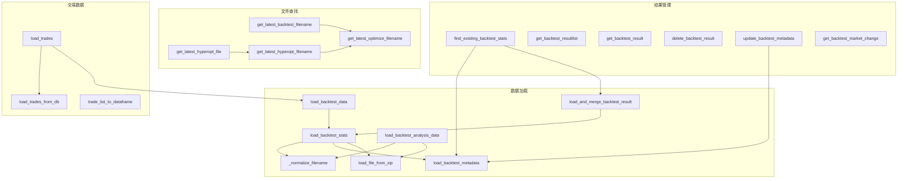

# bt_fileutils.py

## 概述

`bt_fileutils.py` 是回测数据文件操作的核心工具模块。提供了回测结果文件的读取、写入、查找、删除、合并等完整功能。支持 JSON 和 ZIP 两种回测结果存储格式，以及从数据库加载交易记录。它还处理了新旧数据格式的兼容性问题。

## 架构图

## 核心类/函数

### 常量

#### BT_DATA_COLUMNS
回测数据的列定义列表，包含 26 个字段：`pair`, `stake_amount`, `max_stake_amount`, `amount`, `open_date`, `close_date`, `open_rate`, `close_rate`, `fee_open`, `fee_close`, `trade_duration`, `profit_ratio`, `profit_abs`, `exit_reason`, `initial_stop_loss_abs`, `initial_stop_loss_ratio`, `stop_loss_abs`, `stop_loss_ratio`, `min_rate`, `max_rate`, `is_open`, `enter_tag`, `leverage`, `is_short`, `open_timestamp`, `close_timestamp`, `orders`, `funding_fees`。

### 文件查找函数

#### get_latest_optimize_filename(directory, variant) -> str
根据 `.last_result.json` 文件获取最新的优化结果文件名。`variant` 参数可为 `"backtest"` 或 `"hyperopt"`。

#### get_latest_backtest_filename(directory) -> str
获取最新回测结果文件名，封装了 `get_latest_optimize_filename`。

#### get_latest_hyperopt_filename(directory) -> str
获取最新 hyperopt 结果文件名，找不到时回退到 `"hyperopt_results.pickle"`。

#### get_latest_hyperopt_file(directory, predef_filename) -> Path
获取最新 hyperopt 文件的完整路径，支持预定义文件名（必须为相对路径）。

### 数据加载函数

#### load_backtest_stats(file_or_directory, filename) -> BacktestResultType
加载回测统计文件。支持 JSON 和 ZIP 格式。自动加载对应的 metadata 文件。

#### load_backtest_data(file_or_directory, strategy, filename) -> DataFrame
加载回测结果中的单个策略交易数据。支持多策略结果文件，需指定策略名。内部调用 `_load_backtest_data_df_compatibility` 处理旧格式兼容性（如缺少 `is_short`、`leverage`、`funding_fees` 等列）。

#### load_backtest_metadata(filename) -> dict
读取回测结果的元数据（不加载整个结果文件）。元数据存储在独立的 `.meta.json` 文件中。

#### load_backtest_analysis_data(file_or_directory, name, filename)
加载回测分析数据（signals/rejected/exited），支持从 ZIP 文件或独立 pickle 文件加载。使用 `joblib` 进行反序列化。

#### load_file_from_zip(zip_path, filename) -> bytes
从 ZIP 文件中读取指定文件的字节内容。

#### load_and_merge_backtest_result(strategy_name, filename, results)
从多策略回测结果文件中加载单个策略的结果并合并到 `results` 字典中。

### 交易数据函数

#### trade_list_to_dataframe(trades) -> DataFrame
将 Trade/LocalTrade 对象列表转换为 DataFrame，使用 `BT_DATA_COLUMNS` 作为列定义。

#### load_trades_from_db(db_url, strategy) -> DataFrame
从 SQLite 数据库加载交易记录，初始化数据库连接后查询所有交易。

#### load_trades(source, db_url, exportfilename, no_trades, strategy) -> DataFrame
统一的交易数据加载入口，根据 `source` 参数选择从数据库（`"DB"`）或文件（`"file"`）加载。

### 结果管理函数

#### find_existing_backtest_stats(dirname, run_ids, min_backtest_date) -> dict
查找匹配指定 `run_id` 的已有回测结果。用于回测缓存机制，避免重复运行相同配置。文件按新旧排序，遇到无 metadata 的旧文件时停止搜索。

#### get_backtest_resultlist(dirname) -> list
获取目录下所有回测结果文件的历史条目列表。

#### delete_backtest_result(file_abs)
删除回测结果文件及其关联的 metadata 文件。

#### update_backtest_metadata(filename, strategy, content)
更新指定策略的回测元数据，写回文件。

#### get_backtest_market_change(filename, include_ts) -> DataFrame
读取回测期间的市场变动数据（feather 格式），支持从 ZIP 文件读取。

#### extract_trades_of_period(dataframe, trades, date_index) -> DataFrame
从交易记录中提取与给定 K 线 DataFrame 时间段重叠的交易。

## 依赖关系

### 内部依赖（本项目模块）
- `freqtrade.constants.LAST_BT_RESULT_FN` -- 最新回测结果文件名常量
- `freqtrade.exceptions` -- 异常类（ConfigurationError, OperationalException）
- `freqtrade.ft_types` -- 类型定义（BacktestHistoryEntryType, BacktestResultType）
- `freqtrade.misc` -- 工具函数（file_dump_json, json_load）
- `freqtrade.optimize.backtest_caching` -- 回测缓存（get_backtest_metadata_filename）
- `freqtrade.persistence` -- 持久化层（LocalTrade, Trade, init_db）

### 外部依赖（第三方库）
- `pandas` -- DataFrame 操作
- `numpy` -- 数值计算（int64 转换等）
- `zipfile` -- ZIP 文件读写
- `joblib` -- pickle 数据反序列化（延迟导入）
- `pathlib.Path` -- 文件路径处理
- `copy.copy` -- 浅拷贝

### 被依赖（谁引用了本文件）
- 通过 `freqtrade.data.btanalysis.__init__` 暴露所有公共 API
- `freqtrade.data.entryexitanalysis` -- 使用 load_backtest_data, load_backtest_stats, load_backtest_analysis_data
- `freqtrade.optimize.backtesting` -- 使用 find_existing_backtest_stats, load_backtest_data
- `freqtrade.rpc.api_server.api_backtest` -- 使用回测结果管理函数
- `freqtrade.plot.plotting` -- 使用 load_backtest_data, extract_trades_of_period
- `freqtrade.commands.optimize_commands` -- CLI 命令使用各加载函数
