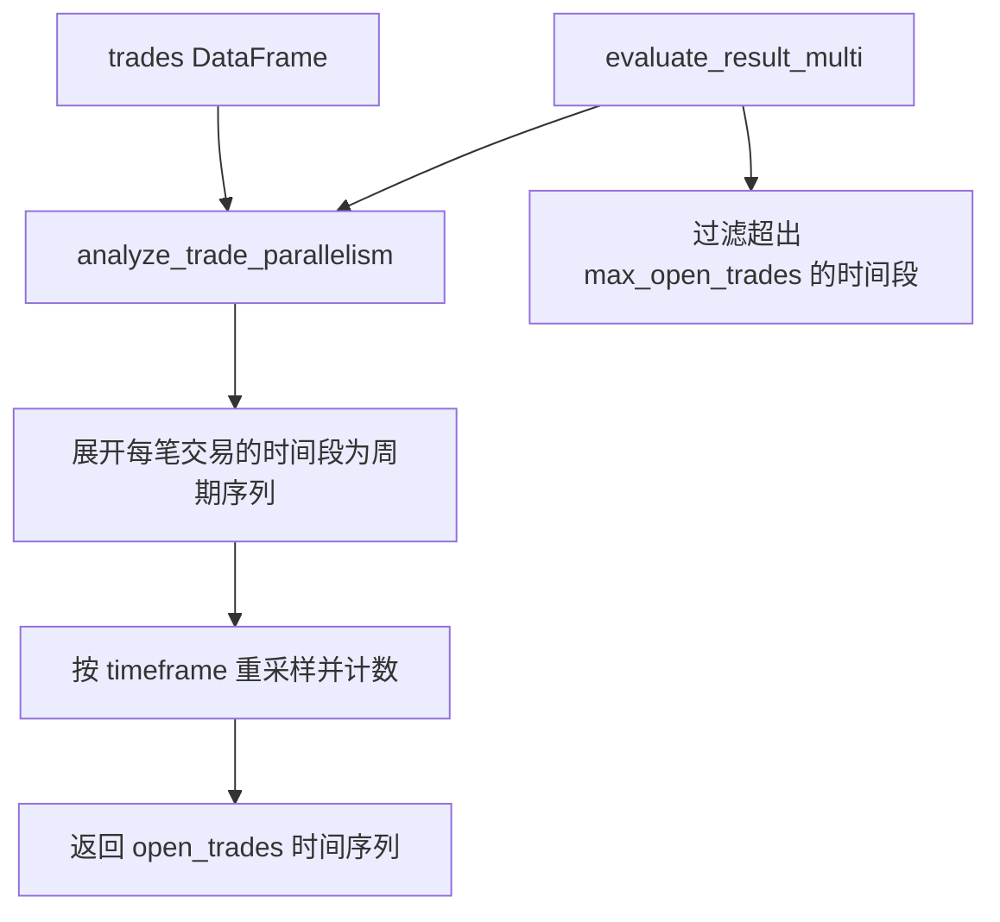

# trade_parallelism.py

## 概述

`trade_parallelism.py` 提供了分析回测中交易并行度（同一时间段内有多少笔交易同时处于开仓状态）的功能。这对于评估 `max_open_trades` 参数的合理性以及理解策略的资金利用情况非常有用。

## 架构图

## 核心类/函数

### analyze_trade_parallelism(trades: DataFrame, timeframe: str) -> DataFrame
分析交易的时间重叠度，计算每个时间周期内同时打开的交易数量。

**参数：**
- `trades: DataFrame` -- 交易数据 DataFrame，需包含 `open_date` 和 `close_date` 列
- `timeframe: str` -- 回测使用的时间周期（如 `"5m"`, `"1h"`）

**返回值：**
- `DataFrame` -- 以 `date` 为索引，包含 `open_trades` 列的 DataFrame，表示每个时间周期的开仓交易数

**处理逻辑：**
1. 对每笔交易，使用 `pd.date_range` 生成从 `open_date` 到 `close_date` 的时间序列（左闭右开，因为 date 是 K 线开盘时间）
2. 使用 `np.repeat` 将交易数据按展开后的长度复制
3. 将展开的时间序列与复制的交易数据合并
4. 按 timeframe 重采样，对 `pair` 列计数得到并行交易数

### evaluate_result_multi(trades: DataFrame, timeframe: str, max_open_trades: IntOrInf) -> DataFrame
评估多交易对回测结果中超出最大同时开仓限制的时间段。

**参数：**
- `trades: DataFrame` -- 交易数据
- `timeframe: str` -- 时间周期
- `max_open_trades: IntOrInf` -- 最大同时开仓数限制

**返回值：**
- `DataFrame` -- 仅包含 `open_trades > max_open_trades` 的时间段

**用途：**
用于验证回测逻辑是否正确遵守了 `max_open_trades` 的限制。如果返回非空 DataFrame，说明存在超额开仓的情况。

## 依赖关系

### 内部依赖（本项目模块）
- `freqtrade.constants.IntOrInf` -- 支持无穷大的整数类型
- `freqtrade.exchange.timeframe_to_resample_freq` -- timeframe 转 resample 频率（延迟导入）

### 外部依赖（第三方库）
- `pandas` -- DataFrame 操作、时间序列处理
- `numpy` -- 数组重复（np.repeat）

### 被依赖（谁引用了本文件）
- 通过 `freqtrade.data.btanalysis.__init__` 导出
- `freqtrade.optimize.backtesting` -- 回测引擎使用 `evaluate_result_multi` 验证交易并行度
- `freqtrade.plot.plotting` -- 绘图模块使用 `analyze_trade_parallelism` 绘制并行交易图
