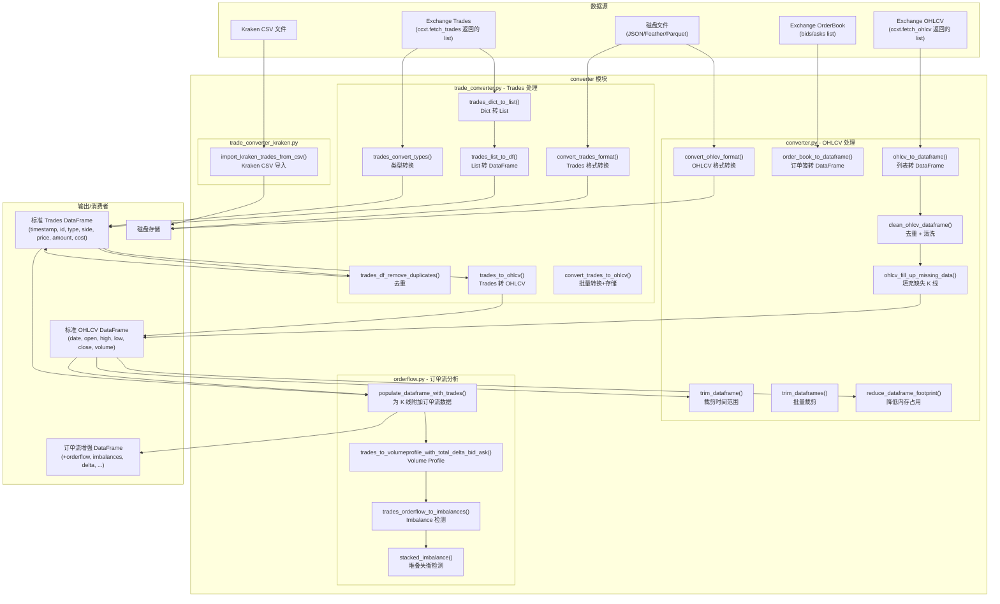
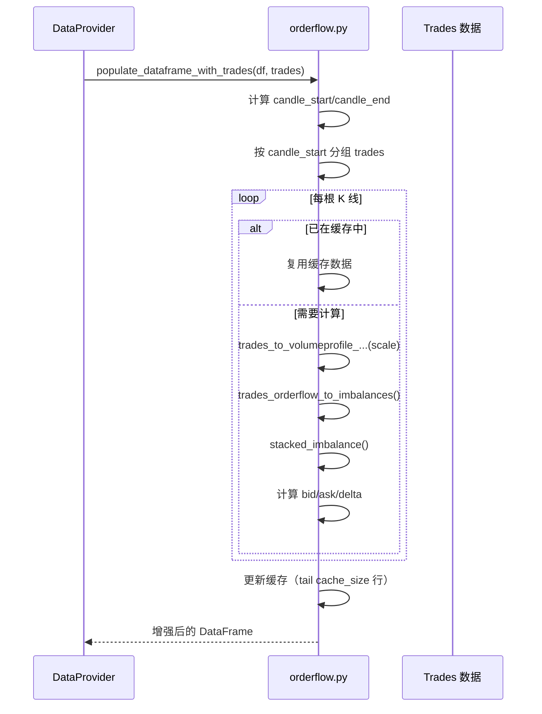
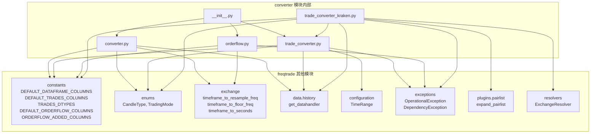
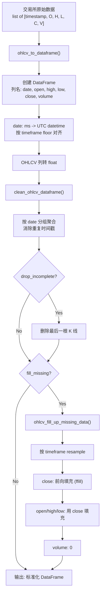
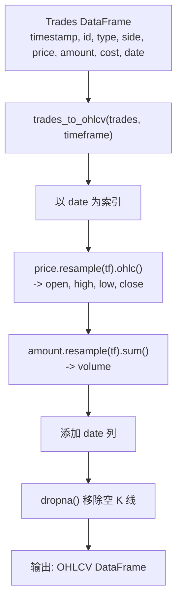
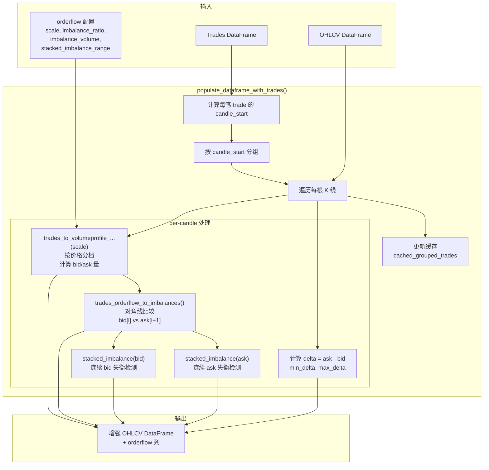
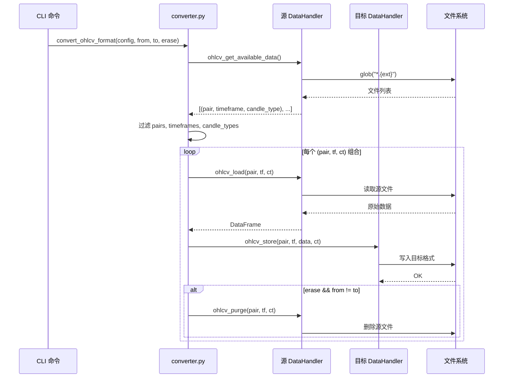

# Freqtrade 数据转换模块 (`freqtrade/data/converter/`)

## 1. 模块概述

`freqtrade/data/converter/` 是 Freqtrade 的**数据格式转换中枢**，负责在不同数据表示形式之间进行转换。它是数据模块中最基础的工具层，被 `history/`、`DataProvider` 和 `btanalysis/` 等上层模块广泛调用。

该模块的核心能力：

- **OHLCV 数据处理**：将交易所返回的原始 K 线列表转换为标准化 DataFrame，进行去重、缺失数据填充、时间对齐等清洗操作
- **数据格式转换**：在 JSON、Feather、Parquet 等存储格式之间转换 OHLCV 和 trades 数据
- **Trades 到 OHLCV 转换**：将逐笔成交数据聚合为不同时间周期的 K 线数据
- **订单流分析**：从逐笔成交数据计算 volume profile、order flow imbalance、stacked imbalance 等高级市场微观结构指标
- **数据优化**：降低 DataFrame 内存占用（float64 -> float32 等），裁剪 DataFrame 到指定时间范围
- **特殊格式导入**：支持从 Kraken 交易所 CSV 导出文件导入 trades 数据

## 2. 目录结构

```
freqtrade/data/converter/
├── __init__.py                  # 模块初始化，统一导出所有公共接口
├── converter.py                 # OHLCV 数据转换核心（清洗、填充、格式转换、裁剪）
├── orderflow.py                 # 订单流数据处理（trades 转 volume profile、imbalance 等）
├── trade_converter.py           # Trades 数据转换（类型转换、去重、trades 转 OHLCV、格式转换）
└── trade_converter_kraken.py    # Kraken 交易所特有的 CSV 数据导入
```

### 文件功能详解

| 文件 | 行数 | 核心功能 |
|------|------|---------|
| `__init__.py` | ~41 | 导出 18 个公共函数，定义 `__all__` |
| `converter.py` | ~306 | OHLCV DataFrame 转换、清洗、填充缺失数据、格式转换、内存优化 |
| `orderflow.py` | ~266 | 订单流分析：volume profile、bid/ask imbalance、stacked imbalance |
| `trade_converter.py` | ~165 | Trades 数据转换：列表转 DataFrame、trades 转 OHLCV K 线、格式转换 |
| `trade_converter_kraken.py` | ~93 | 从 Kraken CSV 文件导入 trades 数据并存储 |

## 3. 架构图



## 4. 核心类/函数说明

### 4.1 converter.py - OHLCV 数据转换核心

#### `ohlcv_to_dataframe(ohlcv, timeframe, pair, *, fill_missing, drop_incomplete) -> DataFrame`

将交易所返回的 OHLCV 列表转换为标准化 Pandas DataFrame。这是**从交易所获取数据后的第一道处理**。

**处理步骤：**

1. 创建 DataFrame，列名为 `DEFAULT_DATAFRAME_COLUMNS`（date, open, high, low, close, volume）
2. 将 `date` 列从毫秒时间戳转为 UTC datetime，并按 timeframe 对齐（floor）
3. 将 OHLCV 列强制转为 `float` 类型（某些交易所返回 int）
4. 调用 `clean_ohlcv_dataframe()` 进行清洗

```python
# 使用示例
from freqtrade.data.converter import ohlcv_to_dataframe

raw_data = exchange.fetch_ohlcv("BTC/USDT", "5m")
df = ohlcv_to_dataframe(raw_data, "5m", "BTC/USDT",
                         fill_missing=True, drop_incomplete=True)
```

#### `clean_ohlcv_dataframe(dataframe, timeframe, pair, *, fill_missing, drop_incomplete) -> DataFrame`

对 OHLCV DataFrame 进行深度清洗：

1. **按 date 分组聚合**：处理重复时间戳，使用 `first`/`max`/`min`/`last`/`max` 聚合策略
2. **删除不完整 K 线**：如果 `drop_incomplete=True`，移除最后一根 K 线（通常是未收盘的 K 线）
3. **填充缺失数据**：如果 `fill_missing=True`，调用 `ohlcv_fill_up_missing_data()`

#### `ohlcv_fill_up_missing_data(dataframe, timeframe, pair) -> DataFrame`

填充缺失的 K 线数据。在数据下载过程中，交易所可能不返回无成交的 K 线，导致时间序列不连续。

**填充策略：**

- 按 timeframe 进行 resample，自动产生缺失的时间点（NaN 值）
- `close`：使用前一根 K 线的 close 前向填充（ffill）
- `open`、`high`、`low`：使用填充后的 `close` 值
- `volume`：保持为 0（sum 聚合，NaN 变为 0）

**日志级别自适应：**

- 缺失数据 > 1% 时使用 `logger.info`
- 缺失数据 <= 1% 时使用 `logger.debug`（避免输出过多噪音）

#### `trim_dataframe(df, timerange, *, df_date_col, startup_candles) -> DataFrame`

根据 TimeRange 裁剪 DataFrame 的时间范围。

- 如果指定了 `startup_candles`，从头部移除对应数量的 K 线（优先于 timerange 的 start）
- 如果 TimeRange 有 `starttype == "date"`，保留 >= startdt 的数据
- 如果 TimeRange 有 `stoptype == "date"`，保留 <= stopdt 的数据

#### `trim_dataframes(preprocessed, timerange, startup_candles) -> dict[str, DataFrame]`

批量裁剪多个交易对的 DataFrame。跳过裁剪后为空的交易对，并发出警告。

#### `order_book_to_dataframe(bids, asks) -> DataFrame`

将 L2 订单簿数据转换为结构化 DataFrame：

```
 b_sum    b_size    bids    asks    a_size    a_sum
 (累计)   (单量)    (买价)  (卖价)   (单量)    (累计)
```

#### `convert_ohlcv_format(config, convert_from, convert_to, erase)`

在不同存储格式之间批量转换 OHLCV 数据。

**处理流程：**

1. 创建源格式和目标格式的 DataHandler
2. 扫描源格式下所有可用的 (pair, timeframe, candle_type) 组合
3. 按配置过滤交易对和时间周期
4. 逐一读取源数据、写入目标格式
5. 如果 `erase=True` 且源格式 != 目标格式，删除源文件

#### `reduce_dataframe_footprint(df) -> DataFrame`

降低 DataFrame 的内存占用：

- `float64` 列 -> `float32`（除 OHLCV 核心列外）
- `int64` 列 -> `int32`
- OHLCV 核心列（open, high, low, close, volume）保持 float64 精度

### 4.2 trade_converter.py - Trades 数据转换

#### `trades_df_remove_duplicates(trades) -> DataFrame`

基于 `timestamp` 和 `id` 两列去除重复的 trades 记录。在多次下载数据后合并时尤为重要。

#### `trades_dict_to_list(trades: list[dict]) -> TradeList`

将 ccxt 返回的 trades dict 列表转为嵌套列表格式，减少内存占用。按照 `DEFAULT_TRADES_COLUMNS` 顺序提取字段：

```python
DEFAULT_TRADES_COLUMNS = ["timestamp", "id", "type", "side", "price", "amount", "cost"]
```

#### `trades_convert_types(trades: DataFrame) -> DataFrame`

将 Trades DataFrame 的列转换为正确的数据类型（按 `TRADES_DTYPES` 定义），并添加 `date` 列（从 timestamp 毫秒转换）。

#### `trades_list_to_df(trades: TradeList, convert: bool = True) -> DataFrame`

将嵌套列表格式的 trades 转换为 DataFrame。如果 `convert=True`，还会调用 `trades_convert_types()` 进行类型转换。

#### `trades_to_ohlcv(trades: DataFrame, timeframe: str) -> DataFrame`

**核心转换函数**：将逐笔成交数据聚合为 OHLCV K 线数据。

**算法：**

1. 以 `date` 列为索引
2. 对 `price` 列按 timeframe 进行 resample，取 OHLC（open/high/low/close）
3. 对 `amount` 列按 timeframe 求和，得 volume
4. 丢弃无交易的空 K 线
5. 返回标准 `DEFAULT_DATAFRAME_COLUMNS` 列结构

```python
# 示例
from freqtrade.data.converter import trades_to_ohlcv

ohlcv = trades_to_ohlcv(trades_df, "5m")
```

#### `convert_trades_to_ohlcv(pairs, timeframes, datadir, timerange, erase, ...)`

批量将磁盘上的 trades 数据转换为 OHLCV 数据并存储。对每个 pair x timeframe 组合执行 `trades_to_ohlcv()`。

#### `convert_trades_format(config, convert_from, convert_to, erase)`

在不同存储格式之间批量转换 trades 数据。特殊处理：如果 `convert_from == "kraken_csv"`，调用 Kraken 专用导入函数。

### 4.3 orderflow.py - 订单流分析

#### `populate_dataframe_with_trades(cached, config, dataframe, trades) -> tuple[DataFrame, DataFrame]`

**核心函数**：为 OHLCV DataFrame 的每根 K 线附加订单流分析数据。

**添加的列：**

| 列名 | 类型 | 说明 |
|------|------|------|
| `trades` | object (list[dict]) | 该 K 线时段内的所有逐笔交易 |
| `orderflow` | object (dict) | Volume Profile 数据（按价格分档） |
| `imbalances` | object (dict) | Bid/Ask Imbalance 数据 |
| `stacked_imbalances_bid` | object (list) | 连续 bid imbalance 价位 |
| `stacked_imbalances_ask` | object (list) | 连续 ask imbalance 价位 |
| `bid` | float | 总 bid 成交量 |
| `ask` | float | 总 ask 成交量 |
| `delta` | float | ask - bid 净成交量 |
| `min_delta` | float | 累积 delta 最小值 |
| `max_delta` | float | 累积 delta 最大值 |
| `total_trades` | int | 总交易笔数 |

**缓存机制：**

- 维护 `cached_grouped_trades` DataFrame，缓存最近 N 根 K 线的订单流数据
- 对已缓存的 K 线直接复用，避免重复计算
- 缓存大小由 `config["orderflow"]["cache_size"]` 配置

**处理流程：**



#### `trades_to_volumeprofile_with_total_delta_bid_ask(trades, scale) -> DataFrame`

将单根 K 线内的逐笔交易数据按照 `scale`（价格精度，如 0.5）分档，计算每个价位的：

- `bid_amount`：卖方成交量
- `ask_amount`：买方成交量
- `bid`：卖方交易笔数
- `ask`：买方交易笔数
- `delta`：ask_amount - bid_amount
- `total_volume`：总成交量
- `total_trades`：总笔数

返回以 price 为索引的 DataFrame，即 **Volume Profile**。

#### `trades_orderflow_to_imbalances(df, imbalance_ratio, imbalance_volume) -> DataFrame`

检测订单流中的**失衡**（imbalance）：

- **Bid Imbalance**: `bid[i] / ask[i+1] > imbalance_ratio`（对角线比较）
- **Ask Imbalance**: `ask[i+1] / bid[i] > imbalance_ratio`
- 额外条件：`total_volume >= imbalance_volume`（过滤低量噪音）

返回 DataFrame，包含 `bid_imbalance` 和 `ask_imbalance` 两列（bool 类型）。

#### `stacked_imbalance(df, label, stacked_imbalance_range) -> list`

检测**堆叠失衡**（Stacked Imbalance）：连续 N 个或以上价位出现相同方向的 imbalance。

**算法：**

1. 统计连续 True 的 cumsum
2. 找到计数 >= `stacked_imbalance_range` 的索引
3. 返回堆叠失衡起始价位列表

堆叠失衡是市场微观结构分析中的重要信号，表示某个价格区域存在强烈的买方或卖方压力。

#### `timeframe_to_DateOffset(timeframe: str) -> pd.DateOffset`

将 Freqtrade 的 timeframe 字符串（如 '1m', '5m', '1h', '1d', '1w'）转换为 pandas DateOffset 对象。根据 timeframe 的大小选择合适的偏移量单位。

### 4.4 trade_converter_kraken.py - Kraken 数据导入

#### `import_kraken_trades_from_csv(config, convert_to)`

从 Kraken 交易所导出的 CSV 文件批量导入 trades 数据。

**处理流程：**

1. 扫描 `datadir/trades_csv/` 目录下所有 `.csv` 文件
2. 通过交易所 API 将 Kraken 的 `altname` 映射为标准交易对名称
3. 对每个交易对，合并所有相关 CSV 文件
4. 处理 CSV 格式：
   - 列: `timestamp`, `price`, `amount`（KRAKEN_CSV_TRADE_COLUMNS）
   - 将 timestamp 从秒转为毫秒
   - 计算 cost = price * amount
   - 补充缺失的标准列
5. 类型转换、去重
6. 通过 DataHandler 存储为目标格式

## 5. 依赖关系

### 5.1 外部依赖

| 库 | 用途 | 使用文件 |
|----|------|---------|
| `pandas` | DataFrame 核心操作、resample、groupby | 全部 |
| `numpy` | 数值计算、条件运算（np.where）、类型转换 | converter.py, orderflow.py |

### 5.2 内部依赖



### 5.3 被依赖方

| 模块 | 使用的函数 |
|------|-----------|
| `freqtrade.data.history.history_utils` | `clean_ohlcv_dataframe`, `trades_df_remove_duplicates`, `trades_list_to_df`, `convert_trades_to_ohlcv` |
| `freqtrade.data.history.datahandlers.idatahandler` | `clean_ohlcv_dataframe`, `trades_convert_types`, `trades_df_remove_duplicates`, `trim_dataframe` |
| `freqtrade.data.history.datahandlers.jsondatahandler` | `trades_dict_to_list`, `trades_list_to_df` |
| `freqtrade.data.dataprovider` | 通过 `history` 间接依赖 |
| `freqtrade.exchange` | `ohlcv_to_dataframe` |
| `freqtrade.commands` | `convert_ohlcv_format`, `convert_trades_format` |
| `freqtrade.freqtradebot` | `populate_dataframe_with_trades`（通过策略回调） |

## 6. 数据流

### 6.1 OHLCV 数据标准化流程



### 6.2 Trades 到 OHLCV 转换流程



### 6.3 订单流数据处理流程



### 6.4 格式转换流程



## 7. 配置参数

### orderflow 配置（`config["orderflow"]`）

| 参数 | 说明 | 典型值 |
|------|------|--------|
| `scale` | Volume Profile 的价格分档精度 | `0.5` |
| `imbalance_ratio` | Imbalance 检测的比率阈值 | `3` |
| `imbalance_volume` | Imbalance 检测的最低成交量 | `10` |
| `stacked_imbalance_range` | 堆叠失衡的连续价位数 | `3` |
| `max_candles` | 处理的最大 K 线数 | `500` |
| `cache_size` | 缓存的 K 线数 | `500` |

### 数据格式配置

| 参数 | 说明 | 可选值 |
|------|------|--------|
| `dataformat_ohlcv` | OHLCV 存储格式 | `json`, `jsongz`, `feather`, `parquet` |
| `dataformat_trades` | Trades 存储格式 | `json`, `jsongz`, `feather`, `parquet` |

## 8. 使用示例

### 将交易所原始数据转为 DataFrame

```python
from freqtrade.data.converter import ohlcv_to_dataframe

raw_ohlcv = [[1609459200000, 29000.0, 29500.0, 28800.0, 29300.0, 1234.5], ...]
df = ohlcv_to_dataframe(raw_ohlcv, "1h", "BTC/USDT")
```

### 将 trades 聚合为 K 线

```python
from freqtrade.data.converter import trades_list_to_df, trades_to_ohlcv

trades_df = trades_list_to_df(trades_list)
ohlcv_df = trades_to_ohlcv(trades_df, "5m")
```

### 批量格式转换

```python
from freqtrade.data.converter import convert_ohlcv_format

convert_ohlcv_format(config, convert_from="json", convert_to="feather", erase=True)
```
