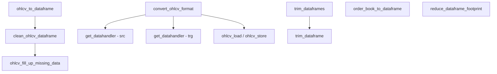

# converter.py

## 概述

`converter.py` 是 OHLCV（Open-High-Low-Close-Volume）K线数据转换和处理的核心模块。提供了将交易所返回的原始数据转换为 pandas DataFrame、清洗数据（去重、去除不完整K线、填充缺失数据）、裁剪数据（按时间范围或 startup candles）、订单簿数据转换以及不同数据格式之间的转换等功能。此外还提供了内存优化功能，将 float64/int64 降级为 float32/int32 以减少内存占用。

## 架构图

## 核心类/函数

### ohlcv_to_dataframe(ohlcv, timeframe, pair, fill_missing, drop_incomplete) -> DataFrame
将 ccxt `fetch_ohlcv` 返回的列表数据转换为 pandas DataFrame。

**参数：**
- `ohlcv: list` -- ccxt 格式的 OHLCV 列表数据
- `timeframe: str` -- 时间周期（如 `"5m"`）
- `pair: str` -- 交易对名称
- `fill_missing: bool` -- 是否填充缺失K线（默认 True）
- `drop_incomplete: bool` -- 是否删除最后一根不完整的K线（默认 True）

**处理逻辑：**
1. 将列表转为 DataFrame，列名使用 `DEFAULT_DATAFRAME_COLUMNS`（date, open, high, low, close, volume）
2. 将毫秒时间戳转为 UTC datetime，并按 timeframe 做 floor 对齐（解决交易所精度问题）
3. 将所有 OHLCV 列强制转为 float 类型（避免 TA-LIB 异常）
4. 调用 `clean_ohlcv_dataframe` 进行清洗

### clean_ohlcv_dataframe(dataframe, timeframe, pair, fill_missing, drop_incomplete) -> DataFrame
清洗 OHLCV DataFrame。

**处理步骤：**
1. 按 `date` 列 groupby 去重（open 取 first，high 取 max，low 取 min，close 取 last，volume 取 max）
2. 如果 `drop_incomplete=True`，删除最后一根K线
3. 如果 `fill_missing=True`，调用 `ohlcv_fill_up_missing_data` 填充缺失数据

### ohlcv_fill_up_missing_data(dataframe, timeframe, pair) -> DataFrame
填充缺失的K线数据。

**填充策略：**
1. 按 timeframe 频率重采样，自动产生缺失时间点的 NaN 行
2. `close` 列使用前向填充（ffill）
3. `open`、`high`、`low` 列使用已填充的 `close` 值
4. `volume` 使用 sum 聚合（缺失为 0）
5. 当缺失比例超过 1% 时输出 info 日志，否则输出 debug 日志

### trim_dataframe(df, timerange, df_date_col, startup_candles) -> DataFrame
按时间范围或 startup candles 裁剪 DataFrame。

**参数：**
- `df: DataFrame` -- 待裁剪的数据
- `timerange` -- TimeRange 对象
- `df_date_col: str` -- 日期列名（默认 `"date"`）
- `startup_candles: int` -- 启动K线数量（非0时优先使用，替代 timerange 起始日期）

### trim_dataframes(preprocessed, timerange, startup_candles) -> dict[str, DataFrame]
批量裁剪多个交易对的 DataFrame 字典。跳过裁剪后为空的交易对并输出警告。

### order_book_to_dataframe(bids, asks) -> DataFrame
将订单簿的 bids/asks 列表转换为 DataFrame，格式：`b_sum | b_size | bids | asks | a_size | a_sum`。其中 `b_sum` 和 `a_sum` 为累计成交量。

### convert_ohlcv_format(config, convert_from, convert_to, erase)
在不同数据存储格式之间转换 OHLCV 数据（如 json -> feather）。

**逻辑：**
1. 创建源格式和目标格式的 data handler
2. 获取所有可用的数据（SPOT + FUTURES）
3. 按配置过滤交易对、timeframe、candle type
4. 逐个加载源数据并存储为目标格式
5. 如果 `erase=True` 且格式不同，删除源数据

### reduce_dataframe_footprint(df) -> DataFrame
减小 DataFrame 内存占用。将 float64 降级为 float32，int64 降级为 int32。**不修改** `open`、`high`、`low`、`close`、`volume` 列（保持精度）。

## 依赖关系

### 内部依赖（本项目模块）
- `freqtrade.constants.DEFAULT_DATAFRAME_COLUMNS` -- 默认列定义
- `freqtrade.constants.Config` -- 配置类型
- `freqtrade.enums.CandleType` -- K线类型枚举
- `freqtrade.enums.TradingMode` -- 交易模式枚举
- `freqtrade.exchange.timeframe_to_floor_freq` -- timeframe 转 floor 频率（延迟导入）
- `freqtrade.exchange.timeframe_to_resample_freq` -- timeframe 转 resample 频率（延迟导入）
- `freqtrade.data.history.get_datahandler` -- 数据处理器工厂（延迟导入，在 convert_ohlcv_format 中使用）

### 外部依赖（第三方库）
- `pandas` -- DataFrame、to_datetime 等核心数据操作
- `numpy` -- 数值类型（float32, float64, int32, int64）

### 被依赖（谁引用了本文件）
- 通过 `freqtrade.data.converter.__init__` 导出
- `freqtrade.data.history.datahandlers.idatahandler` -- IDataHandler.ohlcv_load 调用 clean_ohlcv_dataframe 和 trim_dataframe
- `freqtrade.data.history.history_utils` -- 历史数据下载使用 clean_ohlcv_dataframe
- `freqtrade.exchange.exchange` -- 交易所模块使用 ohlcv_to_dataframe
- `freqtrade.strategy.interface` -- 策略使用 reduce_dataframe_footprint
- `freqtrade.optimize.backtesting` -- 回测使用 trim_dataframes
- `freqtrade.commands.data_commands` -- CLI 使用 convert_ohlcv_format
