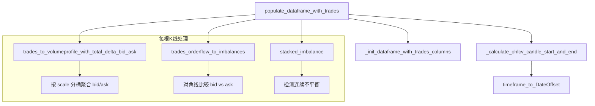

# orderflow.py

## 概述

`orderflow.py` 实现了从公开交易数据（public trades）生成订单流（orderflow）分析数据的功能。它将原始逐笔交易数据按 K 线周期分组，计算每个价格水平的买卖量分布（Volume Profile）、买卖不平衡（Imbalance）和堆叠不平衡（Stacked Imbalance），为策略提供微观结构分析数据。这是 freqtrade 订单流分析功能的核心计算模块。

## 架构图

## 核心类/函数

### populate_dataframe_with_trades(cached_grouped_trades, config, dataframe, trades) -> tuple[DataFrame, DataFrame]
主函数：将交易数据填充到 OHLCV DataFrame 中，生成订单流相关列。

**参数：**
- `cached_grouped_trades: DataFrame | None` -- 上一次缓存的已计算结果，避免重复计算
- `config: Config` -- 配置字典，需包含 `timeframe` 和 `orderflow` 配置
- `dataframe: DataFrame` -- 待填充的 OHLCV DataFrame
- `trades: DataFrame` -- 原始交易数据

**返回值：**
- `(DataFrame, DataFrame)` -- 填充后的 DataFrame 和更新后的缓存 DataFrame

**关键配置（config["orderflow"]）：**
- `scale` -- 价格分桶精度（如 0.5 表示每 0.5 价格单位一个桶）
- `max_candles` -- 最大处理 K 线数量
- `imbalance_ratio` -- 不平衡比率阈值
- `imbalance_volume` -- 不平衡最小成交量
- `stacked_imbalance_range` -- 堆叠不平衡连续范围
- `cache_size` -- 缓存 K 线数量

**添加到 DataFrame 的列（ORDERFLOW_ADDED_COLUMNS）：**
- `trades` -- 原始交易记录（dict list）
- `orderflow` -- 按价格分桶的买卖量分布（dict）
- `imbalances` -- 买卖不平衡（dict）
- `stacked_imbalances_bid` / `stacked_imbalances_ask` -- 堆叠不平衡价格列表
- `bid` / `ask` -- 总买量/总卖量
- `delta` -- ask - bid（净买卖差）
- `min_delta` / `max_delta` -- 累计 delta 的最小/最大值
- `total_trades` -- 总交易笔数

**缓存机制：**
函数利用 `cached_grouped_trades` 避免对未变化的历史 K 线重复计算。每次调用后将最近 `cache_size` 根 K 线的结果缓存。

### timeframe_to_DateOffset(timeframe: str) -> pd.DateOffset
将人类可读的 timeframe（如 `"1m"`, `"1h"`, `"1d"`）转换为 pandas DateOffset 对象。根据时间周期长度选择合适的 DateOffset 单位（秒/小时/天/周/月/年）。

### _init_dataframe_with_trades_columns(dataframe)
初始化 DataFrame 的订单流相关列，设置为 NaN 和 object 类型。

### _calculate_ohlcv_candle_start_and_end(df, timeframe)
为交易数据计算所属 K 线的起止时间。添加 `candle_start`（按 timeframe floor 对齐）和 `candle_end`（candle_start + DateOffset）列。

### trades_to_volumeprofile_with_total_delta_bid_ask(trades, scale) -> DataFrame
将交易数据转换为按价格水平分桶的 Volume Profile。

**处理逻辑：**
1. 根据 `side` 字段区分 bid（sell）和 ask（buy）
2. 将价格按 `scale` 取整到最近的桶
3. 计算每个价格桶的 delta（ask_amount - bid_amount）、total_volume、total_trades
4. 按价格 groupby 求和

**返回 DataFrame 列：** `bid_amount`, `ask_amount`, `bid`, `ask`, `price`（索引）, `delta`, `total_volume`, `total_trades`

### trades_orderflow_to_imbalances(df, imbalance_ratio, imbalance_volume) -> DataFrame
检测价格水平上的买卖不平衡。

**逻辑：**
- 使用对角线比较：当前价格的 bid 与下一个价格的 ask 比较（`bid / ask.shift(-1)` > ratio）
- 当前价格的 ask 与上一个价格的 bid 比较
- 成交量低于 `imbalance_volume` 时过滤掉（设为 False）

**返回 DataFrame 列：** `bid_imbalance`（bool），`ask_imbalance`（bool）

### stacked_imbalance(df, label, stacked_imbalance_range) -> list
检测连续的堆叠不平衡。

**逻辑：**
1. 将 imbalance bool 序列分组（连续相同值为一组）
2. 计算每组内的累计计数
3. 找到累计计数 >= `stacked_imbalance_range` 的位置
4. 返回堆叠不平衡起始位置的价格列表

## 依赖关系

### 内部依赖（本项目模块）
- `freqtrade.constants` -- DEFAULT_ORDERFLOW_COLUMNS, ORDERFLOW_ADDED_COLUMNS, Config
- `freqtrade.exceptions.DependencyException` -- 依赖异常
- `freqtrade.exchange.timeframe_to_seconds` -- timeframe 转秒（延迟导入）
- `freqtrade.exchange.timeframe_to_resample_freq` -- timeframe 转 resample 频率（延迟导入）

### 外部依赖（第三方库）
- `pandas` -- DataFrame 操作、DateOffset、groupby
- `numpy` -- np.where 条件选择、np.nan
- `time` -- 性能计时
- `datetime` -- 日期类型

### 被依赖（谁引用了本文件）
- 通过 `freqtrade.data.converter.__init__` 导出 `populate_dataframe_with_trades`
- `freqtrade.exchange.exchange` -- 交易所模块在获取交易数据后调用
- `freqtrade.optimize.backtesting` -- 回测引擎中使用订单流数据
