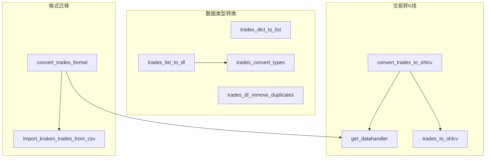

# trade_converter.py

## 概述

`trade_converter.py` 提供了交易数据（trades）格式之间的转换功能。包括交易列表/字典/DataFrame 之间的转换、去重、类型转换，以及将交易数据聚合为 OHLCV K线数据的功能。它还支持不同存储格式（json, feather, parquet）之间的交易数据迁移，以及从 Kraken CSV 导入数据的特殊模式。

## 架构图

## 核心类/函数

### trades_df_remove_duplicates(trades: DataFrame) -> DataFrame
基于 `timestamp` 和 `id` 列去除交易数据的重复行。使用 `pandas.DataFrame.drop_duplicates`。

### trades_dict_to_list(trades: list[dict]) -> TradeList
将 ccxt `fetch_trades` 返回的字典列表转换为嵌套列表格式（更节省内存）。按 `DEFAULT_TRADES_COLUMNS` 顺序提取字段。

### trades_convert_types(trades: DataFrame) -> DataFrame
转换交易 DataFrame 的数据类型：
1. 按 `TRADES_DTYPES` 进行类型转换
2. 添加 `date` 列（从 `timestamp` 毫秒时间戳转为 UTC datetime）

### trades_list_to_df(trades: TradeList, convert: bool = True) -> DataFrame
将嵌套列表格式的交易数据转换为 DataFrame。`convert=True` 时自动调用 `trades_convert_types` 进行类型转换。

### trades_to_ohlcv(trades: DataFrame, timeframe: str) -> DataFrame
将交易数据聚合为 OHLCV K线数据。

**处理逻辑：**
1. 以 `date` 列为索引
2. 对 `price` 列按 timeframe 重采样，生成 OHLC
3. 对 `amount` 列求和生成 volume
4. 去除无交易（NaN）的周期
5. 返回 `DEFAULT_DATAFRAME_COLUMNS` 格式的 DataFrame

**异常：** 交易数据为空时抛出 `ValueError`

### convert_trades_to_ohlcv(pairs, timeframes, datadir, timerange, erase, data_format_ohlcv, data_format_trades, candle_type)
批量将已存储的交易数据转换为不同时间周期的 OHLCV 数据。

**参数：**
- `pairs: list[str]` -- 交易对列表
- `timeframes: list[str]` -- 目标时间周期列表
- `datadir: Path` -- 数据存储目录
- `timerange: TimeRange` -- 时间范围
- `erase: bool` -- 是否先删除已有 OHLCV 数据
- `data_format_ohlcv / data_format_trades` -- OHLCV/交易数据的存储格式
- `candle_type: CandleType` -- K线类型

### convert_trades_format(config, convert_from, convert_to, erase)
在不同数据存储格式之间转换交易数据。

**特殊处理：**
- 当 `convert_from == "kraken_csv"` 时，调用 Kraken 专用的 CSV 导入函数
- 如果配置中没有指定 `pairs`，则自动从源数据中检测所有可用交易对
- `erase=True` 且格式不同时，删除源数据

## 依赖关系

### 内部依赖（本项目模块）
- `freqtrade.configuration.TimeRange` -- 时间范围
- `freqtrade.constants` -- DEFAULT_DATAFRAME_COLUMNS, DEFAULT_TRADES_COLUMNS, TRADES_DTYPES, Config, TradeList
- `freqtrade.enums` -- CandleType, TradingMode
- `freqtrade.exceptions.OperationalException` -- 操作异常
- `freqtrade.exchange.timeframe_to_resample_freq` -- timeframe 转频率（延迟导入）
- `freqtrade.data.history.get_datahandler` -- 数据处理器工厂（延迟导入）
- `freqtrade.data.converter.trade_converter_kraken` -- Kraken CSV 导入（延迟导入）

### 外部依赖（第三方库）
- `pandas` -- DataFrame 操作、to_datetime
- `pathlib.Path` -- 文件路径

### 被依赖（谁引用了本文件）
- 通过 `freqtrade.data.converter.__init__` 导出
- `freqtrade.data.converter.trade_converter_kraken` -- Kraken 导入模块使用 trades_convert_types 和 trades_df_remove_duplicates
- `freqtrade.data.history.history_utils` -- 历史工具使用 trades_list_to_df, trades_df_remove_duplicates
- `freqtrade.data.history.datahandlers.idatahandler` -- IDataHandler 使用 trades_convert_types, trades_df_remove_duplicates
- `freqtrade.data.history.datahandlers.jsondatahandler` -- JSON 处理器使用 trades_dict_to_list, trades_list_to_df
- `freqtrade.commands.data_commands` -- CLI 使用 convert_trades_format, convert_trades_to_ohlcv
