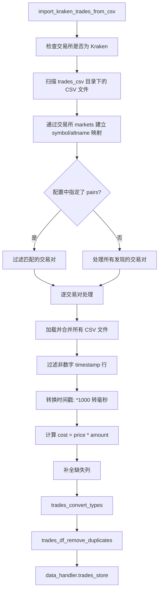

# trade_converter_kraken.py

## 概述

`trade_converter_kraken.py` 实现了从 Kraken 交易所导出的 CSV 交易数据文件导入到 freqtrade 数据格式的功能。这是一个特殊的数据导入模块，专门处理 Kraken 独特的 CSV 数据格式和交易对命名体系。它读取存放在 `datadir/trades_csv/` 目录下的 CSV 文件，将 Kraken 的 `altname`（如 `XBTUSD`）映射为 freqtrade 标准的交易对格式（如 `BTC/USD`），并存储为指定格式。

## 架构图

## 核心类/函数

### 常量

#### KRAKEN_CSV_TRADE_COLUMNS
Kraken CSV 文件的列定义：`["timestamp", "price", "amount"]`

### import_kraken_trades_from_csv(config: Config, convert_to: str)
从 Kraken CSV 文件导入交易数据。

**参数：**
- `config: Config` -- 配置字典，必须包含 `exchange.name == "kraken"`
- `convert_to: str` -- 目标存储格式（如 `"feather"`, `"json"` 等）

**处理流程：**

1. **验证交易所**：确认配置中的交易所为 Kraken，否则抛出 `OperationalException`

2. **发现数据文件**：扫描 `datadir/trades_csv/` 目录下的所有 `.csv` 文件，获取文件名集合（stem，即不含扩展名）

3. **交易对映射**：通过加载 Kraken 交易所的 markets 数据，建立 `(symbol, altname)` 映射。例如 `("BTC/USD", "XBTUSD")`

4. **过滤交易对**（可选）：如果配置中指定了 `pairs`，使用 `expand_pairlist` 过滤匹配的交易对

5. **逐交易对处理**：
   - 使用 `rglob` 递归查找所有匹配的 CSV 文件
   - 用 `pd.read_csv` 读取（列名为 `KRAKEN_CSV_TRADE_COLUMNS`）
   - 合并所有 CSV DataFrame
   - 过滤 timestamp 列中非数字的行（如标题行）
   - 将 timestamp 乘以 1000 转为毫秒
   - 计算 `cost = price * amount`
   - 对 `DEFAULT_TRADES_COLUMNS` 中缺失的列补充空字符串
   - 调用 `trades_convert_types` 进行类型转换
   - 调用 `trades_df_remove_duplicates` 去重
   - 打印交易数量和时间范围信息
   - 存储为 SPOT 模式的交易数据

**注意事项：**
- CSV 文件应存放在 `datadir/trades_csv/` 目录下，可以有子目录
- 文件名应为 Kraken 的 altname（如 `XBTUSD.csv`）
- 仅支持 SPOT 交易模式

## 依赖关系

### 内部依赖（本项目模块）
- `freqtrade.constants` -- DATETIME_PRINT_FORMAT, DEFAULT_TRADES_COLUMNS, Config
- `freqtrade.data.converter.trade_converter` -- trades_convert_types, trades_df_remove_duplicates
- `freqtrade.data.history.get_datahandler` -- 数据处理器工厂
- `freqtrade.enums.TradingMode` -- 交易模式
- `freqtrade.exceptions.OperationalException` -- 操作异常
- `freqtrade.plugins.pairlist.pairlist_helpers.expand_pairlist` -- 交易对列表展开
- `freqtrade.resolvers.ExchangeResolver` -- 交易所解析器

### 外部依赖（第三方库）
- `pandas` -- CSV 读取、DataFrame 操作、to_numeric
- `pathlib.Path` -- 文件路径操作

### 被依赖（谁引用了本文件）
- `freqtrade.data.converter.trade_converter.convert_trades_format` -- 当 `convert_from == "kraken_csv"` 时延迟导入并调用
