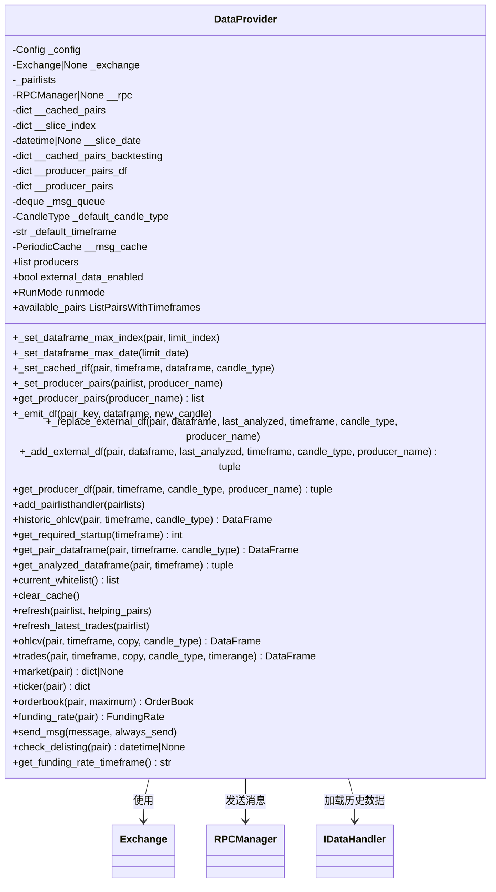

# dataprovider.py

## 概述

`dataprovider.py` 是 freqtrade 数据层的核心文件，实现了 `DataProvider` 类。该类作为 bot 和策略访问数据的统一接口，负责提供包括 ticker、orderbook、历史 OHLCV K线数据、实时 K线数据、交易数据（trades）等各类市场数据。它同时支持实盘（Live/Dry-run）和回测（Backtest/Hyperopt）两种运行模式，并且支持通过外部 Producer 获取来自其他 freqtrade 实例的分析数据。

## 架构图

## 核心类/函数

### DataProvider

数据提供者类，策略通过 `self.dp` 访问此类的实例。

**构造函数参数：**
- `config: Config` -- 配置字典
- `exchange: Exchange | None` -- 交易所实例（回测模式下可为 None）
- `pairlists` -- Pairlist 管理器
- `rpc: RPCManager | None` -- RPC 管理器（用于发送分析结果消息）

**关键方法：**

#### `get_pair_dataframe(pair, timeframe, candle_type) -> DataFrame`
获取交易对的 OHLCV 数据。在实盘模式下返回实时数据，在回测模式下返回缓存的历史数据。会自动处理 funding rate 的特殊 timeframe 逻辑。回测模式下会通过 `__slice_date` 截止日期来防止 lookahead bias。

#### `get_analyzed_dataframe(pair, timeframe) -> tuple[DataFrame, datetime]`
获取经策略分析后的 DataFrame。实盘模式返回完整数据；回测模式返回当前评估点之前最多 1000 根 K 线。返回元组 `(dataframe, last_refreshed_time)`。

#### `historic_ohlcv(pair, timeframe, candle_type) -> DataFrame`
获取已缓存的历史 OHLCV 数据，仅在回测模式下使用。会考虑 FreqAI 的训练周期需求来计算 startup candles。

#### `ohlcv(pair, timeframe, copy, candle_type) -> DataFrame`
获取实盘模式下的 OHLCV 数据，从交易所缓存中读取。

#### `trades(pair, timeframe, copy, candle_type, timerange) -> DataFrame`
获取交易数据。实盘模式从交易所获取，回测模式从磁盘加载。注意：此方法不应在策略回调中使用，因为存在 lookahead bias 风险。

#### `refresh(pairlist, helping_pairs)`
刷新数据，每个交易周期调用一次。刷新最新 OHLCV 数据和（如果启用了）最新 trades 数据。

#### `_add_external_df(pair, dataframe, last_analyzed, timeframe, candle_type, producer_name) -> tuple[bool, int]`
追加来自外部 Producer 的 K 线数据。支持增量追加和全量替换。返回 `(成功标志, 缺失K线数量)`。

#### `send_msg(message, always_send)`
从策略中发送自定义 RPC 通知。默认每根K线只发送一次相同内容的消息。

#### `check_delisting(pair) -> datetime | None`
检查交易对是否即将在交易所退市。

## 依赖关系

### 内部依赖（本项目模块）
- `freqtrade.configuration.TimeRange` -- 时间范围解析
- `freqtrade.constants` -- 常量定义（FULL_DATAFRAME_THRESHOLD, Config 等）
- `freqtrade.data.history` -- 历史数据加载（get_datahandler, load_pair_history）
- `freqtrade.enums` -- 枚举类型（CandleType, RPCMessageType, RunMode, TradingMode）
- `freqtrade.exceptions` -- 异常类（ExchangeError, OperationalException）
- `freqtrade.exchange` -- 交易所接口
- `freqtrade.misc` -- 工具函数（append_candles_to_dataframe）
- `freqtrade.rpc` -- RPC 管理器
- `freqtrade.util.PeriodicCache` -- 带 TTL 的缓存

### 外部依赖（第三方库）
- `pandas` -- DataFrame 数据结构和时间处理
- `collections.deque` -- 消息队列

### 被依赖（谁引用了本文件）
- `freqtrade.strategy.interface` -- Strategy 基类通过 `self.dp` 引用 DataProvider
- `freqtrade.freqtradebot` -- FreqtradeBot 主类初始化 DataProvider
- `freqtrade.optimize.backtesting` -- 回测引擎使用 DataProvider
- `freqtrade.rpc.rpc` -- RPC 层访问 DataProvider 获取数据
- `freqtrade.rpc.external_message_consumer` -- 外部消息消费者通过 DataProvider 存储外部数据
- `freqtrade.plugins.pairlistmanager` -- Pairlist 管理器关联 DataProvider
- `freqtrade.plot.plotting` -- 绘图模块使用 DataProvider 获取数据
- `freqtrade.freqai.*` -- FreqAI 模块使用 DataProvider 获取训练数据
