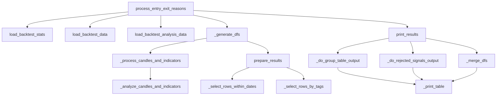

# entryexitanalysis.py

## 概述

`entryexitanalysis.py` 提供回测结果的入场/出场原因分析功能。它能加载回测数据和信号数据，将交易记录与信号 K 线匹配，按不同维度（入场标签、出场原因、交易对等）进行分组统计，输出盈亏汇总表格。这是 `freqtrade backtesting-analysis` 子命令的核心实现。

## 架构图

## 核心类/函数

### process_entry_exit_reasons(config: Config)
主入口函数。从配置中读取分析参数（分组方式、筛选条件、指标列表等），加载回测数据，调用分析和输出函数。支持 CSV 导出。

**关键配置项：**
- `analysis_groups` -- 分组方式列表（"0"-"5"）
- `enter_reason_list` / `exit_reason_list` -- 入场/出场原因筛选
- `indicator_list` -- 需要展示的指标列表
- `entry_only` / `exit_only` -- 仅展示入场/出场指标
- `analysis_rejected` -- 是否分析被拒绝的信号
- `analysis_to_csv` -- 是否导出为 CSV

### _process_candles_and_indicators(pairlist, strategy_name, trades, signal_candles, date_col)
对每个交易对处理信号K线与交易数据的匹配。返回格式为 `{strategy_name: {pair: DataFrame}}` 的嵌套字典。

### _analyze_candles_and_indicators(pair, trades, signal_candles, date_col) -> DataFrame
核心分析函数。对给定交易对，将每笔交易与其对应的信号K线进行关联匹配。匹配逻辑：找到该交易开仓日期之前最近的一根信号K线。返回合并了交易数据和指标数据的 DataFrame。

### _do_group_table_output(bigdf, glist, csv_path, to_csv)
按分组方式输出统计表格：
- **Group 0**: 按 enter_reason 分组的胜率/亏损汇总（含 win/loss ratio、期望比率等）
- **Group 1**: 按 enter_reason 分组的利润摘要
- **Group 2**: 按 enter_reason + exit_reason 分组
- **Group 3**: 按 pair + enter_reason 分组
- **Group 4**: 按 pair + enter_reason + exit_reason 分组
- **Group 5**: 按 exit_reason 分组

### prepare_results(analysed_trades, stratname, enter_reason_list, exit_reason_list, timerange) -> DataFrame
汇总所有交易对的分析结果，并按时间范围和标签进行筛选。

### print_results(res_df, exit_df, analysis_groups, indicator_list, ...)
最终输出函数。根据参数调用分组输出或指标输出。支持合并入场和出场指标数据。

### _merge_dfs(entry_df, exit_df, available_inds, entry_only, exit_only)
合并入场 DataFrame 和出场 DataFrame，根据 `entry_only` / `exit_only` 参数决定合并方式。合并键为 `["pair", "open_date"]`。

## 依赖关系

### 内部依赖（本项目模块）
- `freqtrade.configuration.TimeRange` -- 时间范围解析
- `freqtrade.constants.Config` -- 配置类型
- `freqtrade.data.btanalysis` -- 回测数据加载函数（load_backtest_data, load_backtest_stats, load_backtest_analysis_data, BT_DATA_COLUMNS）
- `freqtrade.exceptions` -- 异常类（ConfigurationError, OperationalException）
- `freqtrade.util.print_df_rich_table` -- Rich 表格输出

### 外部依赖（第三方库）
- `pandas` -- 数据分析和 DataFrame 操作
- `pathlib.Path` -- 文件路径处理

### 被依赖（谁引用了本文件）
- `freqtrade.commands.analyze_commands` -- CLI 的 `backtesting-analysis` 命令调用 `process_entry_exit_reasons`
