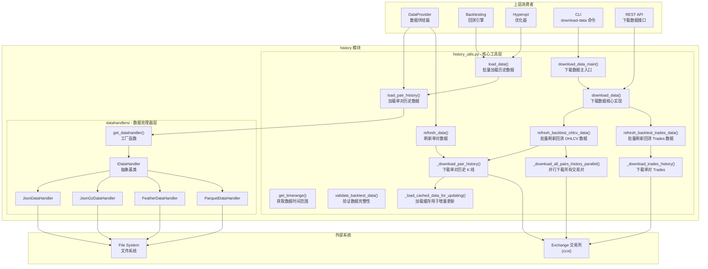
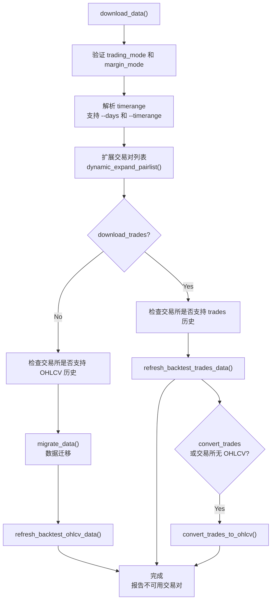
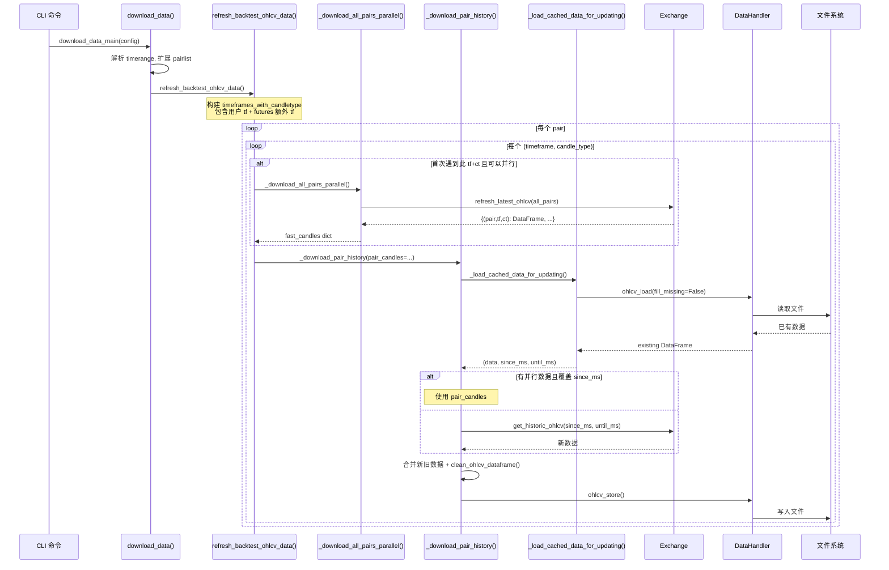
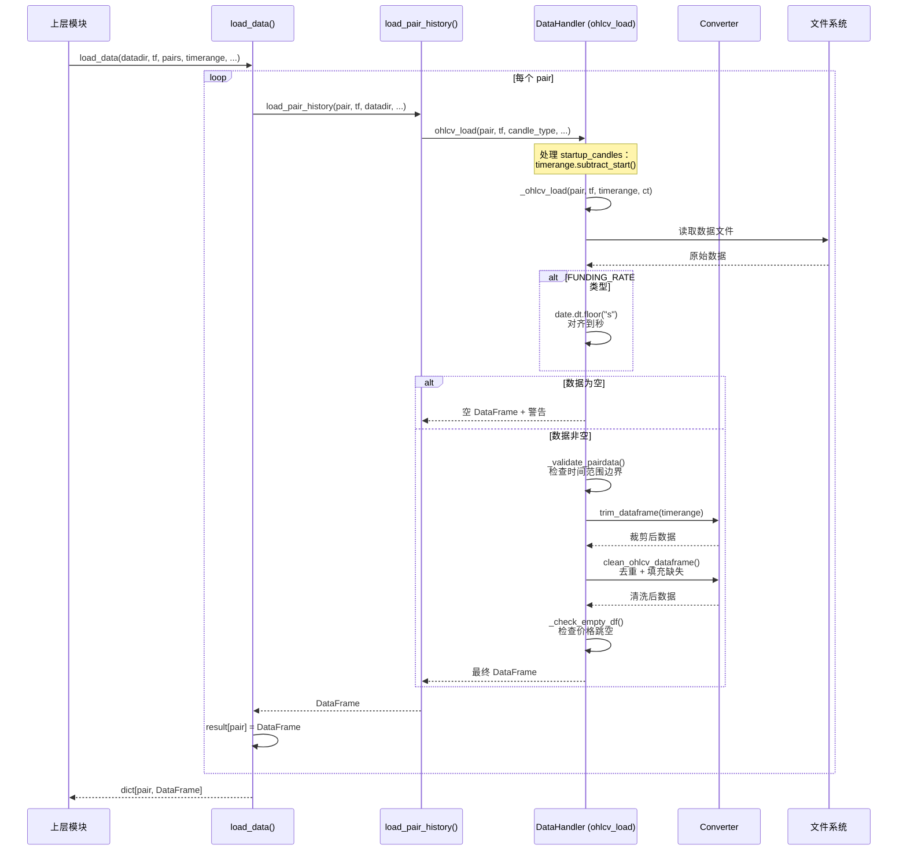
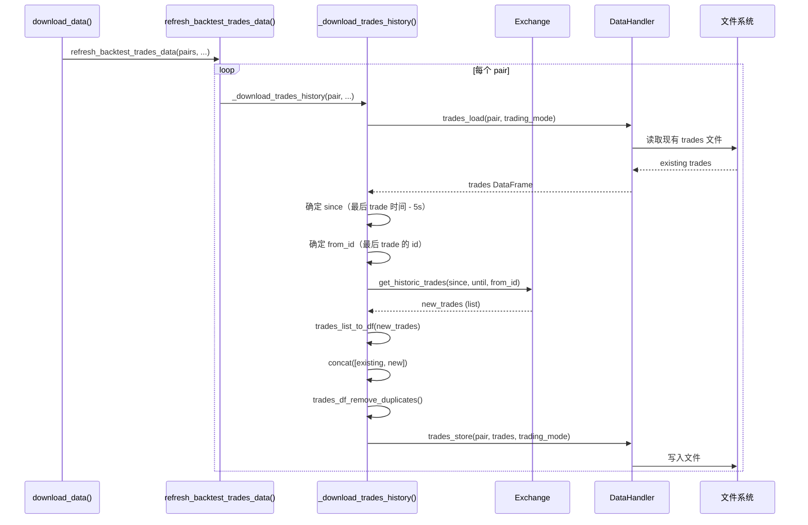
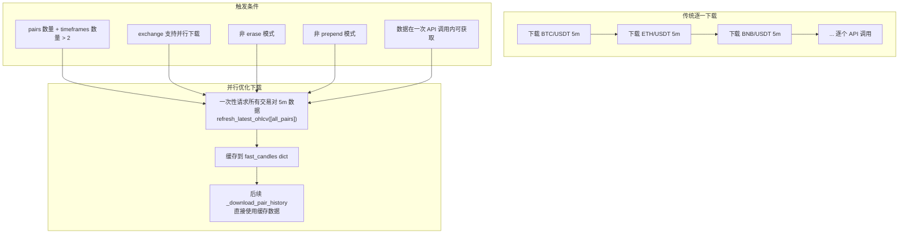

# Freqtrade 历史数据管理模块 (`freqtrade/data/history/`)

## 1. 模块概述

`freqtrade/data/history/` 是 Freqtrade 的**历史数据管理核心模块**，负责本地历史数据的完整生命周期管理，包括：

- **数据下载**：从交易所下载 OHLCV K 线数据和 Trades 逐笔成交数据，支持增量下载和并行下载
- **数据加载**：从磁盘加载历史数据，支持多种文件格式（JSON、Feather、Parquet），并进行清洗和验证
- **数据存储**：通过可插拔的 DataHandler 将数据持久化到不同格式的文件
- **数据验证**：检查数据完整性（缺失 K 线检测）
- **数据刷新**：为回测和实时交易更新本地数据缓存
- **时间范围管理**：支持灵活的 TimeRange 参数控制数据加载和下载的时间边界

该模块是 `DataProvider` 和 Backtesting 引擎的底层数据提供者，也是 `freqtrade download-data` CLI 命令的核心实现。

## 2. 目录结构

```
freqtrade/data/history/
├── __init__.py              # 模块初始化，导出核心公共 API
├── history_utils.py         # 历史数据下载、加载、验证等核心工具函数（约 826 行）
└── datahandlers/            # 数据格式处理器子模块
    ├── __init__.py          # 导出 IDataHandler 和 get_datahandler
    ├── idatahandler.py      # 抽象基类 + 工厂函数（约 572 行）
    ├── jsondatahandler.py   # JSON/JSON.GZ 格式处理器（约 151 行）
    ├── featherdatahandler.py # Apache Feather 格式处理器（约 186 行）
    └── parquetdatahandler.py # Apache Parquet 格式处理器（约 134 行）
```

### 文件功能详解

| 文件 | 行数 | 核心功能 |
|------|------|---------|
| `__init__.py` | ~22 | 导出 `get_datahandler`, `load_pair_history`, `load_data`, `download_data_main` 等 10 个核心函数 |
| `history_utils.py` | ~826 | 数据下载引擎（含并行下载）、数据加载、数据刷新、数据验证 |
| `datahandlers/` | - | 可插拔的数据格式处理器（详见独立文档） |

## 3. 架构图



## 4. 核心类/函数说明

### 4.1 数据加载函数

#### `load_pair_history(pair, timeframe, datadir, *, timerange, fill_up_missing, drop_incomplete, startup_candles, data_format, data_handler, candle_type) -> DataFrame`

**单交易对历史数据加载的主入口**。这是 history 模块最常被调用的函数。

**参数说明：**

| 参数 | 类型 | 默认值 | 说明 |
|------|------|--------|------|
| `pair` | str | - | 交易对名称（如 "BTC/USDT"） |
| `timeframe` | str | - | 时间周期（如 "5m", "1h", "1d"） |
| `datadir` | Path | - | 数据存储目录 |
| `timerange` | TimeRange | None | 时间范围限制 |
| `fill_up_missing` | bool | True | 是否填充缺失 K 线 |
| `drop_incomplete` | bool | False | 是否丢弃最后一根不完整 K 线 |
| `startup_candles` | int | 0 | 额外加载的启动预热 K 线数 |
| `data_format` | str | None | 数据格式（json/feather/parquet） |
| `data_handler` | IDataHandler | None | 已初始化的数据处理器 |
| `candle_type` | CandleType | SPOT | K 线类型（SPOT/FUTURES/MARK/FUNDING_RATE） |

**内部流程：**

```
load_pair_history()
  -> get_datahandler()           # 获取或创建数据处理器
  -> data_handler.ohlcv_load()   # 委托给数据处理器加载
      -> _ohlcv_load()           # 从磁盘读取原始数据
      -> trim_dataframe()        # 裁剪时间范围
      -> clean_ohlcv_dataframe() # 清洗（去重、填充缺失）
```

#### `load_data(datadir, timeframe, pairs, *, timerange, fill_up_missing, startup_candles, fail_without_data, data_format, candle_type, user_futures_funding_rate) -> dict[str, DataFrame]`

**批量加载多交易对历史数据**。为每个交易对调用 `load_pair_history()`。

**特殊处理：**

- 空数据的处理：对于非 SPOT/FUTURES 类型（如 MARK、FUNDING_RATE），即使数据为空也会返回空 DataFrame（而不是跳过）
- FUNDING_RATE 特殊情况：如果用户指定了 `user_futures_funding_rate`，空数据会发出警告但不报错
- `fail_without_data=True` 时，如果所有交易对都没有数据，抛出 `OperationalException`

### 4.2 数据下载函数

#### `download_data_main(config) -> None`

数据下载的**最外层入口**，由 CLI 的 `download-data` 命令调用。

**流程：**

1. 初始化 Exchange 连接
2. 调用 `download_data()` 执行实际下载

#### `download_data(config, exchange, *, progress_tracker) -> None`

数据下载的**核心实现**。这是一个复杂的协调函数，处理所有下载场景。

**决策流程：**



#### `refresh_backtest_ohlcv_data(exchange, *, pairs, timeframes, datadir, ...) -> list[str]`

**批量刷新 OHLCV 数据**的主要实现。这是下载功能中最复杂的函数。

**关键特性：**

1. **Futures 模式自动扩展**：除用户指定的 timeframe 外，自动添加 mark price 和 funding rate 的 timeframe
2. **并行下载优化**：首次遇到新的 (timeframe, candle_type) 时，使用 `_download_all_pairs_history_parallel()` 一次性下载所有交易对的数据
3. **进度追踪**：支持 Rich Progress 进度条显示
4. **错误收集**：不中断执行，收集所有不可用的交易对

**Futures 模式时间周期扩展逻辑：**

```python
# 用户指定的 timeframe -> FUTURES candle_type
# 自动添加:
#   mark_ohlcv_timeframe -> mark_ohlcv_price candle_type (如 MARK)
#   funding_fee_timeframe -> FUNDING_RATE candle_type
```

#### `_download_pair_history(pair, *, datadir, exchange, timeframe, ...) -> bool`

**单交易对增量下载**的核心实现。

**增量下载逻辑：**

1. 调用 `_load_cached_data_for_updating()` 加载已有数据
2. 确定下载起点（从已有数据的最后一条开始）
3. 如果有并行下载的数据（`pair_candles`），直接使用；否则调用 `exchange.get_historic_ohlcv()`
4. 合并新旧数据，进行去重清洗
5. 存储到磁盘

**Prepend 模式：**

- 常规模式：从已有数据末尾往后下载
- Prepend 模式：从已有数据开头往前下载更早的数据

#### `_load_cached_data_for_updating(pair, timeframe, timerange, data_handler, candle_type, prepend) -> tuple[DataFrame, int | None, int | None]`

加载已缓存数据，确定增量下载的起止时间。

**返回值：**

- `data`: 已有的 DataFrame
- `start_ms`: 下载起始时间（毫秒）
- `end_ms`: 下载结束时间（毫秒）

**特殊处理：**

- 如果请求的 start 早于现有数据的起始时间，会发出日志提醒用户使用 `--prepend` 或 `--erase`
- Prepend 模式下，end 设为现有数据的第一条时间

#### `_download_all_pairs_history_parallel(exchange, pairs, timeframe, candle_type, timerange) -> dict[PairWithTimeframe, DataFrame]`

**并行下载优化**：利用交易所的批量 OHLCV 接口一次性下载所有交易对的数据。

**前置条件：**

- 需要下载的数据量能在一次 API 调用内获取（根据 `exchange.ohlcv_candle_limit()` 判断）
- `since` 参数要在 `one_call_min_time_dt` 之后

当条件不满足时返回空 dict，回退到逐交易对下载模式。

#### `_download_trades_history(exchange, pair, *, new_pairs_days, timerange, data_handler, trading_mode) -> bool`

**下载 Trades 逐笔成交数据**。

**流程：**

1. 加载已有 trades 数据
2. 确定下载起点（从最后一条 trade 的 timestamp - 5s 开始，确保不遗漏）
3. 调用 `exchange.get_historic_trades()` 下载
4. 合并新旧数据、去重
5. 存储

#### `refresh_backtest_trades_data(exchange, pairs, datadir, timerange, trading_mode, ...) -> list[str]`

批量刷新 Trades 数据，带进度追踪。

### 4.3 数据验证和工具函数

#### `get_timerange(data: dict[str, DataFrame]) -> tuple[datetime, datetime]`

获取多交易对数据的**最大公共时间范围**：取所有交易对中最早的开始时间和最晚的结束时间。

#### `validate_backtest_data(data, pair, min_date, max_date, timeframe_min) -> bool`

验证回测数据的完整性：计算期望的 K 线数量与实际数量的差异，如果有缺失则发出警告。

```python
expected_frames = (max_date - min_date).total_seconds() // 60 // timeframe_min
if dflen < expected_frames:
    logger.warning(f"{pair} has missing frames: expected {expected_frames}, got {dflen}")
```

#### `refresh_data(*, datadir, timeframe, pairs, exchange, data_format, timerange, candle_type)`

简单的数据刷新函数，为每个交易对调用 `_download_pair_history()`。用于 live/dry-run 模式。

## 5. 依赖关系

### 5.1 外部依赖

| 库 | 用途 |
|----|------|
| `pandas` | DataFrame 操作、数据合并（concat） |
| `pathlib` | 文件路径管理 |
| `datetime` | 时间计算 |
| `operator` | get_timerange 中的比较操作 |

### 5.2 内部依赖

```mermaid
graph TD
    HU[history_utils.py]

    HU --> CFG[freqtrade.configuration<br/>TimeRange]
    HU --> CONST[freqtrade.constants<br/>DATETIME_PRINT_FORMAT<br/>DL_DATA_TIMEFRAMES<br/>Config, ListPairsWithTimeframes]
    HU --> CV[freqtrade.data.converter<br/>clean_ohlcv_dataframe<br/>trades_df_remove_duplicates<br/>trades_list_to_df<br/>convert_trades_to_ohlcv]
    HU --> DH[datahandlers<br/>IDataHandler, get_datahandler]
    HU --> ENUM[freqtrade.enums<br/>CandleType, TradingMode]
    HU --> EXCEPT[freqtrade.exceptions<br/>OperationalException]
    HU --> EXC[freqtrade.exchange<br/>Exchange]
    HU --> EXC_UTILS[freqtrade.exchange.exchange_utils<br/>date_minus_candles]
    HU --> PAIRLIST[freqtrade.plugins.pairlist<br/>dynamic_expand_pairlist]
    HU --> UTIL[freqtrade.util<br/>dt_now, dt_ts, format_ms_time]
    HU --> MIGRATE[freqtrade.util.migrations<br/>migrate_data]
    HU --> PROGRESS[freqtrade.util.progress_tracker<br/>CustomProgress]
    HU --> RESOLVE[freqtrade.resolvers<br/>ExchangeResolver]
```



### 5.3 被依赖方

| 模块 | 使用的接口 |
|------|-----------|
| `freqtrade.data.dataprovider` | `get_datahandler`, `load_pair_history` |
| `freqtrade.data.converter.converter` | `get_datahandler` (convert_ohlcv_format) |
| `freqtrade.data.converter.trade_converter` | `get_datahandler` (convert_trades_*) |
| `freqtrade.data.converter.trade_converter_kraken` | `get_datahandler` |
| `freqtrade.optimize.backtesting` | `load_data`, `get_timerange`, `validate_backtest_data` |
| `freqtrade.optimize.hyperopt` | `load_data` |
| `freqtrade.commands.data_commands` | `download_data_main` |
| `freqtrade.rpc.api_server` | `download_data` |

## 6. 数据流

### 6.1 数据下载完整流程（OHLCV）



### 6.2 数据加载流程



### 6.3 Trades 下载流程



### 6.4 并行下载优化机制



## 7. 文件命名约定

### OHLCV 数据文件

```
{datadir}/{pair_s}-{timeframe}{candle}.{ext}

# Spot 示例
BTC_USDT-5m.feather
ETH_USDT-1h.json

# Futures 示例（存储在 futures/ 子目录）
futures/BTC_USDT_USDT-5m-futures.feather
futures/BTC_USDT_USDT-8h-funding_rate.feather
futures/BTC_USDT_USDT-1h-mark.feather

# 特殊处理：1M 时间周期存储为 1Mo（避免大小写不敏感文件系统冲突）
BTC_USDT-1Mo.feather
```

### Trades 数据文件

```
{datadir}/{pair_s}-trades.{ext}

# 示例
BTC_USDT-trades.feather
futures/BTC_USDT_USDT-trades.feather
```

### 交易对名称到文件名转换

```
BTC/USDT     -> BTC_USDT
BTC/USDT:USDT -> BTC_USDT_USDT
```

## 8. 配置参数

| 配置键 | 说明 | 默认值 |
|--------|------|--------|
| `datadir` | 数据存储根目录 | `user_data/data/<exchange>` |
| `dataformat_ohlcv` | OHLCV 数据格式 | `feather` |
| `dataformat_trades` | Trades 数据格式 | `feather` |
| `timeframe` | 默认时间周期 | 策略配置 |
| `timeframes` | 下载的时间周期列表 | `DL_DATA_TIMEFRAMES` |
| `timerange` | 时间范围字符串 | 无限制 |
| `days` | 下载天数（替代 timerange） | - |
| `new_pairs_days` | 新交易对默认下载天数 | `30` |
| `download_trades` | 是否下载 trades | `false` |
| `convert_trades` | 下载 trades 后是否自动转 OHLCV | `false` |
| `erase` | 是否删除已有数据重新下载 | `false` |
| `prepend_data` | 是否向前追加更早的数据 | `false` |
| `include_inactive` | 是否包含已下架的交易对 | `false` |
| `trading_mode` | 交易模式 | `spot` |
| `candle_types` | 指定下载的 K 线类型 | 自动推断 |
| `no_parallel_download` | 禁用并行下载 | `false` |
| `startup_candle_count` | 预热 K 线数量 | `0` |

## 9. 使用示例

### 加载历史数据

```python
from pathlib import Path
from freqtrade.data.history import load_pair_history, load_data
from freqtrade.configuration import TimeRange
from freqtrade.enums import CandleType

# 加载单个交易对
df = load_pair_history(
    pair="BTC/USDT",
    timeframe="1h",
    datadir=Path("user_data/data/binance"),
    timerange=TimeRange.parse_timerange("20230101-20231231"),
    candle_type=CandleType.SPOT,
)

# 批量加载
data = load_data(
    datadir=Path("user_data/data/binance"),
    timeframe="5m",
    pairs=["BTC/USDT", "ETH/USDT"],
    startup_candles=200,
)
```

### 下载数据（编程式）

```python
from freqtrade.data.history import download_data
from freqtrade.resolvers import ExchangeResolver

exchange = ExchangeResolver.load_exchange(config, validate=False)
download_data(config, exchange)
```
