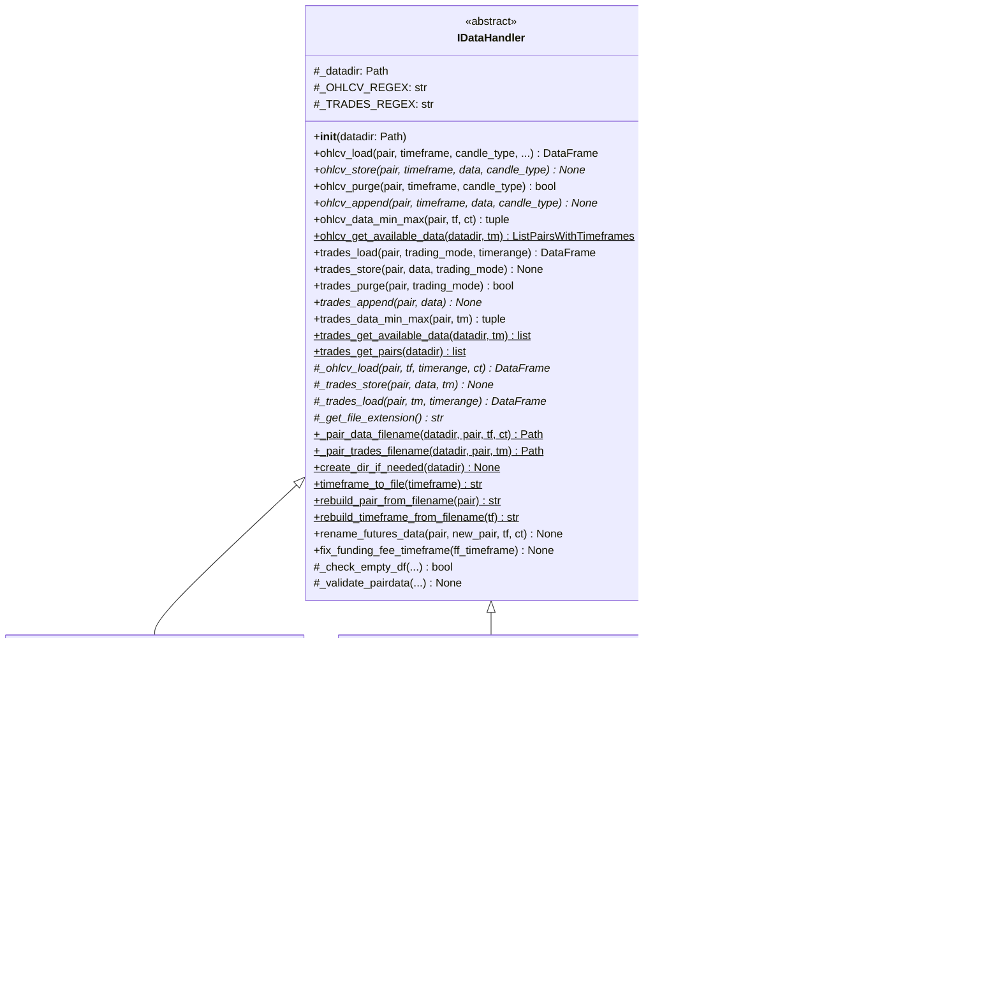
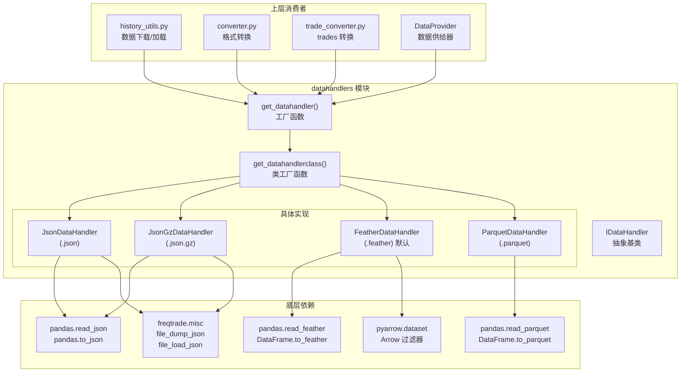
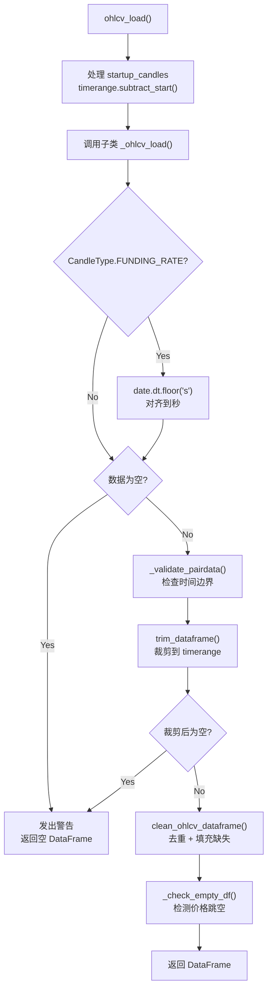
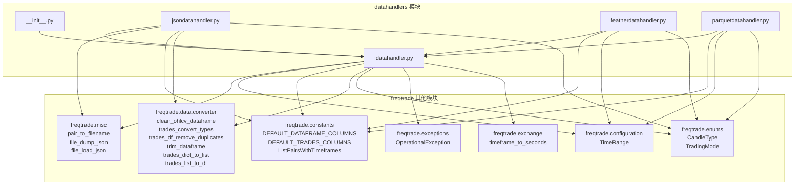
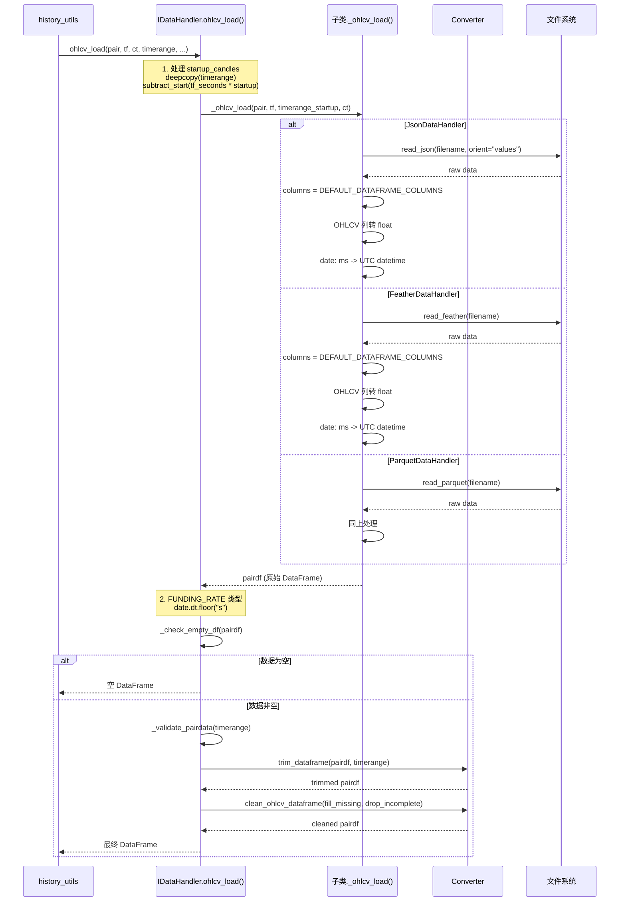
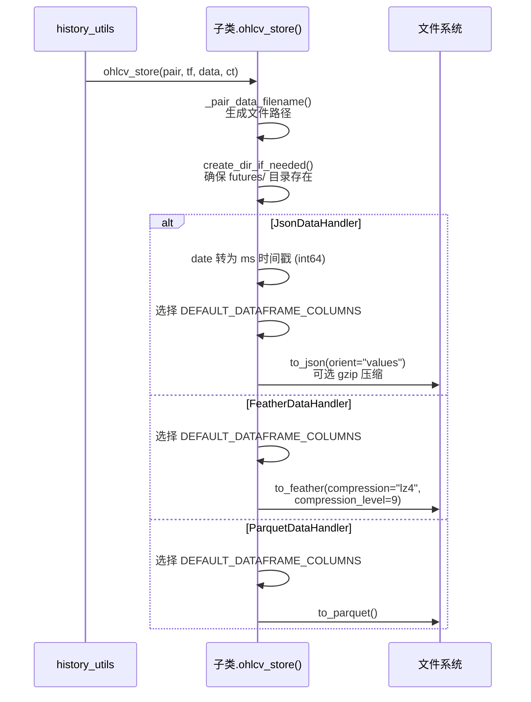
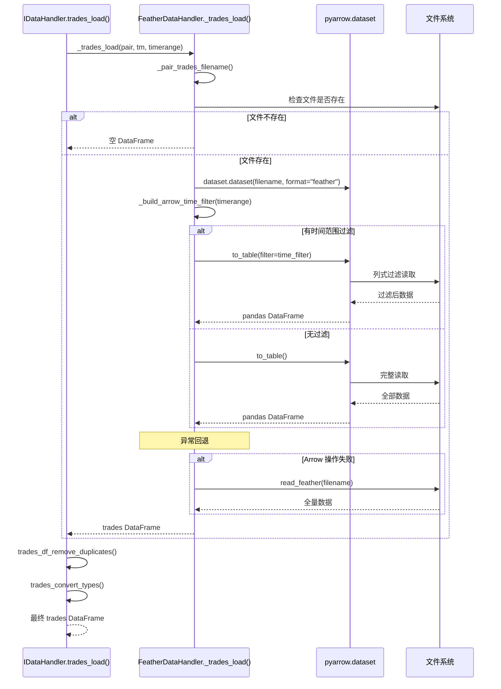
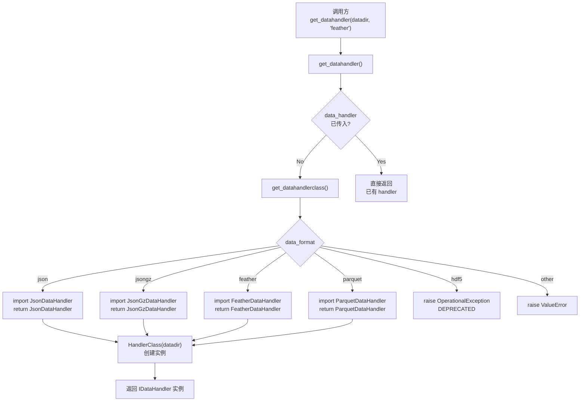

# Freqtrade 数据格式处理器模块 (`freqtrade/data/history/datahandlers/`)

## 1. 模块概述

`freqtrade/data/history/datahandlers/` 是 Freqtrade 的**数据持久化抽象层**，采用经典的**策略模式（Strategy Pattern）** 和**工厂模式（Factory Pattern）** 设计，为 OHLCV K 线数据和 Trades 逐笔成交数据提供统一的读写接口，同时支持多种底层文件格式。

该模块的设计目标：

- **格式无关性**：上层代码只需通过 `IDataHandler` 接口操作数据，无需关心底层存储格式
- **可扩展性**：添加新格式只需继承 `IDataHandler` 并实现抽象方法
- **性能优化**：不同格式针对不同场景优化（JSON 兼容性好、Feather 读写快、Parquet 压缩率高）
- **文件命名标准化**：统一的文件命名约定和交易对名称转换规则

当前支持的格式：

| 格式 | 实现类 | 文件扩展名 | 特点 |
|------|--------|-----------|------|
| JSON | `JsonDataHandler` | `.json` | 人类可读，兼容性最好 |
| JSON.GZ | `JsonGzDataHandler` | `.json.gz` | JSON 的 gzip 压缩版本，节省磁盘空间 |
| Feather | `FeatherDataHandler` | `.feather` | **默认格式**，Apache Arrow 列式存储，读写极快 |
| Parquet | `ParquetDataHandler` | `.parquet` | Apache Parquet 列式存储，压缩率高 |
| HDF5 | - | - | **已废弃**（2025.1 版本移除） |

## 2. 目录结构

```
freqtrade/data/history/datahandlers/
├── __init__.py              # 模块初始化，导出 IDataHandler 和 get_datahandler
├── idatahandler.py          # 抽象基类 IDataHandler + 工厂函数 get_datahandler()（约 572 行）
├── jsondatahandler.py       # JSON 和 JSON.GZ 格式处理器（约 151 行）
├── featherdatahandler.py    # Apache Feather 格式处理器（约 186 行）
└── parquetdatahandler.py    # Apache Parquet 格式处理器（约 134 行）
```

### 文件功能详解

| 文件 | 行数 | 核心功能 |
|------|------|---------|
| `__init__.py` | ~2 | 导出 `IDataHandler` 和 `get_datahandler` |
| `idatahandler.py` | ~572 | 定义抽象基类 `IDataHandler`，实现通用逻辑（文件名生成、数据加载流水线、验证、迁移），提供工厂函数 |
| `jsondatahandler.py` | ~151 | JSON/JSON.GZ 格式的 OHLCV 和 Trades 读写实现 |
| `featherdatahandler.py` | ~186 | Feather 格式的 OHLCV 和 Trades 读写实现，支持 Arrow 时间范围过滤 |
| `parquetdatahandler.py` | ~134 | Parquet 格式的 OHLCV 和 Trades 读写实现 |

## 3. 架构图



### 模块交互图



## 4. 核心类/函数说明

### 4.1 IDataHandler - 抽象基类 (`idatahandler.py`)

`IDataHandler` 是所有数据处理器的抽象基类（ABC），定义了完整的数据读写接口和大量通用实现。

#### 4.1.1 类属性

```python
class IDataHandler(ABC):
    _OHLCV_REGEX = r"^([\w-]+)\-(\d+[a-zA-Z]{1,2})\-?([a-zA-Z_]*)?(?=\.)"
    _TRADES_REGEX = r"^([\w-]+)\-(trades)?(?=\.)"
```

- `_OHLCV_REGEX`：用于从文件名解析 `(pair, timeframe, candle_type)` 三元组
  - 匹配示例：`BTC_USDT-5m.feather` -> `("BTC_USDT", "5m", "")`
  - 匹配示例：`BTC_USDT_USDT-1h-mark.feather` -> `("BTC_USDT_USDT", "1h", "mark")`
- `_TRADES_REGEX`：用于从文件名解析交易对
  - 匹配示例：`BTC_USDT-trades.feather` -> `("BTC_USDT", "trades")`

#### 4.1.2 抽象方法（子类必须实现）

| 方法 | 说明 |
|------|------|
| `_ohlcv_load(pair, timeframe, timerange, candle_type)` | 从磁盘加载 OHLCV 原始数据 |
| `ohlcv_store(pair, timeframe, data, candle_type)` | 将 OHLCV 数据存储到磁盘 |
| `ohlcv_append(pair, timeframe, data, candle_type)` | 追加 OHLCV 数据 |
| `_trades_store(pair, data, trading_mode)` | 存储 trades 数据 |
| `_trades_load(pair, trading_mode, timerange)` | 从磁盘加载 trades 原始数据 |
| `trades_append(pair, data)` | 追加 trades 数据 |
| `_get_file_extension()` | 返回文件扩展名 |

#### 4.1.3 核心公共方法（模板方法模式）

**`ohlcv_load(pair, timeframe, candle_type, *, timerange, fill_missing, drop_incomplete, startup_candles, warn_no_data) -> DataFrame`**

OHLCV 数据加载的**模板方法**，包含完整的数据处理流水线。这是上层代码最常调用的方法。

**处理流水线：**



**`trades_load(pair, trading_mode, timerange) -> DataFrame`**

Trades 数据加载，包含去重和类型转换：

```
trades_load()
  -> _trades_load()              # 子类实现，从磁盘读取
  -> trades_df_remove_duplicates() # 去重（基于 timestamp + id）
  -> trades_convert_types()      # 类型转换 + 添加 date 列
```

**`trades_store(pair, data, trading_mode) -> None`**

Trades 数据存储，自动过滤为标准列：

```python
def trades_store(self, pair, data, trading_mode):
    # 只保留 DEFAULT_TRADES_COLUMNS，移除 date 等衍生列
    self._trades_store(pair, data[DEFAULT_TRADES_COLUMNS], trading_mode)
```

#### 4.1.4 文件名生成方法

**`_pair_data_filename(datadir, pair, timeframe, candle_type, no_timeframe_modify) -> Path`**

根据参数生成 OHLCV 数据文件的完整路径。

```python
# Spot 模式
# BTC/USDT, 5m, SPOT -> {datadir}/BTC_USDT-5m.feather

# Futures 模式（自动添加 futures/ 子目录）
# BTC/USDT:USDT, 5m, FUTURES -> {datadir}/futures/BTC_USDT_USDT-5m-futures.feather
# BTC/USDT:USDT, 1h, MARK    -> {datadir}/futures/BTC_USDT_USDT-1h-mark.feather
# BTC/USDT:USDT, 8h, FUNDING_RATE -> {datadir}/futures/BTC_USDT_USDT-8h-funding_rate.feather

# 1M 时间周期特殊处理
# timeframe_to_file("1M") -> "1Mo"（避免大小写敏感问题）
```

**`_pair_trades_filename(datadir, pair, trading_mode) -> Path`**

根据参数生成 Trades 数据文件的完整路径。

```python
# Spot: {datadir}/BTC_USDT-trades.feather
# Futures: {datadir}/futures/BTC_USDT_USDT-trades.feather
```

#### 4.1.5 数据发现方法

**`ohlcv_get_available_data(datadir, trading_mode) -> ListPairsWithTimeframes`**

扫描磁盘上所有可用的 OHLCV 数据文件，返回 `(pair, timeframe, candle_type)` 三元组列表。

**算法：**
1. 如果是 FUTURES 模式，切换到 `futures/` 子目录
2. glob 匹配所有 `*.{ext}` 文件
3. 用 `_OHLCV_REGEX` 解析文件名
4. 重建交易对名称和时间周期

**`trades_get_available_data(datadir, trading_mode) -> list[str]`**

类似上面，但返回 trades 数据可用的交易对列表。

**`trades_get_pairs(datadir) -> list[str]`**

获取指定目录下所有有 trades 数据的交易对列表。

#### 4.1.6 数据迁移方法

**`rename_futures_data(pair, new_pair, timeframe, candle_type)`**

临时迁移方法，用于 Binance futures 命名统一化（BTC/USDT -> BTC/USDT:USDT）。

**`fix_funding_fee_timeframe(ff_timeframe)`**

修复 funding rate 数据的时间周期不匹配问题。遍历所有 FUNDING_RATE 类型的数据文件，将使用错误时间周期的文件重命名为正确的时间周期。

#### 4.1.7 验证方法

**`_check_empty_df(pairdf, pair, timeframe, candle_type, warn_no_data, warn_price) -> bool`**

检查 DataFrame 是否为空，以及是否存在异常的价格跳空（gap > 10%）。

**`_validate_pairdata(pair, pairdata, timeframe, candle_type, timerange)`**

验证数据是否覆盖了请求的时间范围，对起始/结束时间不匹配的情况发出警告。

### 4.2 工厂函数

#### `get_datahandlerclass(datatype: str) -> type[IDataHandler]`

根据格式名称返回对应的 DataHandler **类**（非实例）。

```python
# 支持的 datatype 值:
# "json"    -> JsonDataHandler
# "jsongz"  -> JsonGzDataHandler
# "feather" -> FeatherDataHandler
# "parquet" -> ParquetDataHandler
# "hdf5"    -> 抛出 OperationalException（已废弃）
```

#### `get_datahandler(datadir, data_format, data_handler) -> IDataHandler`

**DataHandler 工厂函数**。如果传入已有的 `data_handler` 则直接返回；否则根据 `data_format` 创建新实例。默认格式为 `"feather"`。

```python
# 典型用法
handler = get_datahandler(Path("user_data/data/binance"))  # 默认 feather
handler = get_datahandler(Path("user_data/data/binance"), "json")
handler = get_datahandler(Path("..."), data_handler=existing_handler)  # 复用
```

### 4.3 JsonDataHandler (`jsondatahandler.py`)

JSON 格式处理器，Freqtrade 最早支持的格式。

#### OHLCV 存储格式

```json
[[1609459200000, 29000.0, 29500.0, 28800.0, 29300.0, 1234.5],
 [1609459500000, 29300.0, 29400.0, 29100.0, 29200.0, 987.6],
 ...]
```

- date 列存储为毫秒时间戳（int64）
- 使用 `orient="values"` 格式（紧凑数组）
- 加载时将 date 从毫秒转为 UTC datetime

#### Trades 存储格式

使用 `freqtrade.misc.file_dump_json()` 存储为嵌套列表。加载时支持两种旧格式：
- 新格式：嵌套列表（`[[timestamp, id, type, side, price, amount, cost], ...]`）
- 旧格式：字典列表（自动调用 `trades_dict_to_list()` 转换）

#### JsonGzDataHandler

继承 `JsonDataHandler`，仅设置 `_use_zip = True`，在存储时自动使用 gzip 压缩。

### 4.4 FeatherDataHandler (`featherdatahandler.py`)

Apache Feather 格式处理器，**Freqtrade 的默认数据格式**。

#### 特点

- **高速读写**：Feather 基于 Apache Arrow 列式内存格式，读写速度极快
- **LZ4 压缩**：使用 `compression="lz4"`, `compression_level=9`，平衡压缩率和速度
- **Arrow 过滤**：trades 加载支持 `pyarrow.dataset` 的谓词过滤，可按时间范围高效过滤数据

#### Arrow 时间范围过滤

`FeatherDataHandler` 实现了 `_build_arrow_time_filter()` 方法，在 trades 加载时利用 Arrow 的列式过滤机制，**在数据还未完全加载到内存前就进行过滤**，大幅减少内存使用和加载时间。

```python
def _build_arrow_time_filter(self, timerange):
    """构建 Arrow 谓词过滤器"""
    ts_field = dataset.field("timestamp")
    exprs = []
    if start_set:
        exprs.append(ts_field >= timerange.startts)
    if stop_set:
        exprs.append(ts_field <= timerange.stopts)
    return exprs[0] & exprs[1]  # 组合过滤条件
```

**回退机制**：如果 Arrow 过滤失败（ImportError 等），自动回退到 `pandas.read_feather()` 全量加载。

#### OHLCV 存储

```python
data.reset_index(drop=True).loc[:, self._columns].to_feather(
    filename, compression_level=9, compression="lz4"
)
```

### 4.5 ParquetDataHandler (`parquetdatahandler.py`)

Apache Parquet 格式处理器。

#### 特点

- **高压缩率**：Parquet 的默认压缩（snappy）提供较好的压缩率
- **列式存储**：适合分析查询，只读取需要的列
- **生态兼容**：广泛被 Spark、Hadoop 等大数据工具支持

#### 与 Feather 的差异

| 特性 | Feather | Parquet |
|------|---------|---------|
| 压缩算法 | LZ4（快速） | Snappy（默认） |
| 读取速度 | 极快 | 快 |
| 写入速度 | 极快 | 快 |
| 文件大小 | 中等 | 较小 |
| trades 时间过滤 | 支持（Arrow dataset） | 不支持 |
| 跨平台兼容 | 好 | 更好 |

#### 注意事项

ParquetDataHandler 的 `_trades_load()` **尚未实现时间范围过滤**（源码中有 TODO 注释），加载时会读取整个文件。

## 5. 依赖关系

### 5.1 外部依赖

| 库 | 用途 | 使用文件 |
|----|------|---------|
| `pandas` | DataFrame 核心操作、read_json/read_feather/read_parquet | 全部 |
| `numpy` | 类型转换（np.int64） | jsondatahandler.py |
| `pyarrow` | Arrow dataset 过滤器 | featherdatahandler.py |

### 5.2 内部依赖



### 5.3 被依赖方

| 模块 | 使用方式 |
|------|---------|
| `freqtrade.data.history.history_utils` | `get_datahandler()`, `IDataHandler` 类型标注 |
| `freqtrade.data.dataprovider` | `get_datahandler()` |
| `freqtrade.data.converter.converter` | `get_datahandler()` |
| `freqtrade.data.converter.trade_converter` | `get_datahandler()` |
| `freqtrade.data.converter.trade_converter_kraken` | `get_datahandler()` |
| `freqtrade.util.migrations` | `IDataHandler` 实例操作 |

## 6. 数据流

### 6.1 OHLCV 数据读取流程



### 6.2 OHLCV 数据写入流程



### 6.3 Trades 数据读取流程（Feather 特有的 Arrow 过滤）



### 6.4 工厂函数调用流程



## 7. 格式对比与选择建议

### 性能对比

| 指标 | JSON | JSON.GZ | Feather | Parquet |
|------|------|---------|---------|---------|
| 读取速度 | 慢 | 较慢 | **最快** | 快 |
| 写入速度 | 中等 | 较慢 | **最快** | 快 |
| 文件大小 | 最大 | 较小 | 中等 | **最小** |
| 人类可读 | 是 | 否 | 否 | 否 |
| Trades 过滤 | 不支持 | 不支持 | **支持** | 不支持 |
| 兼容性 | 最好 | 好 | 好 | 最好 |

### 选择建议

- **日常使用**：推荐 **Feather**（默认），读写速度最快，支持 Trades 时间范围过滤
- **磁盘空间紧张**：考虑 **Parquet**，压缩率最高
- **需要手动查看数据**：使用 **JSON**，可直接用文本编辑器查看
- **旧版本兼容**：**JSON.GZ** 是旧版本的默认格式

## 8. 扩展新格式

要添加新的数据格式（如 CSV），需要以下步骤：

1. 创建新文件 `csvdatahandler.py`
2. 继承 `IDataHandler`
3. 实现所有抽象方法：
   - `_ohlcv_load()`, `ohlcv_store()`, `ohlcv_append()`
   - `_trades_load()`, `_trades_store()`, `trades_append()`
   - `_get_file_extension()`
4. 在 `idatahandler.py` 的 `get_datahandlerclass()` 中注册新格式

```python
# idatahandler.py 中添加
elif datatype == "csv":
    from .csvdatahandler import CsvDataHandler
    return CsvDataHandler
```
