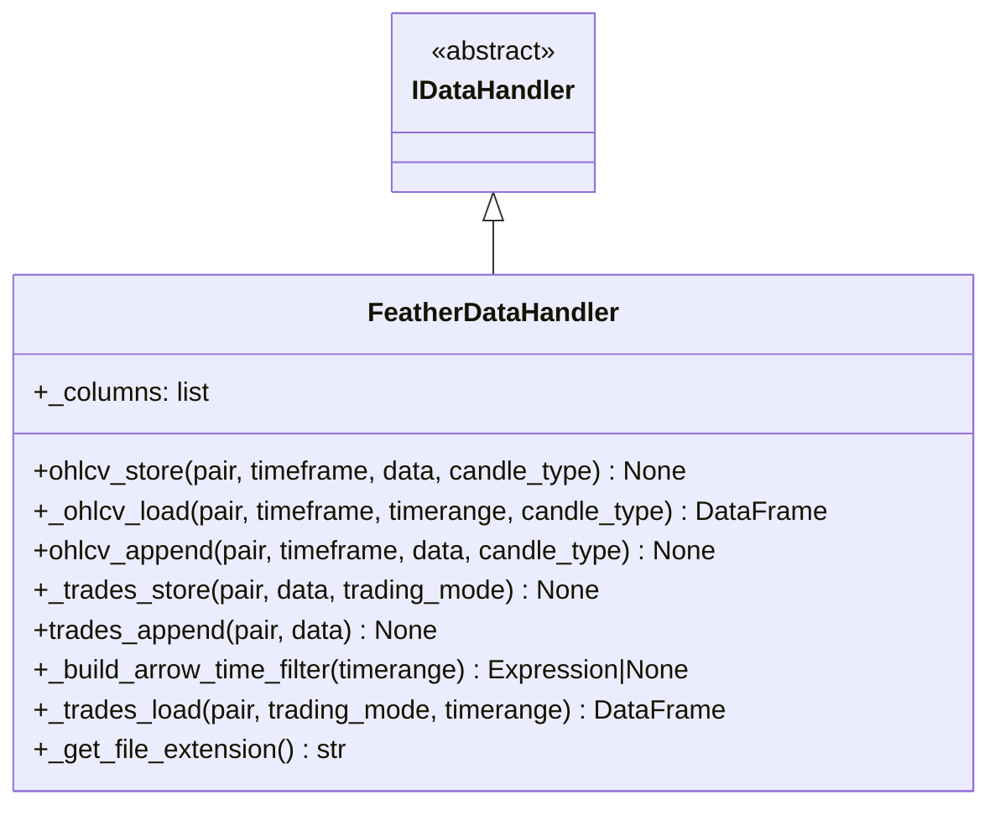

# featherdatahandler.py

## 概述

`featherdatahandler.py` 实现了基于 Apache Arrow Feather 格式的数据处理器 `FeatherDataHandler`。Feather 是 freqtrade 的**默认数据存储格式**，具有高性能读写和良好的压缩比。该处理器使用 LZ4 压缩（level 9），并在加载交易数据时支持通过 Arrow Dataset API 进行时间范围过滤，避免加载不必要的数据。

## 架构图

## 核心类/函数

### FeatherDataHandler

继承自 `IDataHandler`，使用 Feather（Apache Arrow 的列式存储格式）进行数据持久化。

**类属性：**
- `_columns = DEFAULT_DATAFRAME_COLUMNS` -- OHLCV 数据列定义

#### ohlcv_store(pair, timeframe, data, candle_type)
将 OHLCV DataFrame 存储为 Feather 文件。

**存储配置：**
- 压缩算法：LZ4
- 压缩级别：9（最高压缩）
- 仅存储 `_columns` 定义的列
- 重置索引以确保干净的行号

#### _ohlcv_load(pair, timeframe, timerange, candle_type) -> DataFrame
从 Feather 文件加载 OHLCV 数据。

**处理逻辑：**
1. 构建文件路径，如果不存在则尝试不修改 timeframe 的文件名（1M 文件回退兼容）
2. 使用 `pandas.read_feather` 读取
3. 设置列名为标准 `_columns`
4. 将 OHLCV 列转为 float 类型
5. 将 `date` 列从毫秒时间戳转为 UTC datetime

**错误处理：** 任何异常都记录日志并返回空 DataFrame。

#### _trades_store(pair, data, trading_mode)
存储交易数据为 Feather 格式，使用 LZ4 压缩（level 9）。

#### _build_arrow_time_filter(timerange) -> Expression | None
构建 Arrow Dataset 的时间过滤表达式。

**逻辑：**
- 如果 timerange 为 None，返回 None（不过滤）
- 将 `startts` 和 `stopts` 为 0 视为无界限
- 组合 `>=` 和 `<=` 条件为 Arrow filter expression

#### _trades_load(pair, trading_mode, timerange) -> DataFrame
从 Feather 文件加载交易数据。

**Arrow Dataset 过滤优化：**
1. 优先使用 `pyarrow.dataset` API 读取，支持谓词下推（predicate pushdown）
2. 如果提供了 timerange，通过 `_build_arrow_time_filter` 构建过滤器，仅加载所需时间范围的数据
3. 如果 Arrow 操作失败（ImportError, AttributeError, ValueError），回退到标准 `read_feather` 全量加载

#### ohlcv_append / trades_append
均抛出 `NotImplementedError`。Feather 格式不支持追加操作，需要全量重写。

#### _get_file_extension() -> str
返回 `"feather"`。

## 依赖关系

### 内部依赖（本项目模块）
- `freqtrade.data.history.datahandlers.idatahandler.IDataHandler` -- 抽象基类
- `freqtrade.configuration.TimeRange` -- 时间范围
- `freqtrade.constants` -- DEFAULT_DATAFRAME_COLUMNS, DEFAULT_TRADES_COLUMNS
- `freqtrade.enums` -- CandleType, TradingMode

### 外部依赖（第三方库）
- `pandas` -- DataFrame, read_feather, to_datetime
- `pyarrow.dataset` -- Arrow Dataset API（用于高效过滤读取）

### 被依赖（谁引用了本文件）
- `freqtrade.data.history.datahandlers.idatahandler.get_datahandlerclass` -- 当 `datatype == "feather"` 时延迟导入
- 作为默认数据处理器，被整个系统广泛使用
